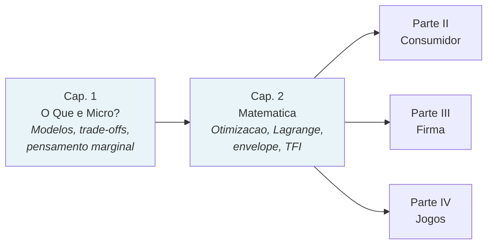
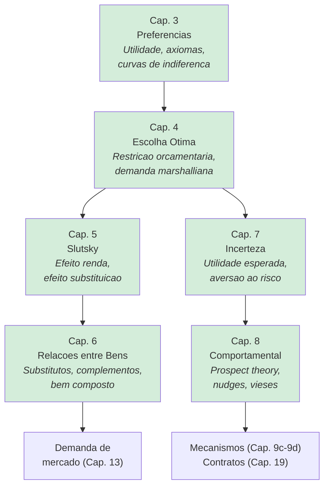
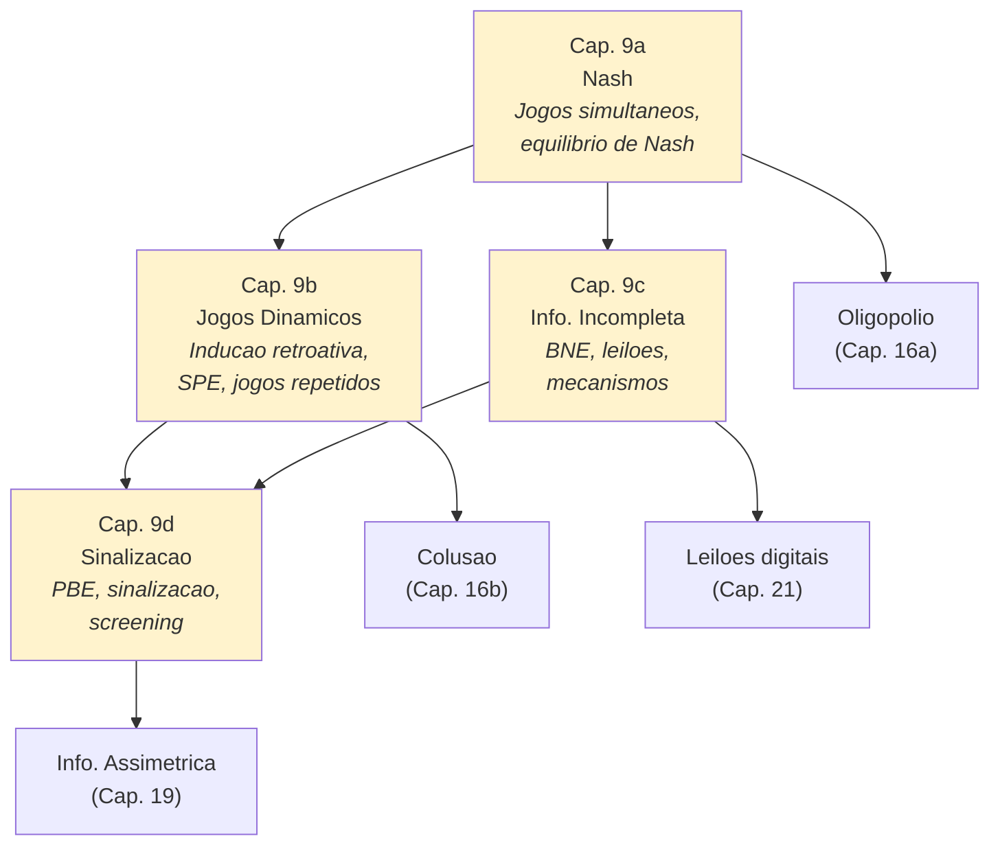
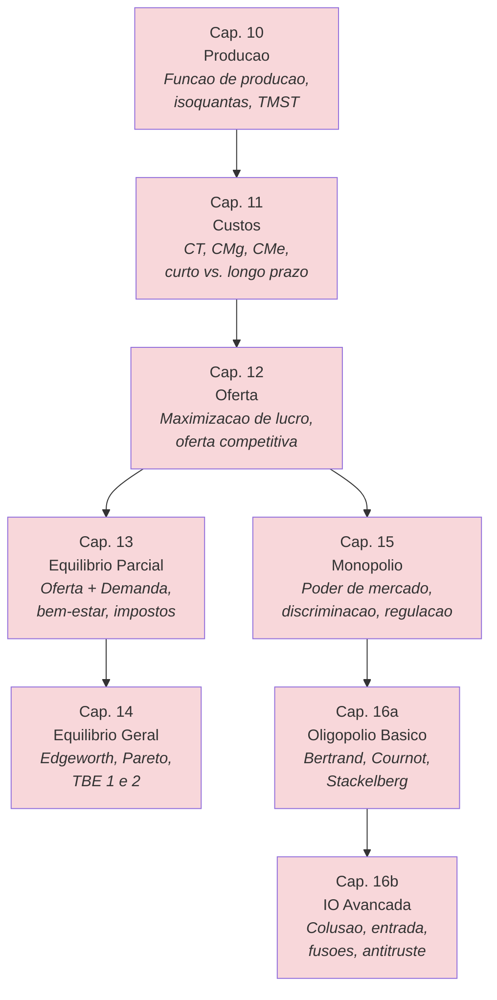
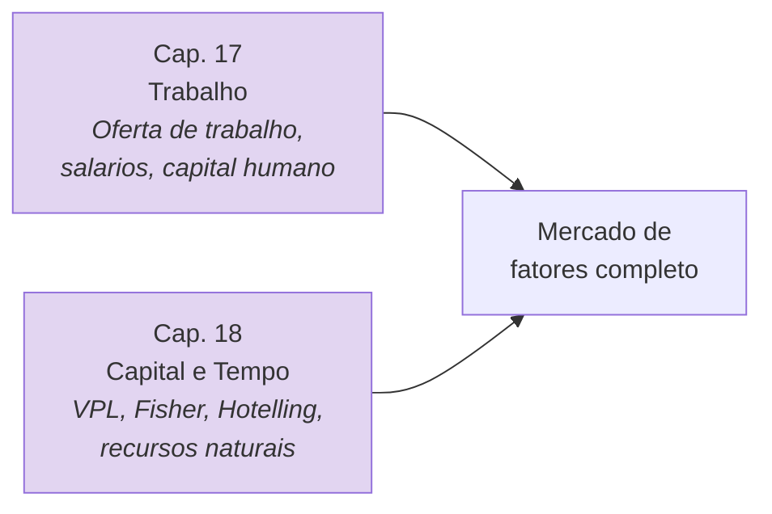
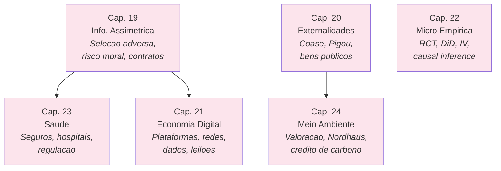

# Mapas Conceituais por Parte

*Mini-mapas para ajudar o aluno a situar-se dentro da progressao do livro.*

---

## Parte I — Fundamentos (Caps. 1-2)

**Ideia central:** A microeconomia e a ciencia das escolhas sob escassez. O Cap. 2 fornece a caixa de ferramentas matematicas usada em *todo* o restante do livro.

---

## Parte II — Consumidor (Caps. 3-8)

**Ideia central:** Do "o que as pessoas querem" (preferencias) ao "o que as pessoas fazem" (demanda), passando por "e quando o preco muda?" (Slutsky) e "e quando as pessoas erram sistematicamente?" (comportamental).

---

## Parte III — Jogos (Caps. 9a-9d)

**Ideia central:** Quando sua escolha depende da escolha do outro. De Nash (todos decidem ao mesmo tempo) a sinalizacao (um sabe mais que o outro e tenta provar).

---

## Parte IV — Firma e Mercados (Caps. 10-16b)

**Ideia central:** Do chao de fabrica (producao) ao tribunal do CADE (antitruste). O caminho passa por custos, lucro, equilibrio e poder de mercado.

---

## Parte V — Fatores e Tempo (Caps. 17-18)

**Ideia central:** Os mercados de insumos — trabalho e capital — determinam a distribuicao da renda. O tempo transforma decisoes presentes em consequencias futuras.

---

## Parte VI — Fronteiras (Caps. 19-24)

**Ideia central:** A microeconomia aplicada as grandes questoes: informacao, falhas de mercado, tecnologia, saude, meio ambiente e a fronteira metodologica.

---

## Como Usar Estes Mapas

1. **No inicio de cada parte:** projete o mapa correspondente para situar a turma.
2. **Na revisao:** use os mapas para conectar conceitos entre capitulos.
3. **Na navegacao do livro:** cada mapa indica os pre-requisitos e as conexoes futuras.
4. **Para o mapa geral completo do livro:** veja o [mapa HTML interativo](../mapa-livro.html).
