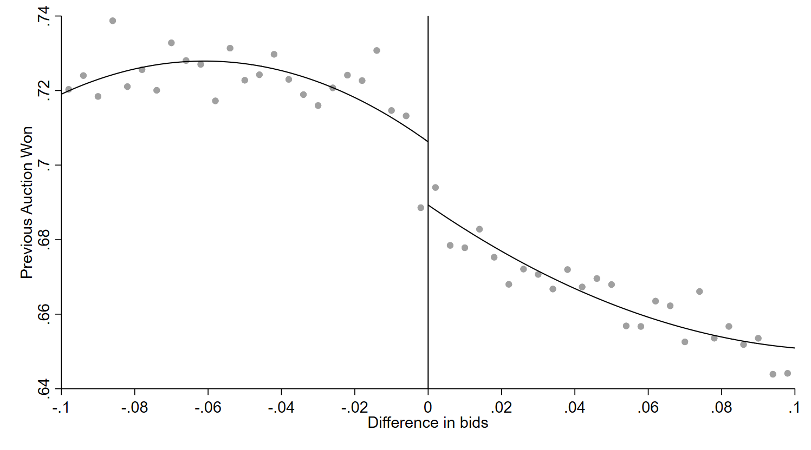
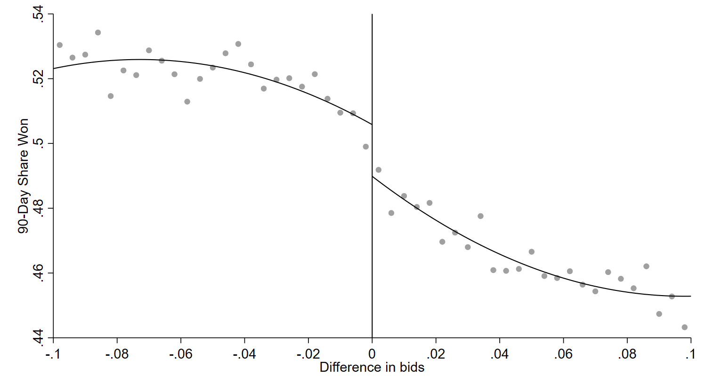
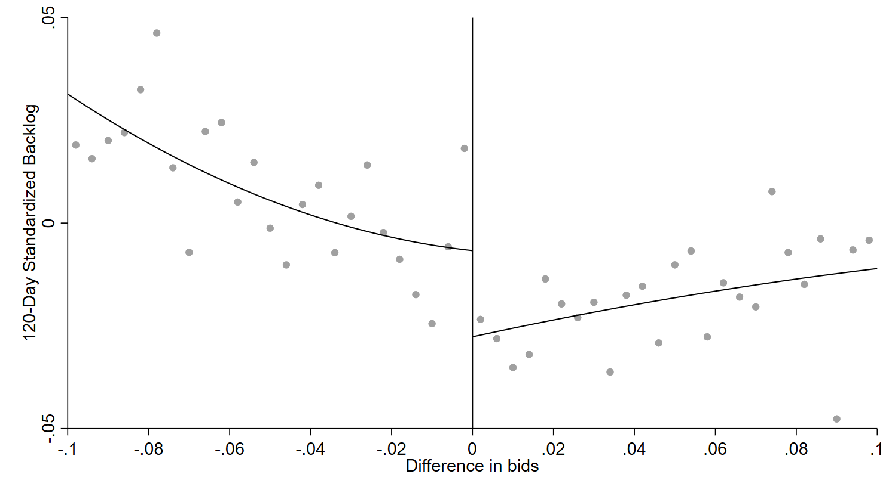
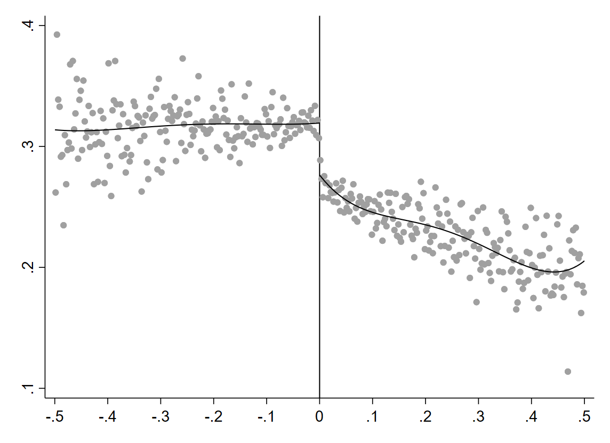

# Main Results

Significant discontinuities at the threshold of closely contested auctions reveal anti-competitive dynamics in Sao Paulo's public procurement.

---

## RDD Estimates

### Table 1: Effect of Winning Auction on Key Outcomes

| | Incumbent (1) | Incumbent (2) | Last Bid (3) | Last Bid (4) |
|:---|:---:|:---:|:---:|:---:|
| **Winning Auction** | **0.0182\*\*\*** | **0.0179\*\*\*** | **0.0636\*\*\*** | **0.0636\*\*\*** |
| | (0.005) | (0.005) | (0.008) | (0.008) |
| Observations | 261,370 | 260,985 | 156,418 | 156,418 |
| Optimal Bandwidth | 0.02 | 0.02 | 0.01 | 0.01 |
| Year FE | | :material-check: | | :material-check: |
| Market FE | | :material-check: | | :material-check: |

*Standard errors in parentheses. \*\*\* p < 0.01.*

!!! success "Both effects robust to fixed effects"
    The point estimates are virtually unchanged when absorbing year and market fixed effects. This rules out the possibility that the discontinuities are driven by time trends, market-level heterogeneity, or compositional shifts across years.

---

## Graphical Evidence

### Incumbency

The figure plots binned averages of incumbency status against the bid margin. Negative values correspond to narrowly won auctions; positive values to narrowly lost auctions. The **clear discontinuity at the cutoff** indicates that firms narrowly winning auctions exhibit a higher probability of incumbency compared to narrowly losing firms.

!!! success "1.8 pp incumbency gap"
    Consistent with incumbent firms benefiting disproportionately---potentially through strategic bidding, bid rotation, or favoritism by procurement officials who may prefer dealing with known suppliers.

### Share Won (90 days)

Narrowly winning firms exhibit a higher share of recent wins in the same market, reinforcing the incumbency finding: the advantage is not a one-time event but part of a persistent pattern of repeated winning.

### Backlog

The standardized cumulative contract value (backlog) shows that narrowly winning firms carry a higher workload than narrowly losing firms. Under competition, firms near the threshold should have similar backlogs---the gap suggests systematic advantages for certain firms.

### Ratio of Wins

The ratio of recent wins to participations confirms the pattern: narrowly winning firms have a systematically higher success rate in recent auctions within the same market.

---

## Interpretation

Two distinct anti-competitive signals emerge from the data:

### Signal 1: Incumbency Advantage (1.8 pp)

Certain firms systematically win close-margin auctions more often than their recent history would predict under genuine competition. Possible mechanisms include:

- **Bid rotation:** Cartel members take turns winning, with the "designated winner" submitting a slightly lower bid
- **Official favoritism:** Procurement officers may provide information advantages to preferred suppliers
- **Switching costs:** Buyers may subtly favor known suppliers through specification choices

### Signal 2: Strategic Bid Timing (6.4 pp)

The last-bid advantage suggests **information leakage**: narrowly winning firms may have knowledge of competing bids, allowing them to time or calibrate their submission strategically. This is consistent with:

- **Bid leakage:** Corrupt officials revealing bid information before deadline
- **Collusive coordination:** Cartel members submitting cover bids early, with the designated winner submitting last
- **Sequential observation:** In practice, firms with connections may learn about early submissions

---

## Planned Extensions

The following analyses are under development for the R1 response:

| Extension | Status |
|:----------|:-------|
| Heterogeneity by market (product category) | In progress |
| Correlation with predicted corruption indices | Planned |
| Firm outcomes (market share dynamics) | Planned |
| RAIS-linked firm characteristics (size, age, sector) | Data ready |
| Donut-hole and placebo robustness | Complete |
| Density test (McCrary / CJM) | Complete |
