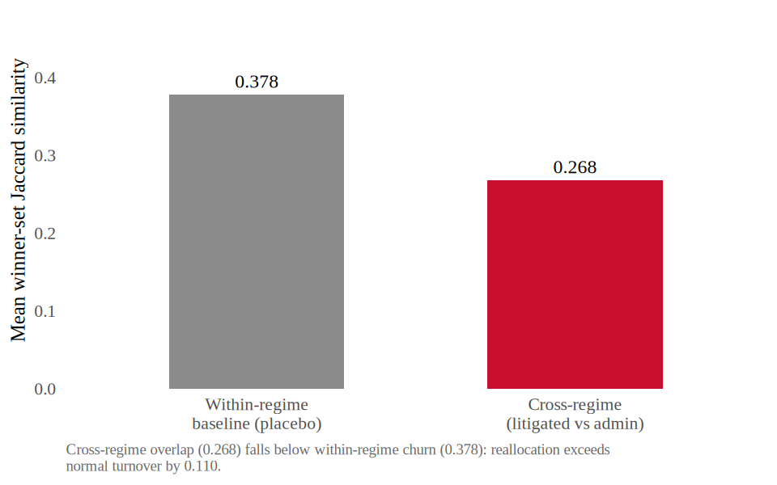

# AN-006: Winner switching across urgent regimes

!!! abstract "Intuition (plain-language)"
    Take a buyer that bought the same item both ways — once on an administrative urgent order and once under a court mandate — and ask: did the same firm win, or did someone else step in? If litigation mainly raised the same supplier's price, the winners would largely match. They do not. Across these pairs, the winning supplier sets barely overlap — about a quarter of overlap on average — and in nearly half the pairs there is no overlap at all. The most common winner is a different firm in about seven of every ten pairs. The supplier set, not just the price, moves with the regime.

## Question

When the same buyer buys the same item under both urgent regimes, does the set
of winning suppliers change? This is the direct evidence on the **supplier-set
reallocation** margin that the supplier-composition residual in
[AN-005](an-005-pricing-sourcing-decomposition.md) points to: if litigation
worked through the same firm's price, the winner sets should largely coincide.

## Design

- **Sample**: 2,134 buyer×item pairs observed under both urgent regimes — each
  pair has at least one administrative and at least one litigated urgent
  purchase.
- **Unit**: a buyer×item pair with ≥1 administrative and ≥1 litigated urgent
  purchase.
- **Specification**: within each pair, compare the set of winning suppliers
  across the administrative and litigated urgent regimes — distinct-winner
  counts, winner-set Jaccard similarity, any-overlap share, and whether the
  modal winner changes.

## Results

| Measure | Value |
|---|---:|
| Buyer×item pairs (both regimes) | 2,134 |
| Mean distinct winners — administrative | ~2.05 |
| Mean distinct winners — litigated | ~1.99 |
| Mean winner-set Jaccard similarity | 0.268 |
| No winner overlap | 48.5% |
| Any winner overlap | 51.5% |
| Modal winner differs | 70.2% |
| Same modal winner | 29.8% |

Output: `v10-causal-mechanism/output/tables/tab_winner_switch.tex`.

## Interpretation

The winning supplier set moves with the regime. Across 2,134 buyer×item pairs
observed under both urgent regimes, the mean winner-set Jaccard similarity is
just 0.268, and 48.5% of pairs share no winners at all (51.5% share at least
one). The modal winner differs in 70.2% of pairs and coincides in only 29.8%.
The mean number of distinct winners is similar across regimes (~2.05
administrative, ~1.99 litigated), so the change is in **which** firms win, not
in how concentrated each regime is.

This is the direct counterpart to the supplier-composition residual in
[AN-005](an-005-pricing-sourcing-decomposition.md): the supplier set, not just
the supplier's price, reallocates under litigation. Together with the near-zero
within-firm pricing margin in [AN-003](an-003-within-firm-pricing.md), it
supports the core reading that in deep repeated urgent markets the cost margin is
fragmented sourcing rather than a broad same-firm markup.

Confidence: **green for the stated descriptive question.** The analysis directly
measures whether the winning supplier set changes within buyer-item pairs
observed under both urgent regimes, and the answer is large: low Jaccard
similarity, many zero-overlap pairs, and a different modal winner in most pairs.
This is not a causal identification design and does not make the administrative
channel random; the green rating is only for the descriptive supplier-set
reallocation fact.

## Follow-ups

- Quantify how much of the −22.8% gap the winner-set reallocation can account
  for, sharpening the supplier-composition residual — see
  [AN-005](an-005-pricing-sourcing-decomposition.md).
- Check whether winner switching is more pronounced in the thin and
  off-formulary markets where the deep-market within-firm null breaks down — see
  [AN-004](an-004-market-depth-heterogeneity.md).
- Validate the regime classification underlying the pairs — see
  [AN-012](an-012-classifier-validation.md).
