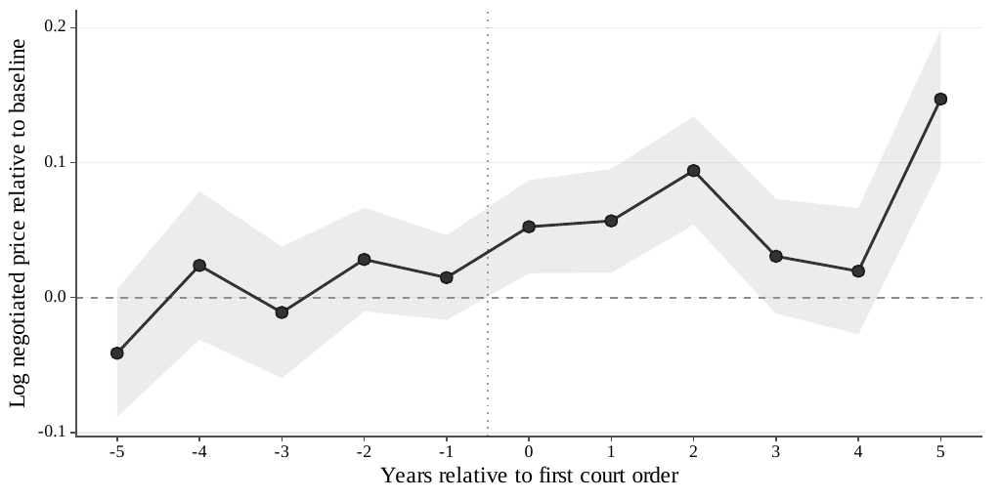
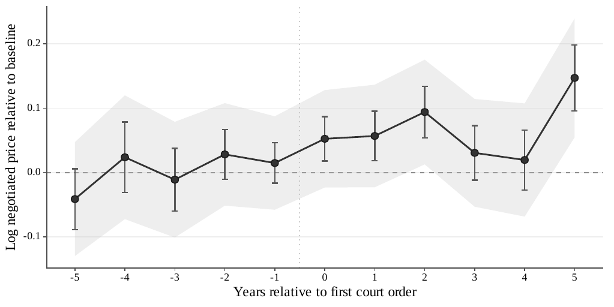

# AN-010: Dynamic BJS event study and Honest-DiD sensitivity

!!! econ "Economic intuition"
    Trace prices period by period around exposure. The gap is small right after exposure and grows over the following periods, which fits a story of demand building up. But when we stress-test the dynamic path against plausible pre-trend deviations, sized to the largest deviation already visible before exposure, the robust intervals no longer rule out zero. So the dynamic pattern is a useful diagnostic, but it is not what the main claims stand on.

## Question

Does a dynamic event study show prices diverging after exposure, and is
that dynamic path robust to plausible violations of parallel trends?
Because the dynamics are only a diagnostic, the test is whether they
survive Honest-DiD deviations sized to the observed maximum pre-period
scale.

## Design

- **Sample**: urgent panel within the BEC group 65 São Paulo
  pharmaceutical sample, 2009–2019.
- **Specification**: a Borusyak-Jaravel-Spiess (BJS) imputation event
  study, with Rambachan-Roth (2023) Honest-DiD sensitivity evaluated at
  the observed maximum pre-period deviation scale.
- **Role**: diagnostic and supportive. The main claims rest on the Lee
  bounds, the within firm-buyer-item pricing test, and the sourcing
  evidence; the dynamics are not the primary identification.

## Results

| Event-study estimate | Coefficient | SE |
|---|---:|---:|
| First post-exposure | 0.052 | 0.018 |
| Five periods after | 0.147 | 0.026 |

Output: `v10-causal-mechanism/output/tables/tab_dynamic_sensitivity_summary.tex`.

## Interpretation

Confidence: **yellow.** The dynamic BJS event study shows the price gap
opening from 0.052 (SE 0.018) in the first post-exposure period to 0.147
(SE 0.026) five periods after, consistent with demand building over
time. The Honest-DiD sensitivity, however, does not survive deviations
at the observed maximum pre-period scale: once plausible pre-trend
violations of that size are allowed, the robust intervals no longer
exclude zero. The dynamic evidence is therefore diagnostic and
supportive, not the primary identification. The main claims rest on the
Lee bounds, the within firm-buyer-item pricing test, and the sourcing
evidence. The reading is yellow because the evidence is from a single
jurisdiction (São Paulo BEC) and rests on own project runs, and because
the dynamic path is explicitly demoted to a diagnostic role.

## Follow-ups

- Read together with the never-litigated placebo in
  [AN-008](an-008-placebo-never-litigated.md); the two diagnostics
  jointly populate the
  [placebo-and-dynamics hypothesis](../hypotheses/placebo-and-dynamics.md).
- Report the smoothness-restriction variant of the Honest-DiD bound
  alongside the relative-magnitude variant to characterize the full
  sensitivity frontier.
