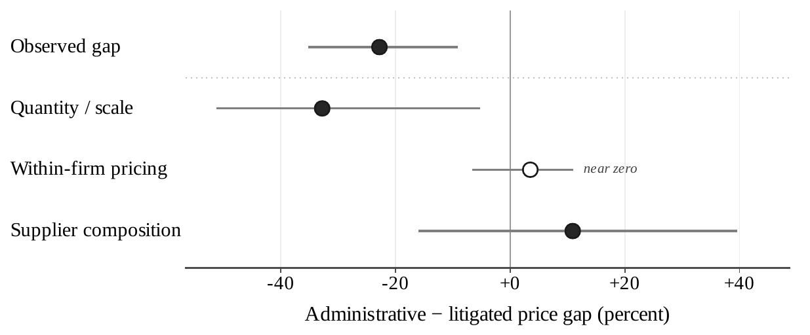

# Fragmented sourcing is the margin: lost scale and supplier-set reallocation

🟡 Decomposing the administrative-minus-litigated price gap shows that the
cost of urgency operates through sourcing, not through same-firm pricing.
Against an observed gap of **−22.8%**, the quantity/scale channel accounts
for **−32.8%**, the within-firm component is **+3.5%** (near zero), and
supplier composition contributes **+10.9%** as a reconciliation residual
([AN-005](../analyses/an-005-pricing-sourcing-decomposition.md),
[AN-009](../analyses/an-009-aggregation-cells.md)). Administrative orders are
**3.3× larger** than litigated ones, and the bulk elasticity of **−0.329**
turns that lost scale into a price penalty
([AN-005](../analyses/an-005-pricing-sourcing-decomposition.md)).

*Decomposition of the administrative-minus-litigated price gap (fig\_sourcing\_vs\_pricing\_v9):
the observed gap is dominated by the quantity/scale channel, the within-firm
component sits near zero, and supplier composition enters as a reconciliation
residual rather than a standalone channel.*

The supplier-composition term is large but must be read with care: it is the
reconciliation residual of the decomposition, **not** standalone proof of a
reallocation effect, and should be interpreted alongside the direct
winner-switching evidence. That evidence is substantial — across **2,134
item-buyer pairs**, the supplier set used under litigation versus
administration has a Jaccard overlap of only **0.268**, **48.5%** of pairs
share no supplier at all, and the modal winner differs in **70.2%** of pairs
([AN-006](../analyses/an-006-winner-switching.md)). Lost scale and
supplier-set reallocation, not incumbent markups, are where the urgency cost
is concentrated.

**Caveat.** The decomposition is an accounting reconciliation of an observed
gap into channels under maintained aggregation choices, not a structural
counterfactual; the **+10.9%** supplier-composition term is a residual that
absorbs whatever the quantity/scale and within-firm terms do not explain, so
it is not a standalone reallocation estimate. The winner-switching statistics
are descriptive comparisons of supplier sets, not causal demand-aggregation
effects. The administrative channel here is the closest feasible
urgent-procurement comparison, not a random benchmark. The reading is 🟡
because it is a single-source own-project estimate in São Paulo BEC.

**Sources.**

- *Own analysis*:
  [AN-005](../analyses/an-005-pricing-sourcing-decomposition.md) (price gap
  decomposition, order-size ratio, bulk elasticity),
  [AN-006](../analyses/an-006-winner-switching.md) (winner switching, Jaccard
  overlap, modal-winner differences),
  [AN-009](../analyses/an-009-aggregation-cells.md) (aggregation-cell
  construction).
- *Cross-refs*: [H:lost-scale](../hypotheses/lost-scale.md);
  [H:supplier-set-reallocation](../hypotheses/supplier-set-reallocation.md).
- *Validation*: backing scripts `45_reconciliation.R`,
  `48_mechanism_evidence.R`, `50_v9_outputs.py`.
