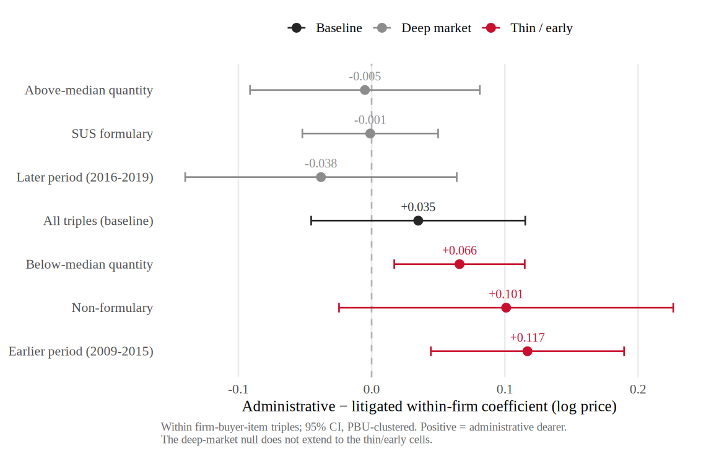

# H:no-broad-same-firm-markup — In deep repeated urgent markets, the sanction-related cost margin does not appear as a broad same-firm markup

The under-the-gun gap could arise in two observationally confounded ways: the
*same* supplier could charge a sanctioned buyer more for the *same* item (a
same-firm markup), or the state could end up buying from a *different* supplier
set on *different* terms (sourcing). To separate them, the paper holds the
supplier–buyer match fixed: it looks within firm-buyer-item triples observed
under **both** urgent regimes — same firm, same item, same buyer. In these deep,
repeated urgent markets, the administrative-vs-litigated price difference is
statistically indistinguishable from zero. The sanction-related cost margin in
these markets is therefore **not** a broad same-firm markup. This is a
**deep-market null, not a universal one** — a residual within-firm gap
reappears elsewhere, which is the subject of
[H:thin-market-supplier-leverage](thin-market-supplier-leverage.md).

!!! abstract "Intuition (plain-language)"
    If a court order let suppliers squeeze the state, you would expect the very same firm to charge the very same buyer more for the very same medicine when a sanction is in play. We can check that directly, because some firm–buyer–item combinations show up under both urgent regimes. When we line those up, the price difference is essentially zero. So in the deep, repeated urgent markets where the same supplier keeps selling the same drug to the same buyer, the extra cost is not coming from that supplier marking up the price. It has to be coming from somewhere else — and the rest of the paper points to how the state is forced to buy: smaller lots and a reshuffled supplier set. This is a statement about deep markets, not a blanket claim.

> **Evidence strength: Partial (strongly supported).**
> Within firm-buyer-item triples (same firm, buyer, item, observed under both
> urgent regimes), [AN-003](../analyses/an-003-within-firm-pricing.md) reports an
> Admin coefficient of 0.035 (SE 0.041), statistically indistinguishable from
> zero — **no broad same-firm markup in deep repeated urgent markets**. The
> sample is 4,573 observations across 1,206 triples. The null is a deep-market
> result, not a universal one: the same analysis surfaces meaningful leverage on
> thinner and earlier subsamples (see
> [H:thin-market-supplier-leverage](thin-market-supplier-leverage.md)).

## Theory

Accountability models of bureaucratic motivation \citep{prendergast2007}
suggest that an agent under one-sided pressure to deliver may accept worse price
terms from an incumbent supplier — the supplier, recognizing that the buyer
*must* obtain the good, extracts a markup. This is the same-firm-markup channel:
the price difference would show up holding the supplier–buyer–item match fixed.
The competing mechanism is the passive-waste / fragmented-sourcing channel
\citep{bandiera2009}, in which the cost margin instead operates through lost
scale and a reallocated supplier set rather than through the incumbent's pricing.
The two channels are observationally confounded in any comparison that lets the
supplier set vary; the within firm-buyer-item triple is the design that
conditions away supplier-set reallocation and isolates same-firm pricing.

## Prediction

In the within firm-buyer-item triple specification — same firm, same buyer,
same item, both urgent regimes — the administrative-minus-litigated price
coefficient should be **near zero and statistically insignificant** in deep
repeated markets. If the cost margin were primarily a same-firm markup, this
coefficient would be sizable and significant; the prediction here is that it is
not.

## Competing prediction

**Incumbent supplier markup (Prendergast-style accountability).** The
alternative is that the under-the-gun gap is largely a same-firm markup: the
incumbent supplier, facing a buyer who must comply with a court order, charges
more for the identical item. Under this view the within-triple coefficient
should be positive and significant. The deep-market within-triple null
(0.035, SE 0.041) rules this channel out **as the broad explanation in deep
repeated markets**. It does not rule it out everywhere: the heterogeneity in
[H:thin-market-supplier-leverage](thin-market-supplier-leverage.md) shows a
residual within-firm gap in thinner and earlier cells — though that gap is
disambiguated (the quantity axis is scale; the earlier-period gap is
administrative-dearer) rather than asserted as litigated-buyer leverage.

## Setting evidence

The repeated, deadline-driven nature of urgent pharmaceutical procurement
generates firm-buyer-item combinations that recur under both the litigated and
administrative regimes. Because the same supplier sells the same molecule to the
same buyer across regimes, these triples are the natural laboratory for
same-firm pricing. The institutional account in [docs/paper.md](../paper.md)
explains how the two urgent regimes share auction procedures, which is what makes
the within-triple comparison meaningful.

## Empirical test

- *Outcome variable*: log negotiated price.
- *Variation*: administrative vs litigated regime **within** a firm-buyer-item
  triple observed under both.
- *Specification*: regression of log negotiated price on an administrative
  indicator with firm-buyer-item fixed effects, so identification comes only
  from within-triple variation across regimes.
- *Sample*: 4,573 observations across 1,206 firm-buyer-item triples.
- *Heterogeneity splits*: above- vs below-median quantity, SUS-formulary vs
  non-formulary, earlier vs later period (reported under
  [H:thin-market-supplier-leverage](thin-market-supplier-leverage.md)).

## Data requirements and limitations

Requires the BEC urgent panel restricted to firm-buyer-item triples present
under both regimes. The within-triple design isolates same-firm pricing **at the
cost of generalizability**: triples that appear under both regimes are, by
construction, the deeper and more repeated markets. The null therefore speaks to
those deep markets and is explicitly **not** a universal no-broad-markup claim;
thinner and earlier markets, where fewer triples recur, can and do show
leverage. The coefficient is a within-triple price difference, not a structural
markup parameter.

## Evidence

| Analysis | Bearing | Key takeaway |
|----------|---------|--------------|
| [AN-003](../analyses/an-003-within-firm-pricing.md) | Supports | Within firm-buyer-item triple Admin coef 0.035 (SE 0.041), indistinguishable from zero: no broad same-firm markup in deep repeated urgent markets. 4,573 obs in 1,206 triples. |

See the cross-cutting finding
[no broad same-firm markup](../findings/no-broad-same-firm-markup.md) for the
claim at full altitude, and
[H:thin-market-supplier-leverage](thin-market-supplier-leverage.md) for where the
margin reappears.

## Open tests

### Firm-side heterogeneity in the within-triple null

The deep-market null pools across suppliers. Splitting the within-triple
coefficient by supplier characteristics (size, market share within the molecule)
would show whether the null is uniform across firms or masks offsetting markups
and discounts among different supplier types. This sharpens the boundary between
the deep-market null and the thin-market leverage result without altering the
headline.

### Bridge the within-triple null to the decomposition residual

The within-firm pricing component enters the Figure 1 decomposition at +3.5%
(near zero), consistent with this null. A tighter reconciliation between the
within-triple coefficient and the decomposition's within-firm term would
consolidate the link from this hypothesis to
[H:lost-scale](lost-scale.md).

### How this null is bounded — and why it is not "confirmed"

This hypothesis is a **null**, and a null is not the same as proof of zero. The
within firm-buyer-item coefficient is 0.035 with a standard error of 0.041, so
the 95% interval runs roughly from &minus;0.045 to +0.115: the data show **no
detectable broad same-firm markup** in deep repeated urgent markets, but the
interval still admits small same-firm price differences. Absence of a detectable
broad markup is not evidence that the markup is exactly zero. The status is
therefore **Partial (strongly supported)** for the bounded, deep-market reading
— not "confirmed."

Two further reasons the status cannot be "confirmed":

- The result is **not universal by design.** A residual within-firm gap persists
  in thinner and earlier subsamples
  ([H:thin-market-supplier-leverage](thin-market-supplier-leverage.md), below-
  median quantity +0.066, earlier period +0.117) — though the quantity axis is
  scale and the earlier-period gap is administrative-dearer, not litigated-buyer
  leverage. The claim is scoped to deep repeated urgent markets and must stay
  scoped.
- It is a **single-jurisdiction** estimate (São Paulo BEC), with no independent
  cross-data replication.

To bound the null formally, we run an **equivalence test** on the within
firm-buyer-item coefficient (`analysis/60_referee_tests.R`). The one-sided upper
95% bound on the coefficient is +0.102, so the deep-market data **rule out broad
same-firm markups above about 10.8%**. The minimum detectable effect at 80% power
is 12.2%, and power to detect a 10% markup is 0.64; a two-one-sided-tests (TOST)
procedure gives p = 0.070 at a ±10% margin (borderline) and p = 0.364 at ±5%. The
null is therefore **genuine against broad markups** (anything above ~11% is
rejected) but **underpowered against modest ones** — which is exactly why the
reading is "no broad same-firm markup," reported as a bound, and **not
"confirmed."** Cross-jurisdiction replication would be needed to consolidate it
further.

A quartile decomposition confirms the null is **not hiding a same-firm pricing
gradient** (`analysis/61_h4_quantity_quartiles.R`): the within-triple coefficient
varies with order size only through bulk discounts — the within firm-buyer-item
log-quantity coefficient is $-0.259$ (SE $0.074$) — and once quantity is held
fixed there is no systematic same-firm price gradient across quantity quartiles.
The order-size variation is the scale channel ([H:lost-scale](lost-scale.md)),
not same-firm pricing.
