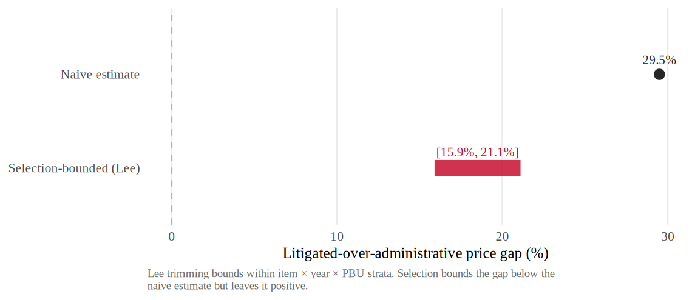

# H:utg-gap-selection-bounded — Court-mandated urgent purchases cost more than the closest administrative urgent comparison, and the gap survives selection bounding

Holding urgency fixed, the paper compares purchases compelled by court order
against the closest feasible urgent-procurement comparison: São Paulo's
administrative-request channel, which produces urgent pharmaceutical purchases
under the same compressed timelines and auction procedures but without the
court-sanction regime. The naive comparison shows court-mandated (litigated)
purchases costing substantially more. The administrative channel is **selected,
larger, and screened** — not a randomized comparison and not free of selection — so the
honest question is whether the gap survives once selection into that channel is
bounded. The answer is that Lee bounds shrink the gap but keep it well above
zero and statistically significant.

!!! abstract "Intuition (plain-language)"
    Two urgent purchases, same kind of medicine, same compressed deadline — one forced by a court order, the other authorized through the state's administrative urgent route. The court-ordered ones look about 29.5% more expensive at face value. But the administrative route is screened: it tends to admit cases that were easier and cheaper to source in the first place, which makes the raw gap flattering. Lee bounds discipline that screening under a monotonicity restriction — they bound the selection rather than wiping it out — and even at the conservative end the court-order premium stays in the 15.9%–21.1% range and remains statistically distinguishable from zero.

> **Evidence strength: Partial (strongly supported).**
> The naive under-the-gun (UTG) gap is 29.5% (coefficient −0.259, in the
> administrative-minus-litigated sign convention, so negative means litigated is
> more expensive). [AN-002](../analyses/an-002-lee-bounds.md) reports Lee bounds
> of 15.9%–21.1% (lower-bound coefficient −0.148, upper −0.192) with a mean trimming
> rate of 26.9%. [AN-007](../analyses/an-007-wild-cluster-bootstrap.md) returns a
> wild-cluster bootstrap p = 0.0080 under the preferred fixed effects and
> p = 0.0390 under item-by-year-month fixed effects. The gap is selection-bounded,
> not selection-free: the bound disciplines screening into the administrative
> channel rather than eliminating it.

## Theory

Court mandates impose one-sided accountability: procurement officials face
fines, civil liability, and other sanctions for failing to deliver a litigated
medication on time, but no symmetric penalty attaches to paying a high price.
In the passive-waste tradition (Bandiera, Prat & Valletti, 2009), this asymmetry predicts
slack on the price margin precisely where delivery is enforced. The
administrative urgent channel runs the same urgent auctions without the
court-sanction regime, so it is the closest feasible urgent comparison for the
court-mandated purchases. But the administrative channel is gated by the SES/SP
scientific committee, which screens cases for admissibility — and that screening
plausibly admits items that would have been cheaper to source under any regime.
Lee's monotone trimming bounds (Lee, 2009) are the right instrument here:
under a monotonicity restriction on selection, they bracket how much of the raw
gap could be an artifact of differential composition between the channels.

## Prediction

The administrative-minus-litigated log-price coefficient should be **negative**
(litigated more expensive), and the implied litigated-over-administrative
premium should remain **positive and significant after Lee trimming**. The
preferred-FE specification should survive a wild-cluster bootstrap at
conventional levels.

## Competing prediction

**Administrative selection (screening admits cheaper or easier cases).** The
leading alternative is that the entire gap is composition: the administrative
committee screens in items that are intrinsically cheaper or easier to source,
so the litigated channel looks expensive only because it carries the harder
cases. This is exactly the channel Lee bounds are built to discipline. Under
this story the gap should collapse toward zero once the more-selected channel is
trimmed down to comparability. It does not: the bounds stay in the 15.9%–21.1%
band. The Lee bound **bounds selection under monotonicity, it does not eliminate
it**, so the conclusion is appropriately a bounded gap, not a point causal
effect.

## Setting evidence

São Paulo runs a parallel administrative-request channel for urgent
pharmaceutical demand, authorized by the SES/SP scientific committee. It uses
the same BEC auction procedures and faces the same compressed timelines and
small quantities as litigated purchases, but it operates outside the
court-sanction regime. This dual channel for urgent demand is the institutional
asset that lets the comparison hold urgency fixed. Crucially, the administrative
channel is **larger and screened** — administrative orders are about 3.3× larger
than litigated orders (see [H:lost-scale](lost-scale.md)) — which is why it must
be treated as a selected comparison and disciplined with bounds rather than
read as a selection-free counterfactual. [docs/paper.md](../paper.md) gives the full
institutional account.

## Empirical test

- *Outcome variable*: log negotiated price.
- *Variation*: under-the-gun (UTG) contrast — litigated vs administrative urgent
  purchases, both inside urgent demand.
- *Specification*: fixed-effects regression of log negotiated price on an
  administrative indicator, with the preferred FE structure and an
  item-by-year-month alternative; sign convention is
  administrative-minus-litigated (negative = litigated more expensive),
  percentages reported litigated-over-administrative.
- *Selection discipline*: Lee monotone trimming bounds on selection into the
  administrative channel (mean trimming rate 26.9%).
- *Inference*: Rademacher wild-cluster bootstrap on the preferred-FE Admin
  coefficient.
- *Sample*: the urgent winner panel (naive regression N=61,620; Lee-trimmed 45,624).

## Data requirements and limitations

Requires the BEC parquet cache restricted to urgent pharmaceutical demand. The
administrative urgent channel is the **closest feasible urgent-procurement
comparison**, not a randomized comparison and not free of selection: it is selected, larger,
and screened. The Lee bound disciplines that selection under a monotonicity
restriction; it does not turn the comparison into an experiment. The estimate is
therefore a **selection-bounded** gap, reported as an interval, with the
direction and lower bound load-bearing rather than any single point. The figure
is a procurement-price gap; its fiscal translation is handled separately and is
a procurement-cost calculation, not a full welfare estimate.

## Evidence

| Analysis | Bearing | Key takeaway |
|----------|---------|--------------|
| [AN-002](../analyses/an-002-lee-bounds.md) | Supports | Naive UTG gap 29.5% (coef −0.259); Lee bounds 15.9%–21.1% (lower coef −0.148, upper −0.192), mean trimming rate 26.9%. Selection-bounded gap stays well above zero. |
| [AN-007](../analyses/an-007-wild-cluster-bootstrap.md) | Supports | Wild-cluster bootstrap p = 0.0080 (preferred FE), p = 0.0390 (item-by-year-month). Significance survives clustering-robust inference. |

## Open tests

### Tighten the bound with richer pre-screening covariates

The Lee bound trims on the observed selection margin. Incorporating additional
admissibility covariates from the SES/SP screening process — if recoverable —
could narrow the 15.9%–21.1% interval without weakening the monotonicity
restriction. This is a precision improvement, not a change in the
identification.

### Map the bounded gap into its mechanism components

The selection-bounded UTG gap is the *headline magnitude*; the paper then asks
*why* the gap arises. The within-firm-buyer-item null
([H:no-broad-same-firm-markup](no-broad-same-firm-markup.md)) and the sourcing
evidence ([H:lost-scale](lost-scale.md),
[H:supplier-set-reallocation](supplier-set-reallocation.md)) decompose this gap;
a tighter bridge from the bound to the decomposition would consolidate Clusters
B and C.

### Robustness to monotonicity violations (run)

The Lee interval assumes monotone selection into the administrative channel. We
relax it (`analysis/60_referee_tests.R`) by trimming an extra share $\delta$ of
administrative observations to absorb potential monotonicity violators. The
litigated-over-administrative gap **stays positive** (litigated more expensive)
for extra trimming all the way past $\delta = 0.60$, and is essentially unchanged
(≈[15.9%, 21.1%]) at a 10% slack. The headline direction is therefore robust to
substantial departures from monotonicity, even though the interval's exact width
remains conditional on the assumption.

### Path to confirmation

**Partial (strongly supported)** is the ceiling for a single-jurisdiction
design, and this hypothesis sits squarely on the project's load-bearing
identifying assumptions: the Lee monotonicity restriction and the selection of
the administrative urgent channel (a selected, larger, closest-feasible
comparison, not a randomized one). Lifting the status would require evidence
that does not rest on either:

- an exogenous or quasi-random source of sanction exposure — none is available
  in the São Paulo setting;
- cross-jurisdiction replication of the litigated-over-administrative gap
  (e.g., federal ComprasNet or another state platform); or
- an identifying design that does not use the administrative channel as the
  comparison.

Absent one of these, the gap remains selection-bounded under monotonicity, not
point-identified. The paper states this directly, and the status reflects it —
the hypothesis is not, and should not be, marked "confirmed."
