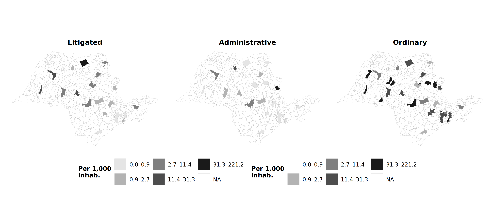
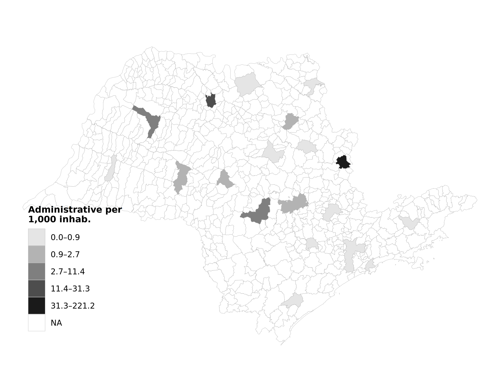
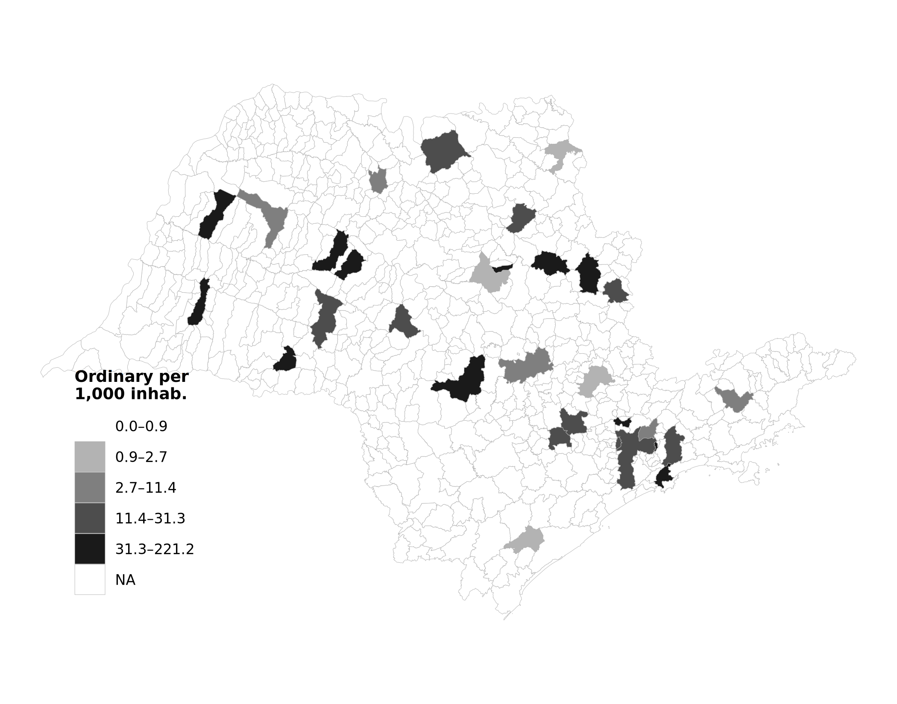

# Geographic Distribution Maps

## Comparison Panel: All Purchase Types

The panel below shows the geographic distribution of purchases per 1,000 inhabitants across Sao Paulo municipalities (2009-2019), using common quintile breaks for comparability.

*Quintile breaks; SIRGAS 2000 / UTM Zone 23S projection. Source: BEC procurement data and IBGE population estimates (SIDRA table 6579).*

!!! info "Key Pattern"
    Litigated purchases are geographically concentrated around the state capital and major urban centers, while ordinary purchases are more evenly distributed. Administrative purchases show the most sparse distribution, reflecting the limited adoption of the administrative request mechanism.

---

## Individual Maps

### Litigated Purchases per 1,000 Inhabitants

### Administrative Purchases per 1,000 Inhabitants

### Ordinary Purchases per 1,000 Inhabitants

---

## Technical Notes

- **Projection:** SIRGAS 2000 / UTM Zone 23S (EPSG:31983)
- **Breaks:** Quintile (5 equal-frequency categories)
- **Population:** IBGE SIDRA table 6579, 2009-2019 average
- **Shapefile:** IBGE via `geobr` R package (2010 municipal boundaries)
- **Color palette:** Sequential grayscale (5 levels), print-friendly
