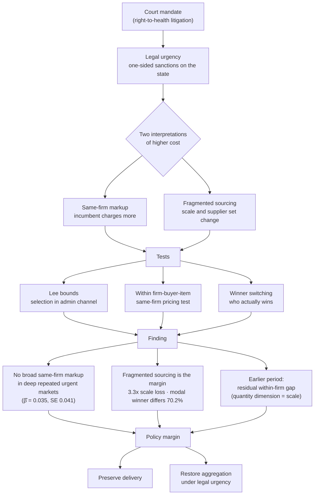

# Mind Map

The diagram below traces the paper's argument from the court mandate to the policy margin. A court mandate creates legal urgency, which admits two interpretations of higher procurement costs — a same-firm markup or fragmented sourcing. Three tests separate them. The finding is that, in deep repeated urgent markets, there is no broad same-firm markup; the cost margin is fragmented sourcing (lost scale plus supplier-set reallocation), while a residual within-firm gap persists in the earlier period (the quantity dimension reflecting scale, not same-firm pricing). The policy margin follows directly: preserve delivery while restoring aggregation under legal urgency.

> Court mandates do not merely affect how much the state pays; they change how the state is forced to buy. The administrative urgent channel is the closest feasible comparison — selected and larger, not random or clean — so the design combines Lee selection bounds, within firm-buyer-item pricing, and direct winner-switching evidence rather than relying on any single contrast.
