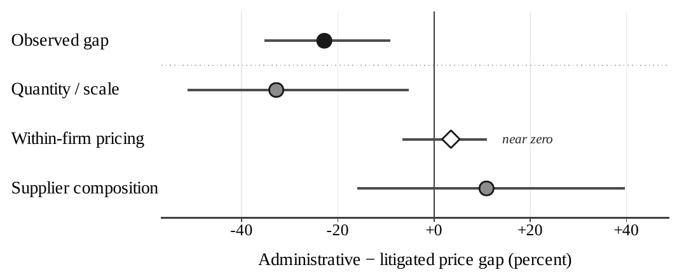

# Main Results

*See also: [Findings overview](findings/index.md) · [Analyses overview](analyses/index.md).*

The results build cumulatively. Section 5.1 establishes that urgent procurement is costlier and less competitive than ordinary procurement of comparable items. Section 5.2 moves inside urgent procurement and bounds the under-the-gun gap for selection into the administrative channel. Section 5.3 asks whether the same firm charges a sanctioned buyer more for the same item, and finds no broad same-firm markup in deep repeated urgent markets. Section 5.4 locates the cost margin in fragmented sourcing — lost scale and supplier-set reallocation. Throughout, the administrative urgent channel is the closest feasible urgent-procurement comparison: selected, larger, and neither random nor a clean control.

---

## 5.1 Urgent procurement is costlier and less competitive

Relative to ordinary purchases of comparable items, urgent procurement moves in the direction expected when sourcing is compressed. The estimates condition on item, year, and buyer fixed effects.

| Outcome | Urgent vs ordinary | SE |
|---|:---:|:---:|
| Negotiated price | **+5.4%** (0.053) | (0.016) |
| Reference price | **+2.7%** (0.027) | (0.014) |
| Number of bidders | **−5.4%** (−0.056) | (0.014) |
| Tender success | **+2.1 pp** (0.021) | (0.006) |

Urgency appears to help the state complete purchases — tender success rises — while weakening the competitive conditions under which those purchases are sourced. These estimates establish the urgent-procurement environment, not judicial sanction exposure; the remaining results move inside urgent procurement and separate pricing from sourcing.

!!! econ "Economic intuition"
    Compressing the time available to source narrows the set of suppliers who can credibly bid, so the buyer faces a thinner, less competitive market and pays more. The higher tender-success rate is the same force seen from the other side: urgency buys *completion*, not *bargaining power*. Read this as the urgent-procurement environment — the cost of buying fast — before any judicial sanction enters.

Detail: [AN-001 — Urgent vs ordinary procurement](analyses/an-001-urgent-vs-ordinary.md).

---

## 5.2 The under-the-gun gap is selection-bounded

The under-the-gun comparison is within urgent procurement: court-mandated (litigated) purchases versus administrative urgent purchases. Coefficients are administrative minus litigated, so a negative coefficient means litigated purchases are more expensive; percentage gaps are reported in the reader-facing litigated-over-administrative direction.

The naive litigated-over-administrative gap is **29.5%**. Because administrative requests are screened and the administrative group is overrepresented, we trim it within item-by-year-by-PBU strata using Lee bounds. The selection-corrected interval is:

[15.9%, 21.1%]
Lee-bounded litigated-over-administrative price gap. The bounded interval, not the naïve cross-sectional gap, is the disciplined object. The bounds discipline selection under a monotonicity restriction; they do not eliminate it or claim assignment to sanctions.

Wild-cluster inference supports the contrast: the preferred specification rejects a zero gap at *p* = 0.0080, with *p* = 0.0390 under the tighter item-by-year-month specification. Even after disciplining the most direct urgent comparison for selection, litigated urgent procurement remains more expensive.

!!! econ "Economic intuition"
    The tempting comparison — litigated versus administrative urgent purchases — is contaminated: administrative requests are pre-screened, so the items flowing through that channel differ systematically from litigated ones. A naïve gap credits urgency for what is partly composition. Lee bounds trade a single number for an honest interval: under a monotonicity restriction, they bracket how much of the gap survives the most and least favorable trimming. It stays positive — selection narrows the gap but cannot explain it away.

Detail: [AN-002 — Lee bounds](analyses/an-002-lee-bounds.md) · [AN-007 — Wild-cluster bootstrap](analyses/an-007-wild-cluster-bootstrap.md).

---

## 5.3 Same firm, same buyer, same item: no broad same-firm markup in deep markets

The pricing test asks whether the same firm charges a sanctioned buyer more for the same item. In firm-buyer-item triples observed under both urgent regimes (4,573 observations, 1,206 triples), the administrative coefficient is:

β̂ = 0.035 (SE 0.041)
Within firm-buyer-item administrative coefficient. Conditional on the same firm, buyer, and item, prices are statistically indistinguishable across urgent regimes: no broad same-firm markup in deep repeated urgent markets. By construction this test conditions away supplier reallocation; it cannot measure who wins.

"Deep markets" are repeated urgent settings with greater scale or more standardized demand, proxied by above-median quantity, SUS-formulary status, and later-period procurement. The heterogeneity is as important as the baseline null:

| Subsample | Coefficient |
|---|:---:|
| Above-median quantity (deeper) | **−0.005** |
| SUS-formulary (deeper) | **−0.001** |
| Below-median quantity (thinner) | **+0.066\*\*\*** |
| Earlier period (thinner) | **+0.117\*\*\*** |

The result is not a claim that same-firm pricing is everywhere zero. In deep repeated urgent markets, the sanction-related cost margin does not appear as a broad same-firm markup; a residual within-firm gap is confined to the earlier period, while the quantity dimension reflects scale rather than same-firm pricing.

!!! econ "Economic intuition"
    If sanctions worked by letting an incumbent hold up a captive buyer, the extra cost would show up *within the same firm, buyer, and item* — and in deep repeated markets it does not. That null is informative: it rules out a broad same-firm markup as the channel and pushes the search toward *who* supplies and *at what scale*. The thin-market positive marks the boundary — where a relationship is shallow and outside options are scarce, supplier leverage can re-emerge, exactly as bargaining logic predicts.

Detail: [AN-003 — Within-firm pricing](analyses/an-003-within-firm-pricing.md) · [AN-004 — Market-depth heterogeneity](analyses/an-004-market-depth-heterogeneity.md).

---

## 5.4 Fragmented sourcing: lost scale and supplier-set reallocation

If the cost margin is not a broad same-firm markup in deep markets, where does it operate? The sourcing evidence points to two channels: lost scale and a reallocated winning supplier set.

**Lost scale.** Administrative urgent orders are **3.3× larger** than litigated urgent orders, so fragmented court-mandated buying gives up scale and the discounts that come with it.

**Supplier reallocation.** Among item-buyer pairs observed under both urgent regimes (2,134 pairs), the mean winner-set Jaccard similarity is **0.268**, **48.5%** of pairs have no winner overlap, and the **modal winner differs in 70.2% of pairs**. Conditional on the same firm, prices are statistically indistinguishable in deep markets; unconditionally, the winning supplier set often changes. That combination is the empirical signature of fragmented sourcing.

**Reconciliation.** The figure below reconciles the observed administrative-minus-litigated price gap with a mechanical quantity/scale component, the within-firm pricing component, and a residual supplier-composition component. The residual is a reconciliation residual and should not be read alone as proof of sourcing; the direct winner-switching evidence above carries that claim.

| Component (admin minus litigated) | Contribution |
|---|:---:|
| Observed price gap | **−22.8%** |
| Quantity / scale | **−32.8%** |
| Within-firm pricing | **+3.5%** |
| Composition (residual) | **+10.9%** |

!!! econ "Economic intuition"
    Two sourcing forces raise the cost of fragmented buying. *Lost scale*: splitting demand into small, urgent orders forfeits the volume discounts a batched tender would capture (litigated orders are ~3.3× smaller). *Reallocation*: the winning supplier changes in most item-buyer pairs, because an emergency pulls in whoever can deliver now rather than whoever is cheapest. The combination — same-firm prices flat, yet the winner set churning — is the fingerprint of fragmentation, not of incumbents charging more.

Detail: [Fragmented sourcing is the margin](findings/fragmented-sourcing-is-the-margin.md).

---

## The policy margin

Court mandates do not merely affect how much the state pays; they change how the state is forced to buy. The mechanism is a judicial-enforcement form of passive waste: one-sided sanctions secure delivery, but they weaken the routines that aggregate demand and match buyers with suppliers. Because the measured margin is lost scale and supplier matching rather than contract language or price caps, the policy response is to **preserve delivery while restoring aggregation under legal urgency** — not to weaken access to medicines.

!!! econ "Economic intuition"
    This is passive waste in a judicial-enforcement guise (Bandiera, Prat & Valletti, 2009): no party need behave opportunistically for the cost to arise. The court secures delivery, the buyer complies on the deadline, suppliers answer the small order in front of them — and what is lost is the routine that aggregates demand and matches suppliers. The corollary for policy: the lever is procurement *capacity* under urgency, not weaker access. The cost is not an argument against enforcing the right to health.

*Continue: [Robustness](robustness.md) · [Extensions](extensions.md) · [Advanced Methods](advanced.md).*
