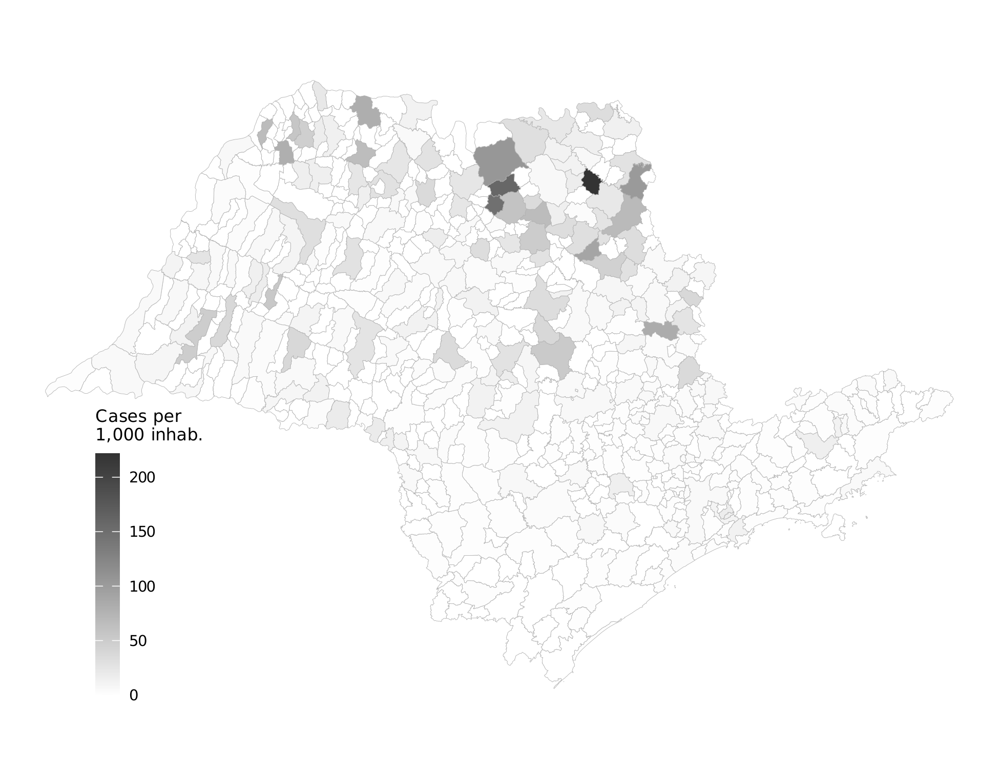
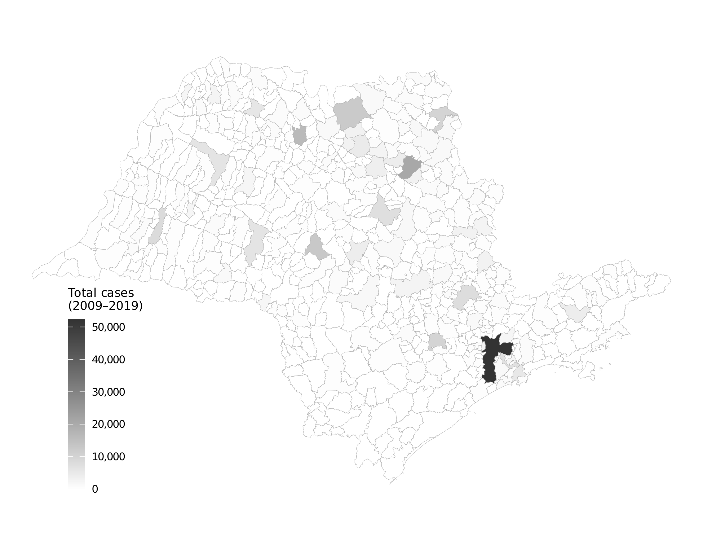
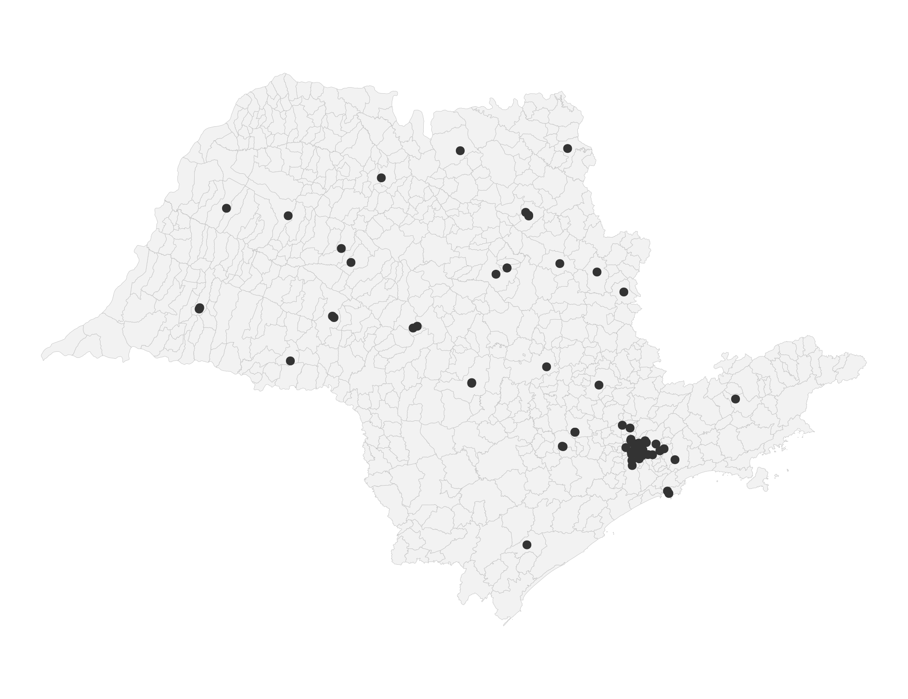
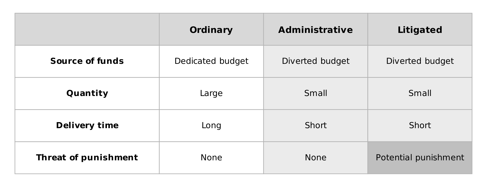
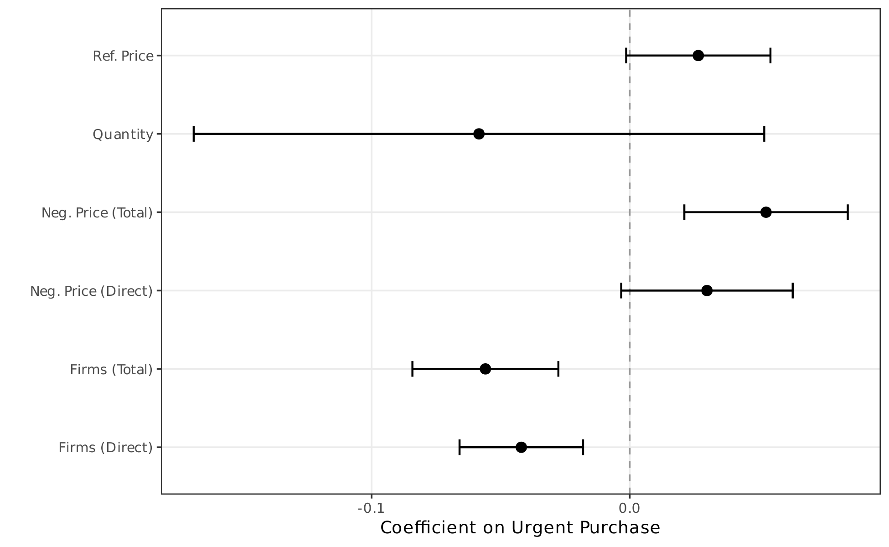
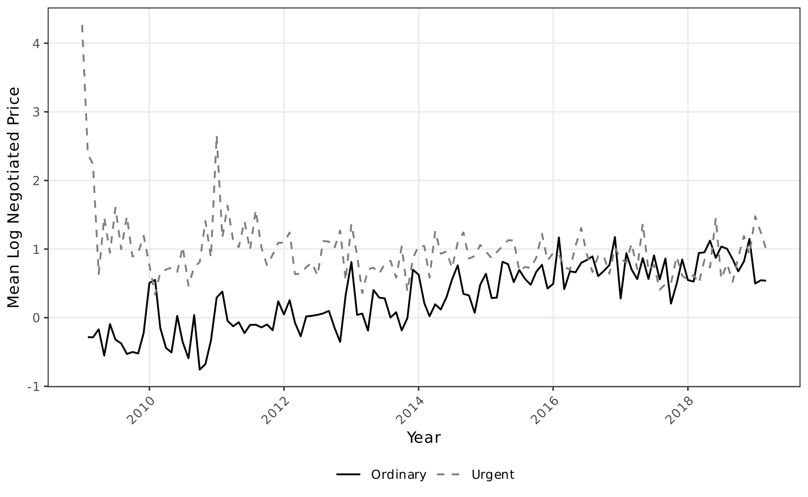
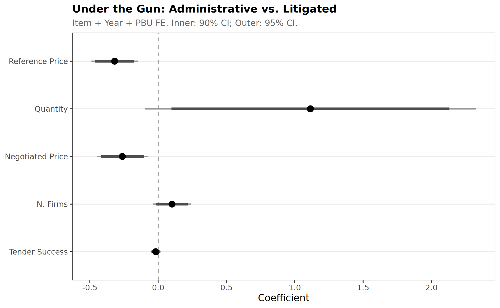
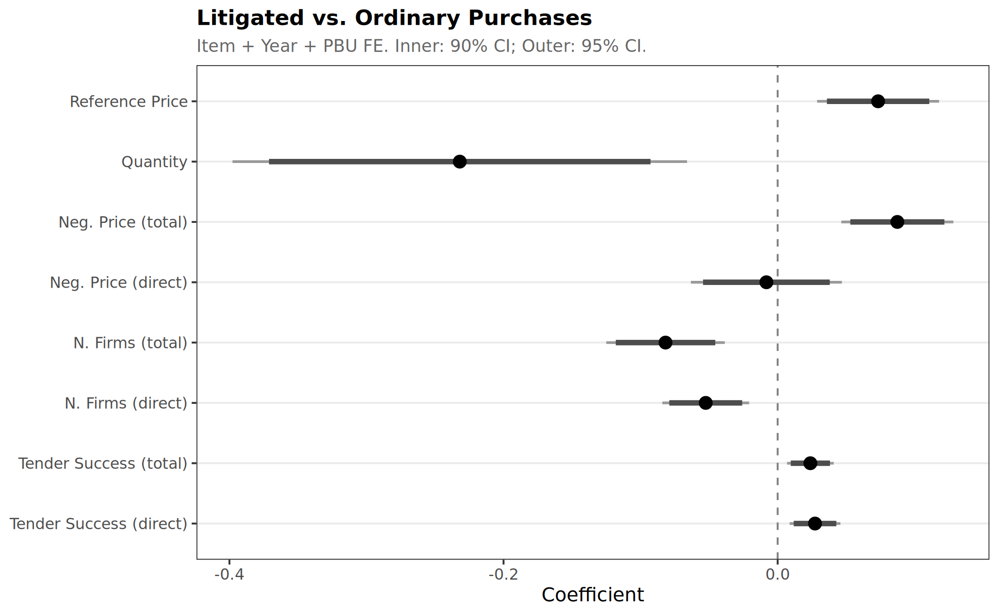

# Results

This page presents the main empirical findings from the paper, organized by the key outcomes and mechanisms. See also: [Administrative vs Ordinary](results_adm_vs_ord.md) | [Maps](maps.md) | [Changelog](changelog.md)

---

## Geographic Context

### Health Litigation Across Sao Paulo

<figure markdown>
  { width="100%" }
  <figcaption><strong>Figure 1.</strong> Health litigation cases per 1,000 inhabitants across municipalities in the state of Sao Paulo. Darker shading indicates higher litigation rates. The geographic variation in litigation intensity motivates the analysis of its procurement consequences.</figcaption>
</figure>

<figure markdown>
  { width="100%" }
  <figcaption><strong>Figure 2.</strong> Total health litigation cases by municipality. The absolute number of cases reflects both population size and litigation propensity, with the metropolitan region of Sao Paulo concentrating the largest volumes.</figcaption>
</figure>

### Procurement Infrastructure

<figure markdown>
  { width="100%" }
  <figcaption><strong>Figure 3.</strong> Public Buyer Units (PBUs) across Sao Paulo state. Each point represents a procurement office that purchases pharmaceuticals through the state's electronic platform (BEC). The 97 PBUs are distributed across the state, with concentration in the capital region.</figcaption>
</figure>

---

## Purchase Type Classification

<figure markdown>
  { width="100%" }
  <figcaption><strong>Figure 4.</strong> Types of purchases: Ordinary, Administrative, and Litigated. This figure illustrates the three-way classification of procurement events. Ordinary purchases follow standard timelines; administrative purchases are expedited but lack judicial oversight; litigated purchases are court-mandated with enforceable sanctions.</figcaption>
</figure>

---

## Main Results

### Preferred Specification: Item + Year + PBU Fixed Effects

The table below summarizes the main estimates from the preferred specification (Specification 3), which includes item, year, and public buyer unit fixed effects. Standard errors are clustered at the PBU level.

| Outcome | Coefficient | Std. Error | Effect (%) |
|:--------|:-----------:|:----------:|:----------:|
| Log Reference Price | 0.027* | (0.016) | +2.7% |
| Log Negotiated Price (total) | 0.053*** | (0.016) | +5.4% |
| Log Negotiated Price (direct) | 0.030* | (0.016) | +3.1% |
| Log Quantity | -0.058 | (0.064) | -5.6% |
| Log N. Firms (total) | -0.056*** | (0.011) | -5.5% |
| Log N. Firms (direct) | -0.042*** | (0.010) | -4.1% |
| Tender Success | 0.021*** | (0.004) | +2.1pp |

<small>**Notes:** \* p < 0.10, \*\* p < 0.05, \*\*\* p < 0.01. "Total" refers to the full-sample effect of litigated vs. ordinary purchases. "Direct" isolates the direct price effect controlling for bidder participation. Percentage effects computed as exp(beta) - 1. Tender success is in percentage points.</small>

!!! tip "Interpretation"
    Litigated purchases pay **2.7% higher reference prices** and **5.4% higher negotiated prices** than ordinary purchases for the same item, in the same year, at the same procurement office. Part of this price increase operates through reduced competition: litigated purchases attract **5.5% fewer bidding firms**.

---

### Coefficient Plot

<figure markdown>
  { width="100%" }
  <figcaption><strong>Figure 5.</strong> Coefficient estimates with 95% confidence intervals from the preferred specification (Item + Year + PBU fixed effects). Each panel shows the estimated effect of litigated procurement on a different outcome variable. The horizontal bars represent 95% confidence intervals based on PBU-clustered standard errors.</figcaption>
</figure>

---

### Price Dynamics Over Time

<figure markdown>
  { width="100%" }
  <figcaption><strong>Figure 6.</strong> Mean log negotiated price over time by purchase type. The figure plots the evolution of average (log) negotiated prices for ordinary, administrative, and litigated purchases from 2009 to 2019. The persistent gap between litigated and ordinary purchases motivates the econometric analysis.</figcaption>
</figure>

---

## The "Under the Gun" Effect

The key mechanism identified in the paper is the **"under the gun" effect**: the price premium that arises specifically from judicial sanctions, above and beyond the general urgency of the purchase.

To isolate this channel, we restrict the sample to **urgent purchases only** (administrative + litigated) and estimate the effect of the administrative indicator. Since both purchase types share urgency but only litigated purchases carry judicial sanctions, a negative coefficient on the administrative indicator means litigated purchases are more expensive.

### Under the Gun: All Outcomes (Preferred Specification)

| Outcome | Coefficient | Std. Error | Effect (%) |
|:--------|:-----------:|:----------:|:----------:|
| Log Reference Price | -0.319*** | (0.087) | -27.3% |
| Log Quantity | +1.115* | (0.618) | +205% |
| Log Neg. Price (total) | -0.262** | (0.102) | -23.0% |
| Log Neg. Price (direct) | -0.117 | (0.093) | n.s. |
| Log N. Firms (total) | +0.102 | (0.070) | n.s. |
| Tender Success | -0.018 | (0.019) | n.s. |

<small>**Notes:** \*\*\* p < 0.01, \*\* p < 0.05, \* p < 0.10. The administrative indicator is coded as 1 for administrative urgent purchases and 0 for litigated purchases. A negative coefficient indicates that litigated purchases have higher values than administrative ones. "n.s." = not statistically significant at conventional levels.</small>

!!! danger "The sanction channel operates through reference prices and quantities"
    The **23--30% negotiated price premium** from the "under the gun" effect is driven by two specific mechanisms: litigated purchases carry **27% higher reference price ceilings** (set during planning) and involve **much smaller quantities** that forgo bulk discounts. By contrast, bidder participation and tender success rates do not differ significantly between administrative and litigated purchases.

<figure markdown>
  { width="100%" }
  <figcaption><strong>Figure 7.</strong> Under the Gun: Coefficient estimates with 90% and 95% confidence intervals from the preferred specification. A negative coefficient on the administrative indicator means litigated purchases have higher values.</figcaption>
</figure>

---

## Litigated vs. Ordinary Purchases

To isolate the specific effect of **court-mandated** procurement, we compare litigated purchases directly to ordinary ones, excluding administrative purchases from the sample. This yields larger estimates than the pooled urgent analysis.

### Litigated-Only: Preferred Specification

| Outcome | Coefficient | Std. Error | Effect (%) |
|:--------|:-----------:|:----------:|:----------:|
| Log Reference Price | +0.073*** | (0.023) | +7.6% |
| Log Quantity | -0.232*** | (0.085) | -20.7% |
| Log Neg. Price (total) | +0.087*** | (0.021) | +9.1% |
| Log Neg. Price (direct) | -0.008 | (0.028) | n.s. |
| Log N. Firms (total) | -0.082*** | (0.022) | -7.9% |
| Log N. Firms (direct) | -0.053*** | (0.016) | -5.1% |
| Tender Success (total) | +0.024*** | (0.009) | +2.4pp |
| Tender Success (direct) | +0.027*** | (0.009) | +2.8pp |

<small>**Notes:** \*\*\* p < 0.01. Sample restricted to litigated and ordinary purchases only (excluding administrative). Effects computed as exp(beta) - 1. Tender success in percentage points.</small>

!!! tip "Litigated purchases drive the bulk of enforcement costs"
    Comparing litigated directly to ordinary purchases yields **larger effects** than the pooled analysis across all outcomes: reference prices +7.6% (vs. 2.7%), negotiated prices +9.1% (vs. 5.4%), and bidder participation -7.9% (vs. -5.5%). The entire negotiated price premium operates through the **quantity channel**: controlling for quantity, the direct effect is essentially zero.

<figure markdown>
  { width="100%" }
  <figcaption><strong>Figure 8.</strong> Litigated vs. Ordinary: Coefficient estimates with 90% and 95% confidence intervals from the preferred specification. "Total" = treatment variable only; "Direct" = additionally controlling for log quantity.</figcaption>
</figure>

---

## Heterogeneity

The paper documents significant heterogeneous effects across several dimensions:

=== "SUS Component"

    Effects are concentrated in **basic SUS items** (essential medicines). For specialized or high-value items, the litigated premium is smaller, possibly because reference prices for these items are already high and less sensitive to procurement pressure.

=== "Time Period"

    The price premium is larger in the **later period (2014--2019)**, consistent with the expansion of health litigation in Brazil and increasing pressure on procurement officials over time.

=== "Market Competition"

    Effects are strongest in **low-competition markets** (items with below-median numbers of bidders). When few firms compete, the reduction in bidder participation induced by judicial urgency has a larger impact on prices.

=== "PBU Size"

    Both large and small procurement offices are affected, but the mechanisms differ. Larger PBUs may have more institutional capacity to manage judicial orders, while smaller ones face more acute resource constraints.

---

## Summary of Channels

The results can be decomposed into two main channels through which judicial mandates increase procurement costs:

1. **Competition channel:** Litigated purchases attract fewer bidders (-5.5%), reducing competitive pressure and leading to higher prices. This channel accounts for the difference between the "total" and "direct" price effects.

2. **Sanction channel ("under the gun"):** Even controlling for reduced competition, the threat of judicial sanctions induces procurement officials to accept higher prices. This is the dominant channel, accounting for the 23--30% premium identified in the urgent-subsample analysis.
