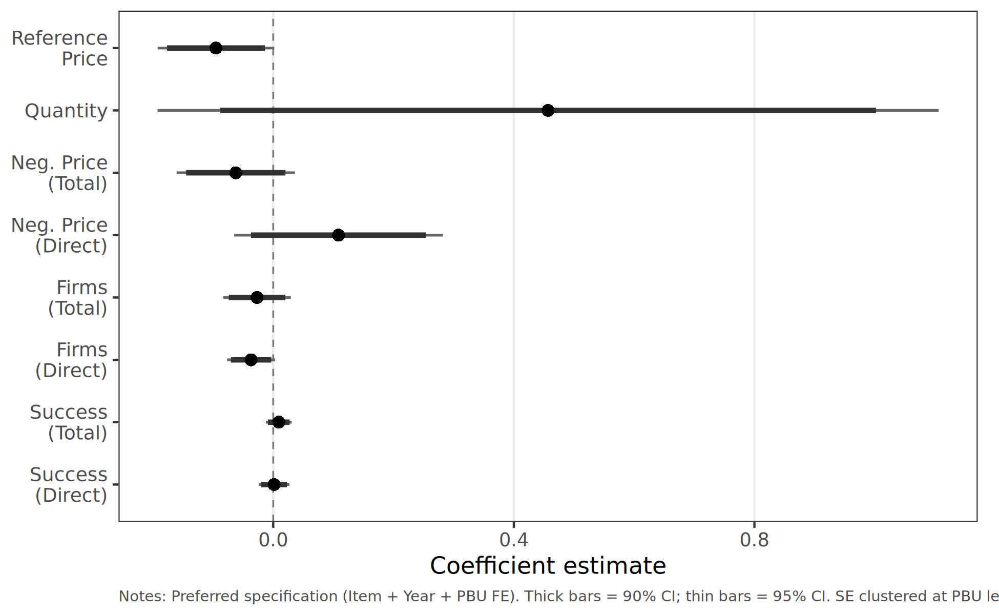

# Administrative vs Ordinary Purchases

## Overview

This analysis compares **administrative** purchases (urgency without judicial sanctions) to **ordinary** purchases, excluding litigated purchases entirely. The sample includes items with both administrative and ordinary purchase types (196,988 observations; 168,814 winners).

## Key Results (Preferred Specification: Item + Year + PBU FE)

| Outcome | Coefficient | % Effect | Significance |
|---------|:-----------:|:--------:|:------------:|
| Reference Price | -0.095 | -9.1% | * |
| Quantity | +0.457 | +57.9% | n.s. |
| Neg. Price (Total) | -0.062 | -6.0% | n.s. |
| Neg. Price (Direct) | +0.109 | +11.5% | n.s. |
| Firms (Total) | -0.027 | -2.6% | n.s. |
| Firms (Direct) | -0.037 | -3.6% | * |
| Success (Total) | +0.009 | +0.9 pp | n.s. |
| Success (Direct) | +0.001 | +0.1 pp | n.s. |

!!! info "Interpretation"
    Administrative purchases carry **lower** reference prices than ordinary purchases (-9.1%, p < 0.10), a striking contrast with litigated purchases which carry +7.6% higher prices. Most other effects are imprecisely estimated. This confirms that administrative purchases occupy an **intermediate position**: they share urgency constraints but lack the price-inflating effects of judicial sanctions.

## Coefficient Plot

*Preferred specification (Item + Year + PBU FE). Thick bars = 90% CI; thin bars = 95% CI. SE clustered at PBU level.*

## Comparison Across All Groups

| Outcome | Urgent vs Ord | Litigated vs Ord | Admin vs Ord | UTG (Admin vs Lit) |
|---------|:------------:|:---------------:|:------------:|:-----------------:|
| Ref. Price | +2.7%* | +7.6%** | **-9.1%*** | -27.3%*** |
| Neg. Price (Total) | +5.4%*** | +9.1%*** | -6.0% | -30.0%** |
| Firms (Total) | -5.5%*** | -7.9%*** | -2.6% | n.s. |
| Success | +2.1pp*** | +2.4pp*** | +0.9pp | n.s. |

!!! success "Key Takeaway"
    The gradient of effects across comparison groups—largest for litigated vs ordinary, moderate for urgent (pooled), and **reversed** for admin vs ordinary—confirms that **judicial sanctions, not urgency per se**, drive the procurement cost premium.

---

[:material-arrow-left: Back to Bitter Pills Summary](index.md) · [:material-book-open-variant: Back to Research](../working-papers.md)
