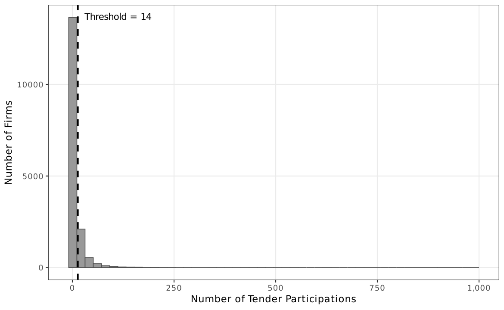

!!! warning "Superseded numbers — canonical-target re-estimation (June 4, 2026)"
    This analysis note documents a historical run under the earlier validation label.
    On June 4, 2026 the paper adopted a reproducible, non-circular target (651
    always-loser cobidders; frequent-loser flag never used in the label) and
    re-estimated every result. Where this page conflicts with the
    [paper](../paper.pdf) or the [changelog](../changelog.md), **the paper wins**.

# AN-002: IQR threshold and FL14 cutoff stability

!!! abstract "Intuition (plain-language)"
    Where does "a few losses" end and "frequent loser" begin? Drawing the line by hand invites cherry-picking, so the paper fixes it with a mechanical quantile rule (median + 1.5 × IQR → FL14, 2,735 firms). The economic question is whether the signal is fragile at that line. It is not: discrimination sits at AUC 0.924 on a wide plateau, and the tighter Tukey cutoff (1,981 firms) actually loses power (0.834). The rule is defensible precisely because the result does not hinge on the exact threshold — the underlying object is continuous loser-side concentration, not a magic number.

## Question

How does the cobidder AUC change as the IQR threshold is varied, and is
the median + 1.5 × IQR cutoff distinguishable from alternatives? The
paper deliberately uses `median + 1.5 × IQR`, not the standard Tukey
`Q3 + 1.5 × IQR`.

## Design

- **Sample**: always-loser firms in BEC 2009–2019 (16,843 firms).
- **Alternative cutoffs evaluated**:
  - *Paper convention*: median + 1.5 × IQR (FL14; integer cutoff = 14;
    2,735 firms);
  - *Tukey*: Q3 + 1.5 × IQR (1,981 firms);
  - *Continuous*: log(1 + tenders_count) (no cutoff).
- **Outcome**: AUC against the cobidder set
  ([AN-003](an-003-cade-bec-linkage.md)).

## Results

| Cutoff rule | N firms above cutoff | AUC | 95% CI |
|---|---:|---:|---|
| FL14 (median + 1.5 × IQR — paper) | 2,735 | 0.924 | [0.921, 0.926] |
| Tukey Q3 + 1.5 × IQR | 1,981 | 0.834 | [0.804, 0.863] |
| Continuous log(1 + tenders_count) | — | 0.939 | [0.932, 0.946] |

Output: `output/threshold_table_q3iqr/threshold_table_q3iqr.csv`. Macros:
`\valAUCFLfirm` (FL14), `\valAUCQThreeIQR` (Tukey),
`\valAUClogtc` (continuous).

*Figure: the FL14 cutoff (median + 1.5 × IQR = 13.5) plotted against
the tenders_count distribution. The Tukey alternative (Q3 + 1.5 × IQR)
is also marked for reference. The paper's choice sits between the
naive median and the conservative Tukey rule.*

## Interpretation

The paper's median + 1.5 × IQR cutoff (FL14) sits between the very tight
Tukey rule and the continuous score. The auditable binary loses ~0.015 in
AUC relative to the continuous score, and the tighter Tukey rule loses
~0.09. The choice of FL14 is a deliberate operational trade-off:
auditable, easy to monitor, but not the maximum-discrimination
specification. The continuous score is documented in
[AN-011](an-011-horse-race-continuous.md) and
[AN-017](an-017-gate-d3.md) as the dominating informational primitive.

## Follow-ups

- Sub-period sensitivity (early vs late panel).
- Cross-modality sensitivity ([AN-016](an-016-gate-d2.md)).
- Theory-operationalization audit comparing FL14, FL10, FL20, percentile
  rank ([AN-023](an-023-theory-operationalization-audit.md)).
