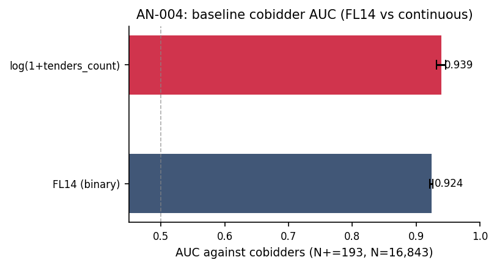

# AN-004: Baseline cobidder concentration in FL14 stratum

!!! abstract "Intuition (plain-language)"
    Do the firms the screen flags actually cluster on the loser side of adjudicated cartels? Yes — FL14 separates cobidders from other always-losers at AUC 0.924, and the continuous score reaches 0.939 (0.5 is a coin flip). Economically, this says the loser-side concentration a cartel needs in order to fake competition is visible in cheap award records alone, with no bid microdata. This is the headline; everything after it is an attempt to break it with placebos, leakage audits, and timing discipline.

## Question

Does the FL14 stratum contain a disproportionate share of CADE-
adjudication-anchored cobidders relative to the always-loser baseline?
This is the headline-baseline triage result.

## Design

- **Sample**: 16,843 always-loser firms in BEC 2009–2019.
- **Outcome**: cobidder indicator (1 if firm is in the 193-firm
  cobidder set from [AN-003](an-003-cade-bec-linkage.md)).
- **Specifications**:
  - FL14 binary: AUC of the FL14 indicator.
  - Continuous: AUC of `log(1 + tenders_count)`.
- **Evaluation**: in-sample baseline; discipline applied separately in
  [AN-005](an-005-sham-fl-permutation.md),
  [AN-006](an-006-strict-prospective-holdout.md),
  [AN-013](an-013-precision-at-k-audit.md), and
  [AN-014](an-014-leakage-audit-d3.md).

## Results

| Score | AUC | 95% CI |
|---|---:|---|
| FL14 (binary) | **0.924** | [0.921, 0.926] |
| log(1 + tenders_count) (continuous) | **0.939** | [0.932, 0.946] |

Macros: `\valAUCFLfirm`, `\valAUCFLfirmCI`, `\valAUClogtc`,
`\valAUClogtcCI`.

*Figure: baseline cobidder AUC for FL14 binary (0.924, [0.921, 0.926])
and continuous log(1+tenders_count) (0.939, [0.932, 0.946]). Both
substantially above the random benchmark (0.5).*

The cobidder share inside FL14 is 7.1% (`\valCobidShareFL`), against a
baseline always-loser cobidder rate that is much lower. This corresponds
to the headline 131/193 cobidder recovery in the gatekeeping setup
([AN-012](an-012-operational-metrics.md)).

## Interpretation

Both the binary and continuous variants concentrate cobidders well
inside the always-loser pool. The continuous score is the dominating
ranking ([AN-011](an-011-horse-race-continuous.md)); FL14 is the
auditable implementation. The baseline numbers are inflated relative to
operational deployment — the disciplined columns in
[AN-013](an-013-precision-at-k-audit.md) and
[AN-014](an-014-leakage-audit-d3.md) are the right operational reading.

## Follow-ups

- Decomposition by adjudication-anchor sub-period.
- Modal-by-modal decomposition ([AN-016](an-016-gate-d2.md)).
- Strict-train-period replication
  ([AN-006](an-006-strict-prospective-holdout.md)).
