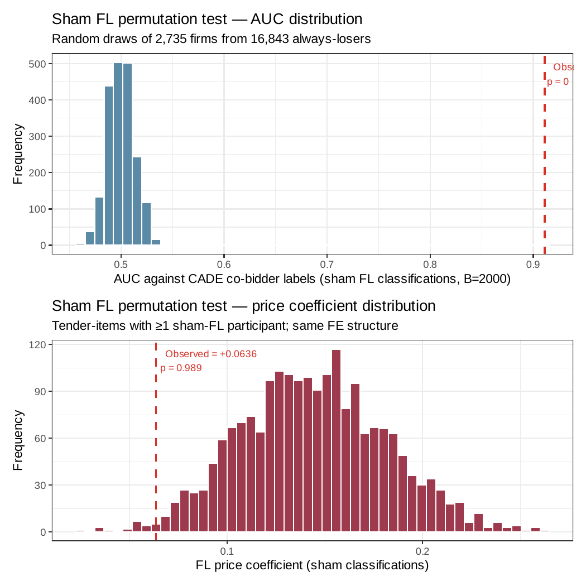

!!! warning "Superseded numbers — canonical-target re-estimation (June 4, 2026)"
    This analysis note documents a historical run under the earlier validation label.
    On June 4, 2026 the paper adopted a reproducible, non-circular target (651
    always-loser cobidders; frequent-loser flag never used in the label) and
    re-estimated every result. Where this page conflicts with the
    [paper](../paper.pdf) or the [changelog](../changelog.md), **the paper wins**.

# AN-005: Sham FL permutation — formal test against the volume-only null

!!! abstract "Intuition (plain-language)"
    The skeptic's first move: the screen just ranks high-volume firms — firms that bid a lot mechanically bump into cartels by sharing products, buyers, and years. To isolate loser-side concentration from raw volume, a placebo reshuffles cobidder labels 2,000 times while holding each firm's bid count fixed. The reshuffled null sits at AUC 0.500; the observed ranking (0.924) clears the entire null distribution (max draw 0.547). Volume-matched reshuffling cannot manufacture the concentration — the footprint is about *losing*, not just *bidding*. This separates a genuine signal from the opportunity arithmetic of exposure.

## Question

Does cobidder concentration in the FL14 stratum survive a participation-
volume-matched placebo? If the result were driven by raw participation
volume rather than a signal-carrying loser-side footprint, permuting the
FL label while preserving the marginal `tenders_count` distribution
should reproduce the observed concentration. The formal test asks: how
many SDs is the observed AUC above the sham null distribution?

## Design

- **Sample**: 16,843 always-loser firms in BEC 2009–2019.
- **Sham construction**: random reassignment of the `FL14` label among
  always-losers preserving the marginal distribution of `tenders_count`
  (volume-matched).
- **Bootstrap depth**: B = 2,000 permutations.
- **Test statistic**: AUC against cobidder labels.
- **Permutation p-value**: share of sham AUCs ≥ observed.
- **Auxiliary**: same B sham draws also compute the price coefficient
  on FL14 presence (for the scope, not damages, reading).

## Results

### Formal sham AUC distribution (B = 2,000)

| Statistic | Value |
|---|---:|
| Observed FL14 AUC | **0.924** |
| Sham mean | 0.500 |
| Sham SD | 0.013 |
| Sham q05 | 0.479 |
| Sham q50 (median) | 0.500 |
| Sham q95 | 0.521 |
| Sham q99 | 0.531 |
| Sham max | 0.547 |
| Permutation p-value | **0** (< 1/2,000) |
| Clears null at 99% | TRUE |

The observed AUC of 0.924 sits above the entire sham distribution. Among
2,000 volume-matched random reassignments, zero permutations reached even
0.55. The volume-only null does not reproduce the observed concentration:
the ranking separates a genuine loser-side signal from the opportunity
arithmetic of exposure.

### Price coefficient under the same sham (auxiliary)

| Statistic | Value |
|---|---:|
| Observed FL14 price coefficient | +0.064 |
| Sham mean | +0.144 |
| Sham SD | 0.037 |
| Sham q95 | +0.207 |
| Sham q99 | +0.232 |
| Permutation p-value | 0.989 |
| Reject null at 99% | FALSE |

The price coefficient does NOT clear the volume-only null — the sham
mean (+0.144) is actually larger than the observed (+0.064). This is
the second piece of the **scope, not damages** reading
([H:price-scope-sign-reversal](../hypotheses/price-scope-sign-reversal.md)):
the price effect at the FL margin is scope information, not a damages or
overcharge parameter, and is not the part of the result that demands
explanation; the AUC concentration is.

### Complementary CADE-label permutation

The `cade_permutation.csv` file (separate test, different randomization
scheme — permuting CADE labels rather than FL labels, and reporting an
AUC pre/post band rather than a single distribution) gives a
complementary band of 0.713–0.783 (`\valAUCprePostCI`). This is also
substantially below the observed 0.924. The two placebos test slightly
different artifacts (volume preservation vs CADE-anchor preservation)
and both reject decisively.

Sources: `output/sham_fl/sham_summary.csv` (formal AUC + price test),
`output/sham_fl/sham_auc_distribution.csv` (B = 2,000 draws),
`output/sham_fl/cade_permutation.csv` (CADE-label permutation).

*Figure: B = 2,000 sham FL permutation draws. The AUC distribution
(left) is tightly centered on 0.500 (SD = 0.013, max = 0.547); the
observed 0.924 sits above the entire null distribution. The price-
coefficient distribution (right) is wider and asymmetric, with sham
mean +0.144 — larger than the observed +0.064 — explaining why the
price-coefficient placebo is NOT cleared under the same draws (the
scope, not damages, reading).*

## Interpretation

**Volume-matched reshuffling does not reproduce the concentration.** Two
independent permutation procedures both fail to reproduce the observed
concentration from volume alone:

- Sham FL permutation: B = 2,000 draws, sham mean 0.500, observed 0.924.
  The observed AUC sits above the entire null distribution.
  Permutation p-value = 0.
- CADE-label permutation: pre/post band 0.713–0.783, observed 0.924.

The asymmetry between the AUC result (null cleared) and the price
coefficient (null not cleared, sham mean larger than observed) is the
honest reading of what the screen does and does not measure: it ranks
cobidders by participation pattern at a level volume-matched reshuffling
cannot match — a genuine signal separated from the opportunity arithmetic
of exposure — but the price reading is descriptive scope information,
not a damages parameter.

This is the **load-bearing audit** for [H:exposure-discipline](../hypotheses/exposure-discipline.md):
the observed AUC cannot come from volume + chance.

## Follow-ups

- Stratified sham permutation by modality (Convite vs Pregão sub-pools).
- Sham permutation on the strict-train sample
  ([AN-006](an-006-strict-prospective-holdout.md)) to test joint
  volume + timing artifact.
- Bootstrap the observed 0.924 to compare its SD to the sham SD
  directly (sham SD = 0.013; bootstrap of observed should also be tight
  — the bound is the SE of an AUC near 1.0).
- Add macros `\valShamMean`, `\valShamSD`, `\valShamQ99`, `\valShamP`
  to the `scripts/99_make_paper_values.R` pipeline.
