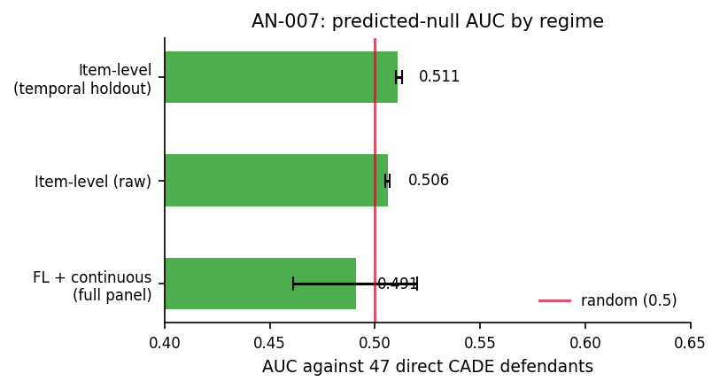

# AN-007: AUC against direct CADE defendants

## Question

Does the FL score discriminate direct CADE defendants? Under the loser-
side scope interpretation, it should not — the score is built over zero-
win firms and cannot rank designated winners. A null AUC is the
predicted finding.

## Design

- **Sample**: all BEC firms (not restricted to always-losers).
- **Positive label**: 47 direct CADE defendants
  ([AN-003](an-003-cade-bec-linkage.md)).
- **Specifications**: AUC of FL14 (binary) and `log(1+tenders_count)`.
- **Identification**: scope-check placebo; the null is the predicted
  finding.

## Results

| Score against direct defendants | AUC | 95% CI |
|---|---:|---|
| FL14 + continuous (combined) | **0.491** | [0.461, 0.520] |
| Item-level (raw) | 0.506 | (close to random) |
| Item-level under temporal holdout | 0.511 | [0.510, 0.513] |

Macros: `\valAUCdirectCADE`, `\valAUCdirectCADECI`,
`\valAUCitemDirect`, `\valAUCItemDirectTemp`.

D4 gate ([AN-018](an-018-gate-d4.md)) corroborates the null
mechanistically: 7 of 47 direct defendants (14.9%) are always-losers;
their median win rate is 0.261 vs 0.086 for the cobidder set.

*Figure: AUC against 47 direct CADE defendants across three regimes —
full panel (0.491, [0.461, 0.520]), item-level raw (0.506), item-level
under temporal holdout (0.511). All within sampling distance of 0.5
(red line). The null is regime-invariant.*

## Interpretation

The result is exactly what the loser-side scope predicts. Direct
defendants are winner-heavy by construction — the rank cannot cover
them, and it shouldn't. This is the **anti-claim** that disciplines the
rest of the paper: it rules out the generic-cartel-detector reading and
pins the interpretation to loser-side adjacency. The 95% CI includes
0.5; the null survives every audit variant
([AN-014](an-014-leakage-audit-d3.md): 0.506 raw, 0.511 temporal).

The result is load-bearing for the framing in §4.3 of the
[manuscript](../paper.md) and confirmed by the auxiliary D4 diagnostic
([AN-018](an-018-gate-d4.md)).

## Follow-ups

- Decomposition of direct defendants by role (declared winner,
  coordinator, other) and AUC by role.
- Sensitivity to alternative direct-defendant labels (e.g., extended
  CADE case set).
- Triangulation with the unified mechanism profile
  ([AN-024](an-024-unified-mechanism.md)).
