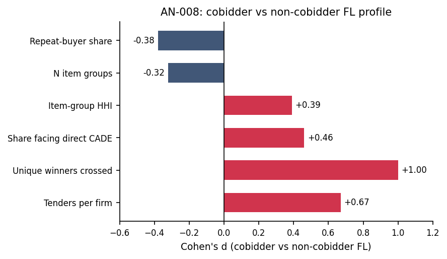

# AN-008: Cobidder buyer breadth and operational footprint

!!! abstract "Intuition (plain-language)"
    Inside the frequent-loser group, are cobidders distinguishable from other frequent losers, or do they look the same? Cobidders bid in twice as many tenders, cross twice as many unique winners, and concentrate in tighter product portfolios. The profile is what one would expect if cobidders are *deployed* against many tenders deliberately, rather than just bidding broadly by chance.

## Question

Within the FL14 stratum, how do cobidders differ from non-cobidder FLs
along buyer breadth and operational footprint? The test is within-
stratum, controlling for tenders_count.

## Design

- **Sample**: FL14 stratum (always-losers above the IQR cutoff).
- **Cobidder vs non-cobidder-FL** split.
- **Outcomes**: mean tenders per firm, unique winners crossed, number of
  buyer-product groups, repeat-buyer share.
- **Effect sizes**: standardized Cohen's d alongside raw means.

## Results

| Metric | Cobidders | Non-cobidder FL | Cohen's d |
|---|---:|---:|---:|
| Mean tenders per firm | 136.5 | 76.7 | +0.67 |
| Unique winners crossed | 24.8 | 13.5 | +1.00 |
| Share with a direct-defendant counterpart | 1.5% | 0.2% | +0.46 |
| Number of buyer-product groups | 7.6 | 9.5 | −0.32 |
| Repeat-buyer share | 21.6% | 33.4% | −0.38 |

Macros: `\valBridgeTendCob`, `\valBridgeTendFLnc`, `\valBridgeTendD`,
`\valBridgeUniqWinCob`, `\valBridgeUniqWinFLnc`, `\valBridgeUniqWinD`,
`\valBridgeDirectCob`, `\valBridgeDirectFLnc`, `\valBridgeNGroupsCob`,
`\valBridgeNGroupsFLnc`, `\valBridgeRepeatShareCob`,
`\valBridgeRepeatShareFLnc`.

*Figure: Cohen's d of cobidders vs non-cobidder FLs across six profile
dimensions. Positive (red): cobidders higher on tenders, unique
winners crossed, share facing direct CADE, item-group HHI. Negative
(navy): cobidders lower on n item groups and repeat-buyer share.
Within-FL14 distinctness is robust across multiple dimensions.*

## Interpretation

Inside the FL14 stratum, cobidders are deployed more broadly (more
tenders, more unique winners crossed) but in tighter focal portfolios
(fewer buyer-product groups, lower repeat-buyer share). The pattern is
consistent with cover-bidding deployment — broad coverage across the
tenders where the cartel operates, concentrated in a few product
verticals — and not with random high-volume losing. The Cohen's d
magnitudes (0.3–1.0) are large in social-science terms.

This is descriptive, not diagnostic: the profile is *consistent with*
credible losing roles, not proof of them. The proof-producing stage
remains the bid layer ([AN-010](an-010-imhof-full-pipeline.md)).

## Follow-ups

- Sub-period stability of profile.
- Triangulation with network proximity
  ([AN-009](an-009-network-hhi.md)) and unified-mechanism quadrants
  ([AN-024](an-024-unified-mechanism.md)).
- Heterogeneity by procurement modality.
