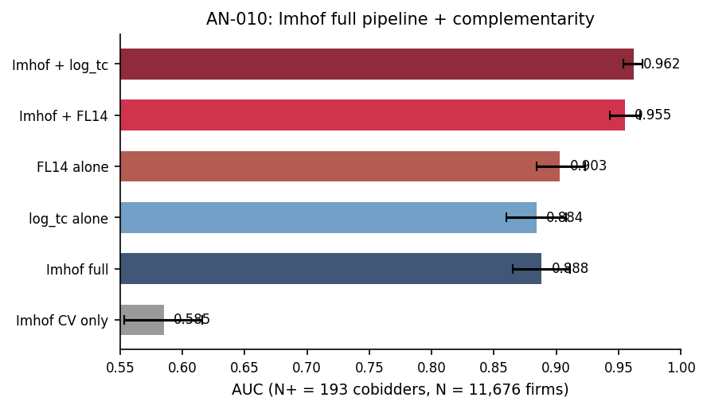

# AN-010: Imhof full pipeline benchmark

!!! abstract "Intuition (plain-language)"
    The standard cartel-screening tool in the literature is the Imhof–Wallimann pipeline, which uses seven features from each tender's full bid history (requires expensive bid microdata). We compare it head-to-head with our cheap award-layer screen: each alone gives AUC ~0.89–0.90. Combined, they reach 0.96. The two layers carry complementary, non-redundant information — not the same signal twice.

## Question

How does the seven-feature Imhof–Wallimann bid-distribution pipeline
perform on the cobidder target, and what is the increment from adding
the award-layer score? The joint score is the full-observability upper
bound.

## Design

- **Sample**: pool of 16,779 firms with both award and bid features
  available in BEC 2009–2019.
- **Specifications**:
  - *Imhof CV-only*: within-tender bid coefficient of variation.
  - *Imhof full pipeline*: seven-feature bid-distribution set.
  - *FL14 alone*: binary award-layer indicator.
  - *log_tc alone*: continuous award-layer score.
  - *Joint (Imhof + FL14)*: stacked features.
  - *Joint (Imhof + log_tc)*: stacked with continuous.
- **Outcome**: AUC against the cobidder target; DeLong test for
  pairwise AUC differences
  \citep{imhof2018screening,imhof2019detecting,wallimann2023machine}.

## Results

| Specification | AUC | 95% CI |
|---|---:|---|
| Imhof CV-only | 0.585 | [0.553, 0.616] |
| Imhof full pipeline | **0.888** | [0.865, 0.911] |
| FL14 alone (binary) | 0.903 | [0.884, 0.923] |
| log_tc alone (continuous) | 0.884 | [0.860, 0.908] |
| **Joint Imhof + FL14** | **0.955** | [0.943, 0.967] |
| Joint Imhof + log_tc | 0.962 | [0.954, 0.969] |

Macros: `\valAUCImhofCV`, `\valAUCImhofFull`, `\valImhofFLBin`,
`\valImhofFLcont`, `\valImhofComboBin`, `\valImhofComboCont`,
`\valImhofPoolN`.

Increment magnitudes
([AN-015](an-015-gate-d1.md), [AN-049 ref] script 49):
`\valAUCFLvsImhofDelta` = 0.035 (FL14 vs Imhof full, p = 0.014);
`\valAUCImhofPlusFLDelta` = 0.096 (Imhof + FL14 vs Imhof full).

*Figure: AUC across the six specifications on the joint sample
(N = 11,676; 193 cobidders). Imhof CV-only is chance-level (0.585);
Imhof full pipeline 0.888; FL14 alone 0.903; joint (Imhof + FL14)
0.955; joint (Imhof + log_tc) 0.962. The award-layer + bid-layer
complementarity adds ~0.07 over either alone.*

## Interpretation

The Imhof full pipeline is comparable to FL14 alone (0.888 vs 0.903),
not dominated by it. The headline is **complementarity**: the joint
score adds roughly 0.05–0.07 AUC over either layer individually. The
two information layers operate at different evidentiary stages —
award-layer triages, bid-layer evaluates — and their union is the
full-observability upper bound.

The pure bid-only CV reading (0.585) is chance-level alone; what makes
the Imhof pipeline informative is the inclusion of participation
features. The award-layer signal is therefore not redundant; it is
necessary for the bid-distribution pipeline to reach AUC 0.888 in the
first place.

This is the cost-of-evidence framing of §6:
[AN-012](an-012-operational-metrics.md) reports the operational
gatekeeping numbers; the joint score is the counterfactual that
gatekeeping approximates at lower cost.

## Follow-ups

- Decomposition of the 0.05–0.07 increment by Imhof feature.
- Modal-by-modal increment ([AN-016](an-016-gate-d2.md)).
- Robustness to alternative bid-distribution feature sets.
