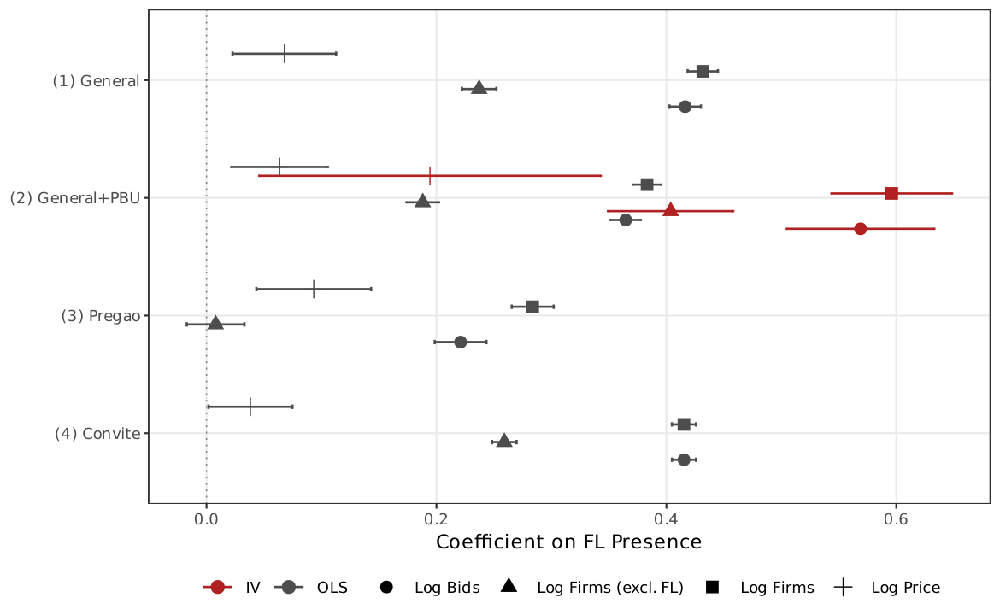

# AN-011: Horse race — continuous vs binary FL

!!! abstract "Intuition (plain-language)"
    The screen comes in two forms — a binary flag (bid count above the cutoff) and the continuous log of bid count. The continuous score carries strictly more information and statistically dominates the binary (0.939 vs 0.924; DeLong p ≈ 10⁻⁵). The reading: the empirical primitive is loss *intensity*, a continuous quantity; FL14 is just the auditable on/off rule a regulator can defend in the field. The binary is for deployment, the continuous is for the underlying truth.

## Question

Does the continuous `log(1 + tenders_count)` dominate the binary `FL14`
on the cobidder target? The binary rule is auditable but the continuous
score carries the full information.

## Design

- **Sample**: harmonized same-sample set in BEC 2009–2019; N = 1,653,658
  item-firm observations.
- **Specifications**: AUC of `FL14` (binary) vs
  `log(1 + tenders_count)` (continuous).
- **Statistical test**: DeLong AUC-difference test on paired
  predictions.
- **Auxiliary**: price coefficients in three configurations (FL14
  alone, continuous alone, joint).

## Results

| Score | AUC | 95% CI |
|---|---:|---|
| FL14 (binary) | 0.924 | [0.921, 0.926] |
| Continuous log(1+tenders_count) | **0.939** | [0.932, 0.946] |

DeLong test: continuous dominates the binary flag (Z = −4.38, p = 1.2 × 10⁻⁵); the gap is 0.015 under the corrected FL14 (≥ 14) definition. The D1 re-run (2026-05-25) confirmed the direction; the earlier Z = −4.30 / p = 2 × 10⁻⁵ were computed under the superseded (> 14, i.e. FL15) cut.

Auxiliary price coefficients (item × year × PBU FE):

| Specification | FL coef | SE | Continuous coef | SE |
|---|---:|---:|---:|---:|
| FL14 binary alone | +0.0653*** | 0.0216 | — | — |
| Continuous alone | — | — | +0.0188*** | 0.0055 |
| Joint | −0.0746* | 0.0383 | +0.0349*** | 0.0108 |

Macros: `\valAUCFLfirm`, `\valAUClogtc`, `\valDeLongZ`, `\valDeLongP`,
`\valHorseFLOne`, `\valHorseFLOneSE`, `\valHorseContTwo`,
`\valHorseFLThree`, `\valHorseContThree`.

*Figure: AUC point estimates with 95% CIs for the FL14 binary flag and
continuous log(1+tenders_count). Continuous dominates; FL14 is the
deployable simplification. Point estimates from the D1 re-run
(2026-05-25); see the table above.*

## Interpretation

The continuous score dominates the binary at p < 10⁻⁴. FL14 is the
auditable deployable rule; the true signal is the continuous loss
intensity. This is the result that motivated the locked rule of
engagement: "loser-side concentration" is the concept; "frequent
losers" is the operational implementation. The paper's `FL14` cutoff is
not defended as ontologically special — it is the operational
auditable layer over the continuous primitive.

In the joint price regression, the FL14 coefficient flips negative
once the continuous score is included — the binary picks up a
truncation-induced residual that the continuous score absorbs. This
sign reversal is part of the price-scope evidence
([AN-019](an-019-rdd-cap-price.md),
[H:price-scope-sign-reversal](../hypotheses/price-scope-sign-reversal.md)).

## Follow-ups

- Same horse race on temporal-holdout sample
  ([AN-006](an-006-strict-prospective-holdout.md)).
- Alternative continuous transformations (rank, percentile).
- Modal-by-modal horse race
  ([AN-016](an-016-gate-d2.md)).
