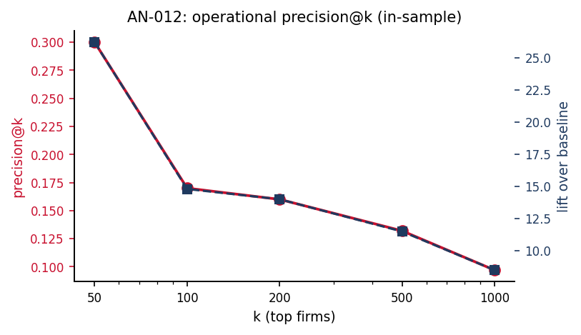

# AN-012: Operational metrics — in-sample precision@k

!!! abstract "Intuition (plain-language)"
    How well does the screen perform if a regulator uses it to draw up a ranked enforcement priority list? Out of the top 500 flagged firms, 13% are cobidders — 11× the baseline rate. The screen meaningfully concentrates investigative attention. Caveat: these are in-sample numbers and inflated; the next page disciplines them with temporal holdout.

## Question

What are the in-sample precision@k and lift metrics for the FL ranking
used as a forensic gatekeeper? These are the upper-bound numbers that
the temporal-holdout audit ([AN-013](an-013-precision-at-k-audit.md))
disciplines.

## Design

- **Sample**: 16,843 always-losers in BEC 2009–2019.
- **Positive class**: 193 cobidders ([AN-003](an-003-cade-bec-linkage.md)).
- **Metrics**:
  - *precision@k*: share of cobidders in top-k.
  - *recall@k*: share of total cobidders captured.
  - *lift*: precision@k / baseline cobidder rate.

## Results

| k | precision@k | recall@k | lift |
|---:|---:|---:|---:|
| 50 | 0.300 | 0.078 | 26.2× |
| 100 | 0.170 | 0.088 | 14.8× |
| 200 | 0.160 | 0.207 | 14.0× |
| 500 | **0.132** | 0.342 | 11.5× |
| 1000 | 0.097 | 0.503 | 8.5× |

Pool-reduction headline: at the FL14 cutoff (2,735 firms), the
bid-microdata pool needed for the forensic stage drops by approximately
**83%** while recovering 131 of 193 cobidders (~68%).

Macros: `\valPrecInSFifty`, `\valPrecInSHund`, `\valPrecInSTwofh`,
`\valPrecInSFivehu`, `\valPrecInSOnek`, plus the matching `\valRecInS*`
and `\valLiftInS*` series.

*Figure: in-sample precision@k (red, left axis) and lift (navy, right
axis) for k = 50, 100, 200, 500, 1000. Both decline monotonically as k
expands the top-k pool with non-cobidders. The lift line shows the
multiple over baseline cobidder rate.*

## Interpretation

The in-sample numbers are the upper bound: ~13% of the top-500
flagged-firms are cobidders, ~11× the baseline rate. As operating
metrics, however, these are inflated — see
[AN-013](an-013-precision-at-k-audit.md) for the temporal-holdout
column. The operational headline of the paper relies on the audited
numbers, not these.

The 83% pool-reduction figure is robust (it is a property of the
ranking + cutoff, not of the evaluation regime); the precision
calibration changes between in-sample and audited regimes.

## Follow-ups

- Sensitivity to k (especially around the FL14 cutoff at k ≈ 2,735).
- Operational headcount: at k = 500, the gatekeeper flags
  `\valOpFlaggedFiveHund` = 35 cobidders, a manageable forensic
  workload.
- Compare with the joint-scoring upper bound
  ([AN-010](an-010-imhof-full-pipeline.md)).
