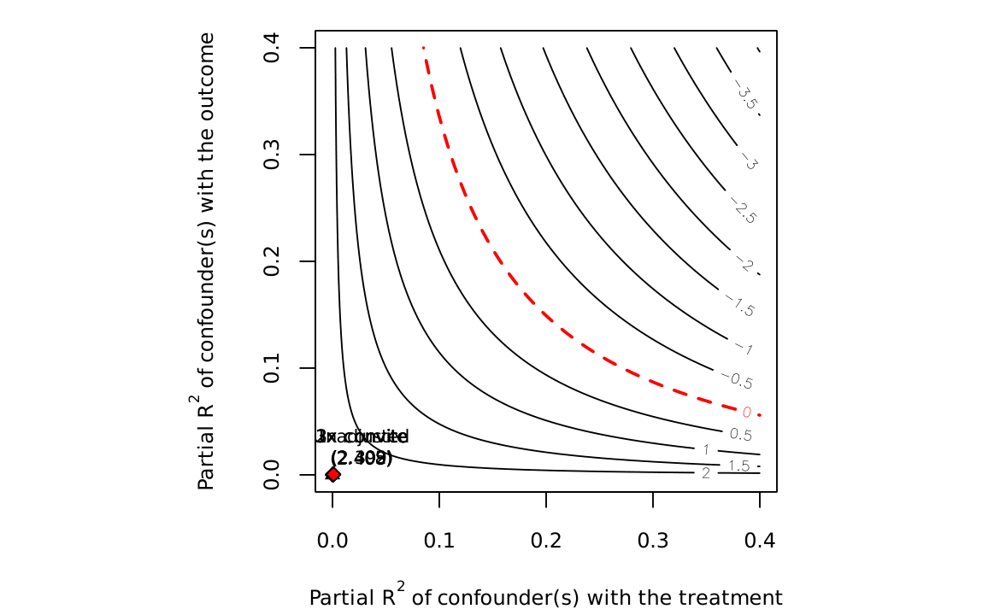

!!! warning "Superseded numbers — canonical-target re-estimation (June 4, 2026)"
    This analysis note documents a historical run under the earlier validation label.
    On June 4, 2026 the paper adopted a reproducible, non-circular target (651
    always-loser cobidders; frequent-loser flag never used in the label) and
    re-estimated every result. Where this page conflicts with the
    [paper](../paper.pdf) or the [changelog](../changelog.md), **the paper wins**.

# AN-014: Leakage audit (D3 diagnostic)

!!! abstract "Intuition (plain-language)"
    When a screen is built and scored on the same items, structural reuse can inflate performance ("leakage"). We tighten the evaluation in three steps: raw item-level (0.995), out-of-fold by firm (0.891), temporal holdout (0.864). The drop is real but bounded — the honest discriminating signal lives in the 0.86–0.89 band, comfortably above random. The tell that it is genuine: against direct defendants the AUC stays ~0.51 under *every* regime, so the screen isn't memorizing identities, it is ranking loser-side behavior.

## Question

How much does item-level evaluation leak relative to out-of-fold and
temporal-holdout retraining? The audit is the transparency block on the
generalization gap.

## Design

- **Sample**: item × firm panel in BEC 2009–2019.
- **Steps**:
  1. *Raw item-level AUC* (in-sample item-firm panel — leaks
     repeated-firm structure).
  2. *Out-of-fold cross-validation* at cobidder-firm level (no firm
     appears in both train and test folds).
  3. *Temporal holdout*: train 2009–2016, test 2017–2019.
- **Outcome**: cobidder AUC at each step; direct-defendant AUC as null
  reference at each step.

## Results

| Step | Cobidder AUC | Direct-defendant AUC |
|---|---:|---:|
| Raw item-level | 0.995 [0.995, 0.995] | 0.506 [0.505, 0.507] |
| Out-of-fold CV at firm | 0.891 [0.887, 0.894] | — |
| Temporal holdout (firm) | 0.864 [0.858, 0.870] | 0.511 [0.510, 0.513] |

Macros: `\valAUCitemRaw`, `\valAUCitemCV`, `\valAUCitemCVCI`,
`\valAUCitemTemp`, `\valAUCitemTempCI`, `\valAUCitemDirect`,
`\valAUCItemDirectTemp`, `\valLeakStructLow`, `\valLeakStructHigh`,
`\valLeakTautLow`, `\valLeakTautHigh`.

The cobidder AUC drops 0.104 from raw to OOF, and another 0.027 from
OOF to temporal holdout — totalling **~0.10–0.13 attenuation**
(`\valLeakTautLow`–`\valLeakTautHigh`). The remaining AUC band of
0.86–0.89 (`\valLeakStructLow`–`\valLeakStructHigh`) is the structural
discriminating performance the operational claim relies on.

*Figure: sensitivity contour for the leakage audit, showing how AUC
attenuates as evaluation regime tightens (raw item-level → OOF firm-
level → temporal holdout). The structural discriminating band sits at
~0.86–0.89; direct-defendant AUC stays at ~0.51 across regimes
(predicted null, [AN-007](an-007-auc-direct-cade.md)).*

## Interpretation

**Verdict: DEFENSIBLE.** Item-level evaluation leaks repeated-firm
structure, inflating AUC to ~1.0. The disciplined OOF and temporal-
holdout columns drop the AUC by 0.10–0.13 but leave it above 0.85 —
operationally informative. Direct-defendant AUC stays at ~0.51 in every
scenario (predicted null,
[AN-007](an-007-auc-direct-cade.md)), confirming the structural scope
limit independently of evaluation regime.

The audit is reported as an anti-leakage transparency block in the
online appendix of the paper. Its purpose is to neutralize the JLEO-
reviewer suspicion that ~1.0 AUC numbers signal leakage rather than
real discrimination.

## Follow-ups

- Sensitivity to fold definitions (firm vs item vs item-PBU).
- Re-estimation under alternative cobidder definitions.
- Triangulation with [AN-006](an-006-strict-prospective-holdout.md).
