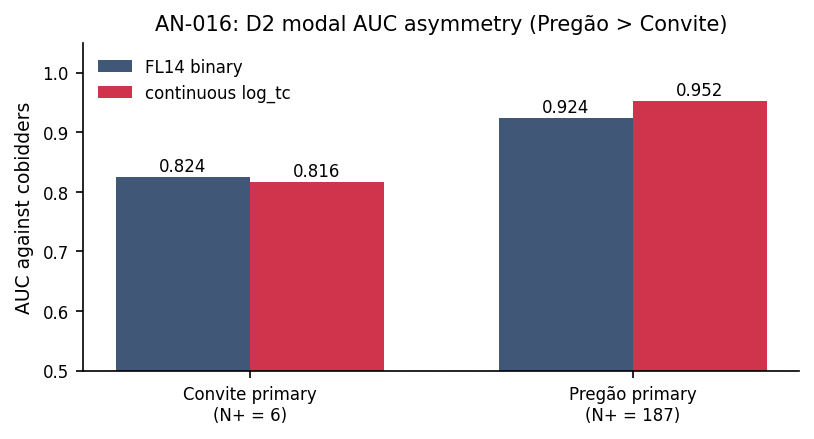

# AN-016: Gate D2 — modal-by-modal AUC

!!! abstract "Intuition (plain-language)"
    D2 asks where the screen bites harder: Convite (sealed-bid, with a minimum-bidder rule) or Pregão (open electronic auction). A tempting institutional theory predicted Convite — the minimum-bidder rule should force cartels to field *more* cover bidders. The data say the opposite (continuous AUC Pregão 0.95 vs Convite 0.82), which killed an alternative framing of the paper. The disciplined reading: this is *scope* information about where the footprint is strongest, not evidence that an institutional rule identifies the mechanism.

## Question

D2 gate diagnostic: does the FL screen discriminate cobidders better in
Convite (sealed-bid, minimum-bidder rule) or in Pregão (electronic
auction, no minimum-bidder rule) environments? The institutional theory
behind a hypothetical γ++ winner/loser reframing predicted **Convite >
Pregão**: under the minimum-bidder rule, cartels need *more* cobidders
to manufacture the appearance of competition, so the loser-side
footprint should be larger and the FL signal stronger in Convite.

## Design

- **Sample**: cobidders split by procurement modality:
  - *convite_primary*: cobidders primarily active in Convite tenders;
  - *pregão_primary*: cobidders primarily active in Pregão tenders.
- **Specification**: AUC by modality for FL14 (binary) and continuous
  log_tc; bootstrap CI on the AUC difference.
- **Caveat**: convite_primary has only 6 cobidders (small N+), so
  Convite-specific results are statistically thin.

## Results

| Modality | FL14 AUC | FL14 CI | log_tc AUC | log_tc CI |
|---|---:|---|---:|---|
| convite_primary | 0.865 | [0.857, 0.873] | 0.816 | [0.758, 0.874] |
| pregão_primary | **0.924** | [0.910, 0.938] | **0.952** | [0.946, 0.958] |

Bootstrap difference (continuous, pregão − convite): −0.136, p ≈ 0.

External-validity cross-check (script 52):
`\valExtConvAUC` = 0.816, `\valExtPregAUC` = 0.952.

Macros: `\valAUCConvFL`, `\valAUCConvlogtc`, `\valAUCPregFL`,
`\valAUCPreglogtc`, `\valExtConvAUC`, `\valExtPregAUC`.

*Figure: AUC against cobidders by modality. Pregão (no minimum-bidder
rule) dominates: FL14 0.924, continuous 0.952. Convite
(minimum-bidder rule) lower: FL14 0.865, continuous 0.816. Direction
is OPPOSITE to the institutional theory — interpreted as scope
information, not institutional positive test.*

## Interpretation

**Direction is OPPOSITE to the institutional minimum-bidder-rule
theory.** The screen discriminates *better* in Pregão (no minimum-bidder
rule) than in Convite (minimum-bidder rule). This formally
disqualifies the γ++ winner/loser reframing that would have required
the opposite direction for its institutional argument to hold.

**Framing (mr-frequent locked rule)**: present D2 as "the construct
discriminates better in Pregão environments; we interpret this as
**scope information**, not as institutional identification" — NOT as a
positive test of the minimum-bidder-rule theory. This framing aligns
with [H:price-scope-sign-reversal](../hypotheses/price-scope-sign-reversal.md).

The Convite cell is small (6 cobidders) and its CI is wide; the
asymmetry is statistically robust because the Pregão cell is large and
tight, not because the Convite cell is precise.

This result locked the JLEO path on 2026-04-30 and prevented a 4-week
detour into a salvage narrative that the data did not support.

## Follow-ups

- Diagnostic on the small-N Convite stratum (exact tests, power).
- Sub-period stability of the modal asymmetry.
- Triangulation with the falsification Pregão-only result
  ([AN-022](an-022-falsification-pregao.md)).
