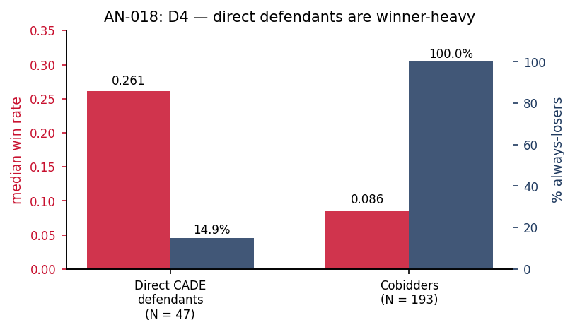

# AN-018: Gate D4 — CADE winner-heavy diagnostic

!!! abstract "Intuition (plain-language)"
    Why is the screen blind to ringleaders? D4 measures it directly: only ~15% of direct CADE defendants are always-losers, and their median win rate (0.261) is triple the cobidders' (0.086). Ringleaders are winner-heavy *by construction* — capturing contracts is the whole point of running the cartel. A screen built on persistent losing therefore cannot cover them, and shouldn't be asked to. This is the mechanism behind the AN-007 null.

## Question

D4 gate diagnostic: what share of direct CADE defendants are always-
losers, and what is their win-rate distribution? The diagnostic
mechanistically confirms the predicted AUC null against direct
defendants ([AN-007](an-007-auc-direct-cade.md)).

## Design

- **Sample**: 47 direct CADE defendants linked to BEC.
- **Comparison set**: 193 cobidders.
- **Outcomes**:
  - share of always-losers among direct defendants;
  - median win_rate (direct defendants vs cobidders);
  - median win count.
- **Test**: Mann–Whitney on win_rate distributions.

## Results

| Quantity | Direct defendants | Cobidders |
|---|---:|---:|
| N | 47 | 193 |
| Share that are always-losers | 14.9% (7/47) | 100% (193/193) |
| Median win rate | 0.261 | 0.086 |
| Median win count | 42 | (always-losers ⇒ 0 wins) |

Macros: `\valDirectCADE`, `\valDirectShareAL` (14.9), `\valDirectMedWR`
(0.261), `\valOthersMedWR` (0.086), `\valDirectMedWins` (42),
`\valCobidders`.

Mann–Whitney test on win_rate (direct defendants vs cobidders):
p < 0.05.

*Figure: direct CADE defendants vs cobidders on two dimensions —
median win rate (red, left axis) and % always-losers (navy, right
axis). Direct defendants: win rate 0.261, 14.9% always-losers.
Cobidders: win rate 0.086, 100% always-losers by construction. The
loser-side rank literally cannot cover most direct defendants.*

## Interpretation

**D4 passes**. Direct CADE defendants are structurally **winner-heavy**:
only 14.9% are always-losers, and their median win rate (0.261) is
~3× that of cobidders (0.086). A loser-side rank built from always-
loser participation literally cannot cover most of them, by
construction.

This mechanistically explains the predicted null AUC against direct
defendants ([AN-007](an-007-auc-direct-cade.md)): the scope of the
screen is loser-side adjacency, not membership.

D4 closes the four-diagnostic gate battery (D1–D4) from 2026-04-30. The
result is load-bearing for the framing of §4.3 of the
[manuscript](../paper.md): direct-defendant AUC ≈ 0.50 is a *feature*
of the scope, not a *failure* of the screen.

## Follow-ups

- Decomposition by adjudication date (within-cartel role allocation).
- Sensitivity to alternative direct-defendant definitions.
- Triangulation with the unified mechanism quadrants
  ([AN-024](an-024-unified-mechanism.md)).
