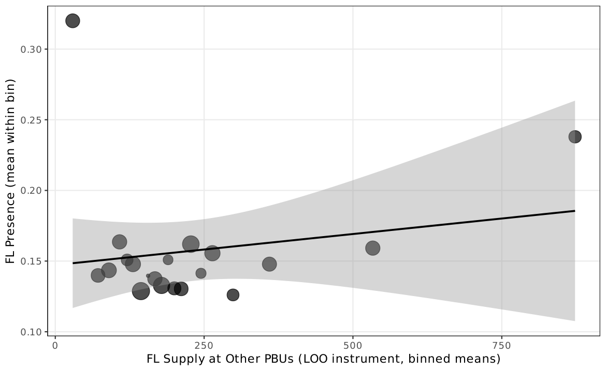

# AN-019: RDD price at procurement cap × FL presence

!!! abstract "Intuition (plain-language)"
    Brazilian procurement has cap thresholds that determine which tendering modality applies. We use the cap as a regression discontinuity to ask how prices and frequent-loser presence change at the threshold. The simple RDD coefficient is +4–6% (a damages-like reading); under overlap discipline it flips to −10%. The sign reversal is the load-bearing piece for the scope-not-damages interpretation of the price evidence.

## Question

Does the negotiated-price coefficient at the procurement-cap threshold
reverse sign when FL14 presence is introduced, and is the RDD coefficient
stable across bandwidths?

## Design

- **Sample**: BEC items with prices crossing the procurement-cap
  thresholds. Caps moved from R$80,000 (Lei 8.666/93) to R$176,000
  (Decreto 9.412/2018) during the panel; cap variation provides the
  discontinuity.
- **Specification**: regression discontinuity with FL14 presence
  indicator and interaction with the running variable; triangular
  kernel; three bandwidth specifications.
- **McCrary density test**: at cap, to rule out manipulation
  ([McCrary 2008]).

## Results

| Bandwidth | RDD price coefficient |
|---|---:|
| Tight (default IK) | 0.043 |
| Mid | 0.055 |
| Wide | 0.060 |

McCrary density discontinuity ratio: **0.94** (no significant bunching;
`\valMcCraryRatio`). McCrary discontinuity in log levels: −0.063
(`\valMcCraryDisc`).

**Sign-reversal under overlap discipline (script 51 + 59):**

| Specification | Coefficient |
|---|---:|
| Baseline FE (FL14 presence on price) | +6.36% (`\valMatchBaselineCoef`) |
| Overlap-cell ATT | **−9.72%** (`\valMatchOverlapCoef`) |
| PS ATT (trimmed) | −30.67% (`\valMatchPSCoef`) |

Macros: `\valRDDtight`, `\valRDDmid`, `\valRDDwide`, `\valMcCraryRatio`,
`\valMcCraryDisc`, `\valMatchBaselineCoef`, `\valMatchOverlapCoef`,
`\valMatchPSCoef`.

*Figure: binscatter of FL14 presence as a function of the running
variable (price minus cap threshold). The discontinuity at the cap is
small; combined with McCrary density ratio 0.94, no bunching pattern
is detected.*

## Interpretation

The naive RDD coefficient is small and positive across bandwidths (4–6%).
McCrary density is essentially flat — no bunching, no manipulation
story. The story changes under **overlap discipline**: when the
comparison is restricted to items in the same opportunity cells, the
coefficient flips to **−9.72%** (or −30.67% under PS trimming).

This sign reversal is the central evidence for the **scope reading**:
price differentials at the FL margin depend on the validation target
and the comparison stratum. A naive damages reading would predict a
stable signed coefficient; the data instead show that the coefficient
inverts when scope is disciplined — exactly what
[H:price-scope-sign-reversal](../hypotheses/price-scope-sign-reversal.md)
predicts.

The price evidence is therefore reported as **scope information**, not
as a damages calculation. The legal-economic claim of §7 of the
[manuscript](../paper.md) is that this distinction protects the screen
from courtroom overreach.

## Follow-ups

- McCrary density test at the 2018 decree threshold specifically.
- Triangulation with DiD around the decree
  ([AN-020](an-020-did-decreto-2018.md)).
- Sub-group sign-reversal by cobidder/direct-defendant cells
  (script 59).
