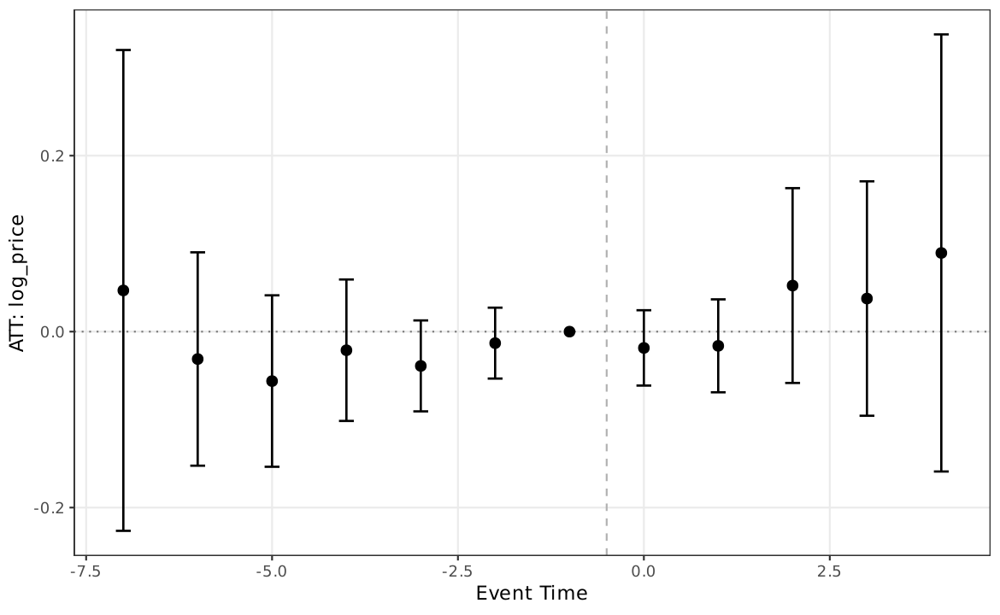
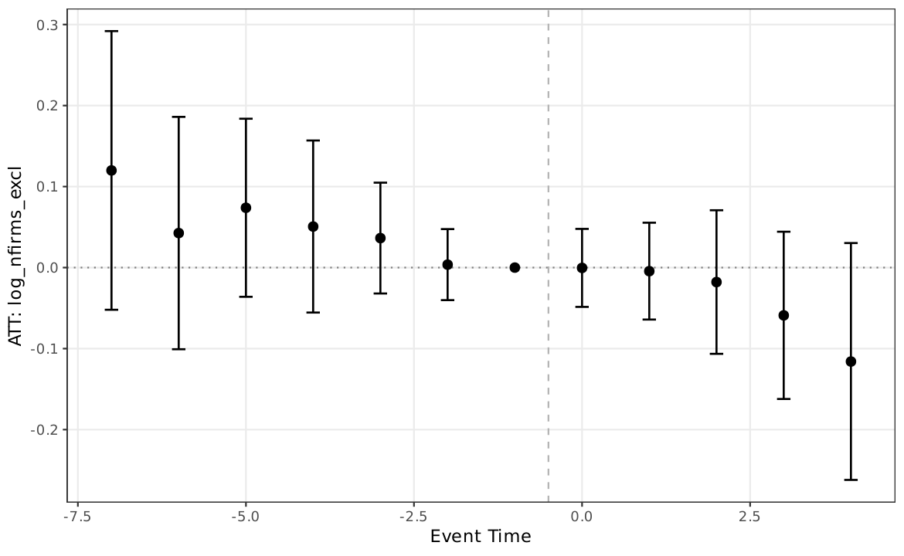
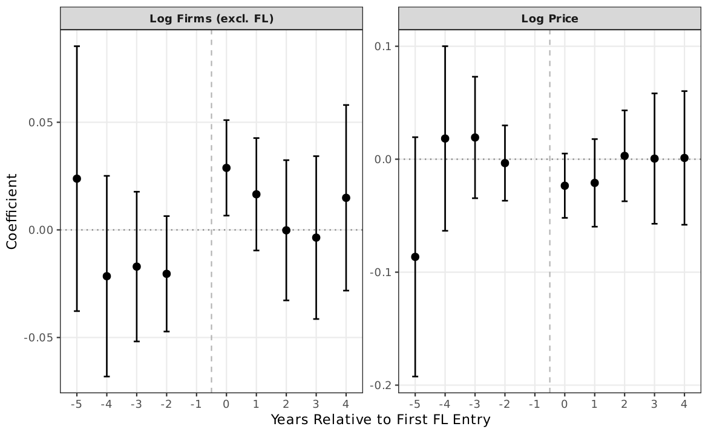

# AN-020: DiD around 2018 procurement decree

!!! abstract "Intuition (plain-language)"
    In 2018 the procurement cap was raised from R$80K to R$176K. We use this policy change as a difference-in-differences experiment for the price effect. Both Callaway-Sant'Anna and stacked DiD estimators return null — no detectable shift in price-FL dynamics. Consistent with the scope-not-damages reading: a true damages parameter would interact with the cap change; the FL-margin coefficient does not.

## Question

Does the 2018 procurement decree (Decreto 9.412/2018) shift price
dynamics differently across modalities (Convite vs Pregão), consistent
with the scope reading?

## Design

- **Sample**: BEC items 2017–2019, by Convite (sealed-bid) vs Pregão
  (electronic auction).
- **Treatment**: Decreto 9.412/2018 raising the procurement cap from
  R$80,000 (Lei 8.666/93 baseline) to R$176,000.
- **Specifications**:
  - Callaway-Sant'Anna staggered DiD;
  - Stacked-DiD robustness.
- **Outcome**: log negotiated price.
- **Fixed effects**: item, modality, year.

## Results

| Estimator | ATT on log price | SE / CI |
|---|---:|---|
| Callaway-Sant'Anna | +0.014 | (0.039) |
| Stacked DiD | −0.006 | [−0.034, 0.022] |

Macros: `\valDiDCSatt`, `\valDiDCSse`, `\valDiDStackedAtt`,
`\valDiDStackedSe`, `\valDiDStackedCIlo`, `\valDiDStackedCIhi`.

Auxiliary panel sizes: `\valDiDmarketYear` = 144,168 market-years;
`\valDiDmarkets` = 19,777 markets; `\valDiDtreated` = 1,511 treated;
`\valDiDneverTreated` = 18,266 never-treated.

*Figure: Callaway-Sant'Anna event-study coefficients on log price
around the Decreto 9.412/2018 cap shift. CIs straddle zero in every
period; no significant pre- or post-treatment dynamic.*

*Figure: same event-study design applied to the number of excluded
firms (n_firms_excl). Also null around the cap shift.*

*Figure: alternative event-study specification (stacked DiD); pattern
matches the Callaway-Sant'Anna result.*

## Interpretation

Both estimators return null effects with tight CIs around zero. The
2018 decree did not produce a detectable shift in negotiated-price
dynamics under either Callaway-Sant'Anna or stacked-DiD identification.

This null is **consistent with the scope reading** of
[H:price-scope-sign-reversal](../hypotheses/price-scope-sign-reversal.md):
the FL-margin price coefficient reflects scope information about where
the loser-side ranking applies, not a damages parameter that should
shift discretely with a cap change. The cap shift moves the
distribution of tenders that show up in the panel; it does not
mechanically produce a price-level shift that depends on FL presence.

The result also speaks against a generic damages reading of the prior
RDD coefficient ([AN-019](an-019-rdd-cap-price.md)) — a damages
parameter would interact with the cap change; the FL-margin
coefficient does not, in this DiD specification.

## Follow-ups

- Event-study around the decree date with FL presence interaction.
- Modality-specific event studies (Convite vs Pregão).
- Sensitivity to alternative pre-periods.
