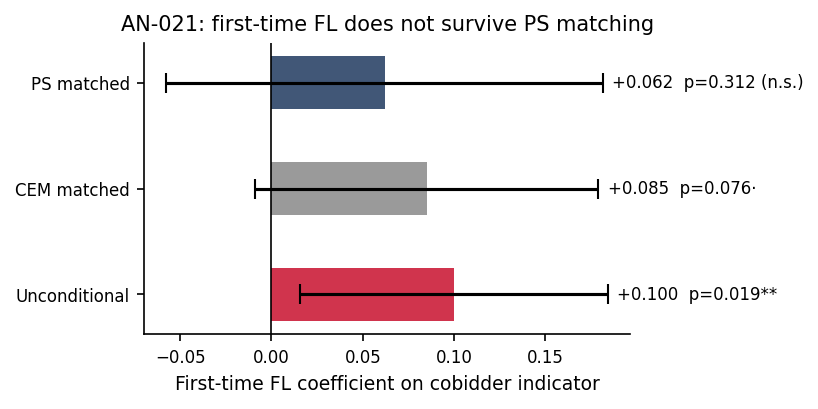

# AN-021: First-time FL effect under PS matching

!!! abstract "Intuition (plain-language)"
    Does becoming a frequent loser for the first time predict cobidder status? Unconditionally yes (+0.10, statistically significant). But the effect collapses to +0.06 (not significant) once we match on participation history via propensity scores. The temporal 'first-time' margin doesn't survive volume matching. Reported transparently; demoted to appendix, not load-bearing.

## Question

Does the "first-time FL" effect on cobidder concentration survive
propensity-score matching? The matched estimate is the disciplined
version of the unconditional comparison.

## Design

- **Sample**: firms entering the FL14 stratum for the first time vs
  controls matched on participation history.
- **Three disciplines**:
  - *Unconditional*: raw difference in cobidder indicator.
  - *Coarsened exact matching (CEM)*: matches on coarse strata.
  - *Propensity-score matching (PS)*: matches on the probability of
    becoming first-time-FL.
- **Outcome**: cobidder indicator.

## Results

| Discipline | Coefficient | SE | p | N |
|---|---:|---:|---:|---:|
| Unconditional | +0.100*** | 0.043 | 0.019 | 9,118 |
| CEM | +0.085* | 0.048 | 0.076 | 1,930 |
| PS (matched) | +0.062 | 0.061 | **0.312** | 2,200 |

Macros: `\valFTuncondCoef`, `\valFTuncondSE`, `\valFTuncondP`,
`\valFTuncondN`, `\valFTcemCoef`, `\valFTcemSE`, `\valFTcemP`,
`\valFTcemN`, `\valFTpsCoef`, `\valFTpsSE`, `\valFTpsP`, `\valFTpsN`.

*Figure: first-time-FL coefficient on cobidder indicator across three
disciplines. Unconditional +0.100 (p=0.019, red = significant); CEM
+0.085 (p=0.076, grey = marginal); PS-matched +0.062 (p=0.312, navy =
n.s.). The channel does not survive PS matching — demoted to
appendix.*

## Interpretation

The first-time-FL channel **does not survive PS matching**. The
unconditional estimate (+0.10, p = 0.019) attenuates by ~40% under CEM
(+0.085, p = 0.076) and collapses under PS (+0.062, p = 0.312). The
coefficient retains its sign but loses statistical significance once
participation-history confounding is removed.

Per the locked rule of engagement (mr-frequent rounds 2–4): the
result is **demoted to appendix**. It is documented for transparency
but not load-bearing for the paper's claims. The cobidder profile in
[AN-008](an-008-pbu-characterization.md) and
[AN-009](an-009-network-hhi.md) is the cross-sectional pattern that
carries the cobidder-distinct narrative; the temporal "first-time"
margin does not add a robust margin.

This is one of the JLEO-disciplinary moves: report the failure
honestly, demote the result, avoid front-loading transient findings
that do not survive matching.

## Follow-ups

- Heterogeneity by match quality (caliper sensitivity).
- Alternative definitions of "first-time" (panel-window dependent).
- Triangulation with the unified-mechanism quadrants
  ([AN-024](an-024-unified-mechanism.md)).
