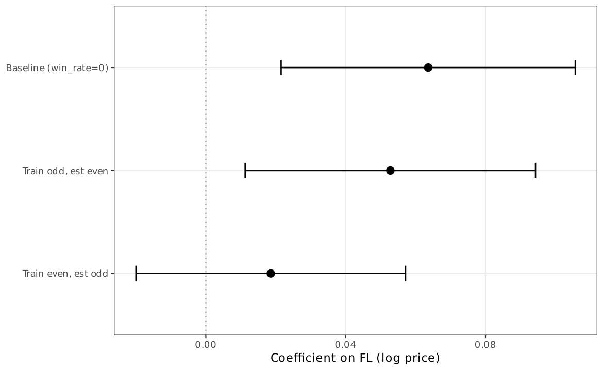

# AN-023: Theory operationalization audit

!!! abstract "Intuition (plain-language)"
    How much does the result depend on the specific FL14 cutoff? We compare it against FL10, FL20, the Tukey alternative, and percentile-based ranks. The continuous score dominates every binary variant. The paper's FL14 choice is auditable but not ontologically privileged — it is the operational implementation of an underlying continuous primitive (loser-side concentration).

## Question

Does the operational mapping from theory (loser-side concentration) to
implementation (FL14) survive an explicit audit against alternative
operationalizations? The audit anchors the locked rule of engagement:
*loser-side concentration* is the concept; *frequent losers* is the
implementation. The paper does not defend FL14 as ontologically
special.

## Design

- **Sample**: 16,843 always-loser firms in BEC 2009–2019.
- **Operationalizations evaluated**:
  1. Continuous log(1 + tenders_count) — the underlying signal.
  2. FL14 (paper convention): median + 1.5 × IQR, integer cutoff 14.
  3. Tukey Q3 + 1.5 × IQR (alternative IQR rule).
  4. Strict-train FL7 (cutoff retrained on 2009–2016 only).
- **Outcome**: AUC against the cobidder target.

## Results

| Operationalization | AUC | 95% CI | N firms |
|---|---:|---|---:|
| Continuous log(1+tenders_count) | **0.939** | [0.932, 0.946] | 16,843 |
| FL14 (paper) | 0.924 | [0.921, 0.926] | 2,735 |
| Tukey Q3 + 1.5 × IQR | 0.834 | [0.804, 0.863] | 1,981 |
| Strict-train FL7 firm-level | 0.767 | [0.734, 0.800] | (train-pool) |
| Strict-train continuous (train) | 0.750 | [0.706, 0.795] | (train-pool) |

Macros: `\valAUClogtc`, `\valAUCFLfirm`, `\valAUCQThreeIQR`,
`\valAUCStrictFirmFL`, `\valAUCStrictFirmTC`, `\valFLQThreeIQR`,
`\valFL`, `\valAlwaysLosers`.

*Figure: AUC point estimates across alternative FL operationalizations
— continuous log_tc (0.939), FL14 (0.924), Tukey Q3 + 1.5 × IQR
(0.834), strict-train FL7 (0.767). Continuous dominates; FL14 sits on
the high plateau; tighter cutoffs lose discrimination. The paper's
choice is auditable, not ontologically privileged.*

## Interpretation

The continuous score dominates every binary operationalization. FL14 is
not ontologically privileged: it is the auditable, deployable layer on
top of an underlying continuous primitive. Three readings:

1. **FL14 vs continuous** (0.924 vs 0.939): the auditable binary loses
   ~0.015 AUC relative to the full-information continuous score —
   the trade-off price of an auditable cutoff.
2. **FL14 vs Tukey** (0.924 vs 0.834): the paper's `median + 1.5 × IQR`
   cutoff substantially outperforms the Tukey `Q3 + 1.5 × IQR`
   alternative. The choice is documented, not arbitrary.
3. **Full-panel vs strict-train** (0.924 vs 0.767, FL14 binary):
   in-sample numbers are inflated; the train-cutoff variant gives the
   honest discrimination ([AN-006](an-006-strict-prospective-holdout.md)).

The audit forecloses the JLEO-reviewer suspicion that the paper is
over-defending an arbitrary cutoff. The rule of engagement is
explicit: the construct is the continuous primitive; FL14 is the
operational rule.

## Follow-ups

- Robustness to alternative IQR definitions (Q1+x×IQR, median+kσ).
- Sensitivity of the continuous score to alternative transformations
  (rank-percentile, raw counts).
- Persistence across sub-periods.
