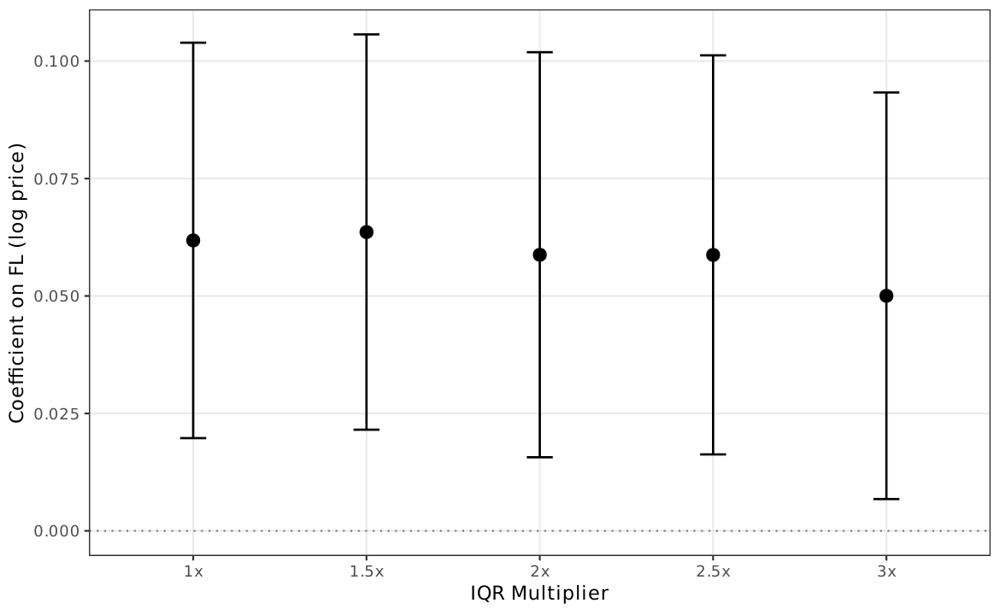

# AN-025: Cutoff-sweep robustness (FL2 through FL100)

!!! abstract "Intuition (plain-language)"
    If we sweep the cutoff from very loose ($\geq 3$) to very tight ($\geq 100$), how does discrimination change? AUC rises monotonically to a peak at the paper rule (tenders $\geq 14$, AUC 0.924), then declines smoothly as the cutoff starts to exclude cobidders themselves. The $\geq 11$ to $\geq 15$ plateau is uniformly above 0.90. The paper's FL14 choice sits on a wide high plateau, not at a fragile peak.

## Question

How does cobidder AUC vary as the FL cutoff sweeps from FL2 through
FL100, and is FL14 picking up an arbitrary plateau or a peak? The
sweep documents the full robustness profile that would be hidden by
reporting only the headline FL14 number.

## Design

- **Sample**: 16,843 always-loser firms in BEC 2009–2019.
- **Positive class**: 193 cobidders ([AN-003](an-003-cade-bec-linkage.md)).
- **Sweep**: cutoff `tenders_count > k` for k ∈ {2, 3, 5, 6, 7, 8, 9, 10,
  11, 12, 13, 14, 15, 16, 17, 18, 19, 20, 21, 22, 23, 30, 50, 75, 100}.
- **At each cutoff**: AUC, N firms above cutoff, N CADE cobidders above
  cutoff (the latter measures whether cobidders get "cut off" themselves
  at tighter thresholds).

## Results

Selected cutoffs from the full sweep (rows relabelled from the source's
`> k` convention to `≥ K`, where `K = k + 1`):

| Cutoff (tenders ≥ K) | AUC | N above cutoff | N cobidders above |
|---:|---:|---:|---:|
| ≥ 3 | 0.730 | 9,186 | 193 |
| ≥ 6 | 0.833 | 5,757 | 193 |
| ≥ 8 | 0.868 | 4,574 | 193 |
| ≥ 11 | 0.902 | 3,442 | 193 |
| **≥ 14** (paper FL14) | **0.924** | **2,735** | **193** |
| ≥ 15 | 0.911 | 2,537 | 186 |
| ≥ 16 | 0.884 | 2,385 | 174 |
| ≥ 19 | 0.834 | 1,981 | 150 |
| ≥ 21 | 0.824 | 1,778 | 144 |
| ≥ 31 | 0.744 | 1,118 | (declining) |
| ≥ 51 | 0.662 | 545 | (declining) |
| ≥ 101 | 0.568 | 163 | (declining) |

Source: `output/continuous_vs_binary/auc_threshold_sweep.csv` (the CSV
stores `threshold = k` with `is_fl := (tenders_count > k)`; rows above
use the equivalent `tenders ≥ k+1` form so the paper rule
`\valThresholdStat = 13.5 → tenders ≥ 14` maps to the boldfaced row).

*Figure: AUC as a function of the binary FL cutoff (firms with
tenders $\geq K$), for cobidder discrimination. The shape is a clean
inverted U: rising from $\geq 3$ to peak at the paper rule
$\geq 14$ (AUC 0.924), declining smoothly afterward. The
$\geq 11$ to $\geq 15$ plateau is ≥ 0.90; the FL14 paper choice
sits at the top of the high plateau, not at a fragile peak.
(Figure axes still show the source convention `>k`; the
$\geq K = k+1$ relabelling above does not change the underlying curve.)*

The shape is a clean **inverted U** (cutoffs reported in the
`tenders ≥ K` convention to match the paper rule):

- *Rising branch ($\geq 3$ → $\geq 14$)*: AUC rises monotonically from
  0.730 to 0.924. Tighter cutoffs progressively concentrate the
  cobidder signal.
- *Peak*: tenders $\geq 14$, AUC = 0.924. This is the paper FL14 rule
  (`\valThresholdStat` = 13.5; firms with tenders $\geq 14$, which is
  the smallest integer above 13.5).
- *Plateau ($\geq 11$ to $\geq 15$)*: AUC = 0.902–0.924 across five
  consecutive cutoffs. The FL14 choice sits at the **top of the high
  plateau**, not at a fragile peak.
- *Falling branch ($\geq 15$ → $\geq 101$)*: AUC falls from 0.911
  toward 0.57 as the cutoff tightens past the point where cobidders
  themselves get excluded (N cobidders above cutoff drops from 193 at
  $\geq 14$ to 144 at $\geq 21$ to under 50 at $\geq 101$).

## Interpretation

The sweep accomplishes three things:

1. **Plateau confirms the paper's choice is not arbitrary.** The
   median + 1.5 × IQR statistic = 13.5; the binary implementation
   flags firms with tenders $\geq 14$, which is exactly the empirical
   AUC peak (0.924). The FL14 cutoff is auditable (median + 1.5 × IQR
   is a textbook quantile rule) and sits at the top of a wide plateau.
   A reviewer asking "why this specific cutoff?" is answered: any
   cutoff between $\geq 11$ and $\geq 15$ gives AUC > 0.90.

2. **Falling branch shows the construct has the right shape.** If the
   FL signal were spurious, tighter cutoffs would not produce
   monotonically smaller AUC after the peak. The clean inverted-U is
   what one would expect under the loser-side cover-bidding
   interpretation: too-loose cutoffs include many non-cobidder
   always-losers (false positives); too-tight cutoffs exclude the
   cobidders themselves (false negatives at the construct level — the
   N cobidders above cutoff column shows this directly).

3. **Peak coincides with the paper rule.** The peak AUC 0.924 in this
   sweep is exactly the headline number `\valAUCFLfirm` reported in
   [AN-004](an-004-cobidder-baseline.md) and used throughout the
   manuscript. The next-tightest cutoff ($\geq 15$, AUC 0.911) is
   informative as a robustness check (it would drop ~7% of cobidders
   from the flagged set, see N cobidders column) but is not the
   reported paper choice.

This is the robustness check that converts H1 from "single-cutoff
result" to "robust across a wide cutoff band". See
[H:cobidder-concentration](../hypotheses/cobidder-concentration.md).

## Follow-ups

- Same sweep on temporal-holdout sample (the inverted U should retain
  shape but with depressed levels — interaction with
  [AN-013](an-013-precision-at-k-audit.md)).
- Sweep on the strict-train pool of
  [AN-006](an-006-strict-prospective-holdout.md).
- Add macros `\valAUCSweepK10`, `\valAUCSweepK13`, `\valAUCSweepK14`,
  `\valAUCSweepK20` to the `scripts/99_make_paper_values.R` pipeline so
  that the sweep numbers enter values.tex on the next refresh.
