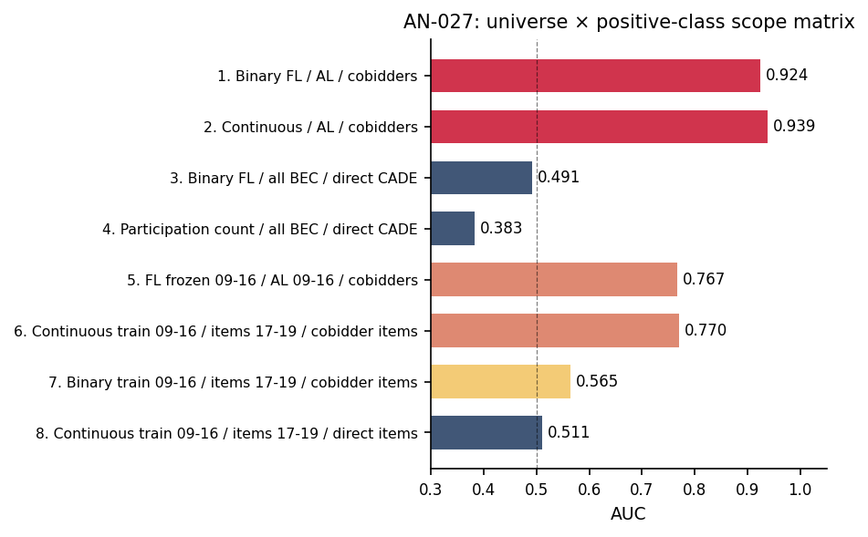

!!! warning "Superseded numbers — canonical-target re-estimation (June 4, 2026)"
    This analysis note documents a historical run under the earlier validation label.
    On June 4, 2026 the paper adopted a reproducible, non-circular target (651
    always-loser cobidders; frequent-loser flag never used in the label) and
    re-estimated every result. Where this page conflicts with the
    [paper](../paper.pdf) or the [changelog](../changelog.md), **the paper wins**.

# AN-027: Universe-anchored stratum scope matrix

!!! abstract "Intuition (plain-language)"
    An eight-cell matrix varies *who* gets ranked (always-losers vs all BEC firms) and *what* counts as a hit (cobidders vs direct defendants). Two lessons. First, the headline 0.924 is *exposure-inflated*: a firm that bids more simply has more chances to brush against a defendant, and an opportunity decomposition shows exposure alone scores 0.946 while the genuine within-stratum increment is only +0.042 (still real, p ≈ 2e-6). Second, the disciplining row — ranking by raw participation against direct defendants gives AUC 0.383, *below* random — shows the loser-side score actively *repels* winner-heavy ringleaders. The method separates genuine signal from opportunity arithmetic; it is not a generic detector.

## Question

How does AUC behave when the universe (the set of firms or items being
ranked) and the positive class (the validation target) are systematically
varied? The meta-table documents what the loser-side score targets and
what it does NOT target — the scope discipline that converts "the screen
works" into "the screen works on a specific, declared population".

## Design

- **Universes**:
  - *Always-loser firms*: 16,843 firms with `win_rate == 0` in BEC
    2009–2019.
  - *All BEC firms*: 41,444 firms in the registry.
  - *Items 2017-2019*: 1,009,729 items used for prospective evaluation.
  - *Always-losers as of 2009-2016*: 21,819 firms for the frozen-cutoff
    variant.
- **Positive classes**:
  - Cobidders inside always-loser stratum (193 firms);
  - Direct CADE defendants in full BEC (47 firms);
  - Cobidder-bearing items 2017-2019 (5,299 items);
  - Direct-defendant-bearing items 2017-2019 (12,037 items).
- **Scores**: FL14 binary; continuous log(1 + tenders_count);
  participation count in the full-BEC universe; frozen binary and
  continuous variants from the 2009-2016 train window.

## Results

The 8-row scope matrix (source CSV `stratum_scope_metrics.csv`):

| # | Score | Universe | Positive class | AUC | 95% CI | N+ | N |
|---|---|---|---|---:|---|---:|---:|
| 1 | Binary FL rule | Always-losers | Cobidders | **0.924** | [0.921, 0.926] | 193 | 16,843 |
| 2 | Continuous log_tc | Always-losers | Cobidders | **0.939** | [0.932, 0.946] | 193 | 16,843 |
| 3 | Binary FL rule | All BEC firms | Direct CADE | 0.491 | [0.461, 0.520] | 47 | 41,444 |
| 4 | **Participation count** | **All BEC firms** | **Direct CADE** | **0.383** | [0.322, 0.443] | 47 | 41,444 |
| 5 | Binary FL frozen on 2009-2016 | Always-losers as of 2009-2016 | Cobidders | 0.767 | [0.734, 0.800] | 193 | 21,819 |
| 6 | Continuous item score trained on 2009-2016 | Items 2017-2019 | Cobidder-bearing items | 0.770 | [0.764, 0.776] | 5,299 | 1,009,729 |
| 7 | Binary item flag frozen on 2009-2016 | Items 2017-2019 | Cobidder-bearing items | 0.565 | [0.564, 0.566] | 5,299 | 1,009,729 |
| 8 | Continuous item score trained on 2009-2016 | Items 2017-2019 | Direct-defendant items | 0.511 | [0.510, 0.513] | 12,037 | 1,009,729 |

*Figure: AUC across the 8 (universe × positive class × score) rows.
Red bars: rows 1-2 (where the score should work — 0.92–0.94 against
cobidders within always-losers). Navy bars: rows 3-4, 7-8 (where the
score should not work — near 0.5 against direct defendants).
Intermediate (orange/amber): rows 5-6 (timing-disciplined cobidder
targets). Row 4 below 0.5: participation count actively repels
winner-heavy defendants.*

Headline readings from the source CSV:

- Row 1: "Within-stratum prioritization only" — the binary rule
  prioritizes cobidder risk inside the always-loser stratum.
- Row 2: "Best within-stratum ranking object" — the continuous score
  is the empirical primitive.
- Row 3: "No; performance is at chance" — the score does not detect
  cartel defendants in general (predicted null).
- Row 4: "**No; loser-side scores miss winner-heavy defendants**"
  — and *actively repel* them: AUC = 0.383 means the score discriminates
  *against* direct defendants (a high-participation firm is *less*
  likely to be a direct CADE defendant under the screen).
- Row 5: "Much weaker than pooled within-stratum performance" — strict
  ex ante variant.
- Row 6: "Some prospective generalization, but narrower and weaker".
- Row 7: "No; binary holdout performance is weak" — the item-level
  binary flag does not generalize prospectively.
- Row 8: "No; direct-defendant scope failure remains" — direct-defendant
  null survives temporal holdout.

## Opportunity decomposition (the headline reframe)

The raw within-stratum AUC numbers (rows 1–2: 0.924 / 0.939) are
**exposure-inflated pooled numbers**: most of the apparent
concentration is opportunity arithmetic — firms that bid in more
tenders mechanically have more chances to co-bid with a defendant.
The v22 contribution is to *decompose* that raw signal:

- **Exposure-only** (rank firms by bidding opportunity alone): AUC
  **0.946** — i.e. raw opportunity by itself reproduces almost all of
  the pooled discrimination.
- **Within-stratum** (hold opportunity fixed, ask whether the loser-side
  score still ranks): AUC **0.7715**.
- **Genuine increment** (the signal that survives once opportunity is
  netted out): **+0.042**, DeLong p ≈ 2 × 10⁻⁶.

So the honest claim is *not* "the screen discriminates at 0.92". It is:
raw concentration is mostly opportunity, and a **limited but real**
signal (+0.042) survives the opportunity match. The volume- and
opportunity-matched audits
([AN-041](an-041-volume-matched-cobidder-audit.md),
[AN-042](an-042-volume-matched-timing-audit.md)) reach the same verdict
from the firm-profile side. This is a decomposition method — separating
genuine loser-side signal from opportunity arithmetic — not a cartel
detector.

## Interpretation

The scope matrix is the systematic alternative-hypothesis sweep that
[H:exposure-discipline](../hypotheses/exposure-discipline.md) needs.
Eight different (universe × positive-class) combinations:

1. **Where the score should work, it does** (rows 1, 2): AUC 0.924–0.939
   on cobidders within always-losers.
2. **Where the score should not work, it doesn't** (rows 3, 4, 8): AUC
   ≈ 0.5 against direct defendants in any universe.
3. **Row 4 is stronger than just "null"**: participation count on full
   BEC vs direct defendants is 0.383 — below random. This is the
   discriminating-against-winners result. A high-participation BEC firm
   is *less* likely to be a direct CADE defendant — exactly the
   sign predicted by the loser-side scope interpretation. Direct
   defendants are winner-heavy ([AN-018](an-018-gate-d4.md): 14.9%
   always-losers, median win rate 0.261), so they sit at lower
   loser-side participation than non-defendants.
4. **Frozen variants preserve the pattern under timing discipline**
   (rows 5, 6, 7, 8): the loser-side scope and the AUC magnitudes
   degrade gracefully, the direct-defendant null remains.

The matrix structurally rules out the "the screen picks up something
generic" reading. The score targets exactly what the loser-side framing
predicts and misses exactly what the framing says it should miss.

For [H:exposure-discipline](../hypotheses/exposure-discipline.md), the
combination of (i) sham permutation rejecting at p = 0
([AN-005](an-005-sham-fl-permutation.md)), (ii) leakage audit surviving
at 0.864 ([AN-014](an-014-leakage-audit-d3.md)), (iii) this scope
matrix showing the score targets the right population in every cell, is
near-exhaustive within-data evidence that the result is not an
artifact.

## Follow-ups

- Add a within-modality variant of the matrix (Pregão-only and
  Convite-only sub-samples).
- Triangulate row 4 (participation count vs direct defendants, AUC
  0.383) with the D4 mechanistic check
  ([AN-018](an-018-gate-d4.md)).
- Cross-validate the prospective rows (6, 7, 8) under alternative train
  windows.
- Add macros `\valScopeRowOne` through `\valScopeRowEight` and a
  `\valAUCParticDefendants` (= 0.383) macro to the
  `scripts/99_make_paper_values.R` pipeline.
