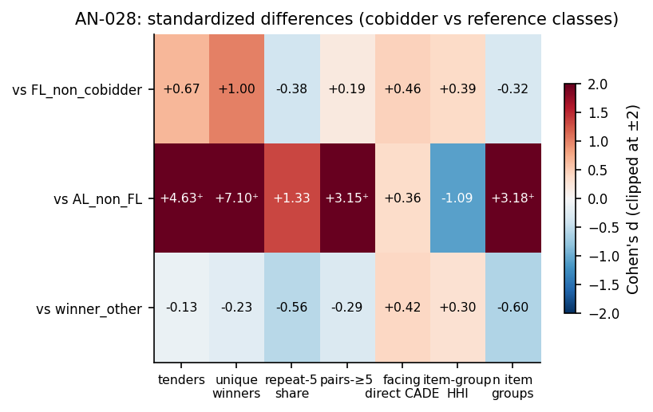

# AN-028: Exposure-stratum balance — cobidders vs reference classes

!!! abstract "Intuition (plain-language)"
    Are cobidders just the highest-volume frequent losers wearing a different label? Across seven dimensions — tenders, unique winners crossed, repeat-buyer share, pair density, CADE-facing share, portfolio HHI, number of item groups — they separate from other FLs at effect sizes Cohen's d 0.19–1.00. The distinctness is multi-dimensional, which matters: if it were one-dimensional (just volume) the screen would carry no information beyond a bid counter. AN-041 then asks which dimensions survive once volume is matched away.

## Question

Within the always-loser stratum, are cobidders distinguishable from
non-cobidder FLs along dimensions other than raw participation volume?
The exposure question for H3 is: if we hold the stratum fixed and ask
whether cobidders look like other FLs, do we see them collapse into a
homogeneous "high-volume losers" pool? The standardized-diff battery
says no — they remain distinct across multiple dimensions.

## Design

- **Sample**: always-loser firms in BEC 2009–2019, partitioned:
  - *Cobidders*: 191 firms (a subset of FL).
  - *FL_non_cobidder*: 2,544 firms (other FL14 firms).
  - *AL_non_FL*: 14,108 firms (always-loser, but below FL14 cutoff).
  - *winner_other*: 24,561 firms (with at least one win).
- **Dimensions** (7):
  - `tenders_count`: participation intensity.
  - `unique_winners`: count of distinct winners crossed.
  - `share_repeat_5`: share of buyers with ≥5 repeat interactions.
  - `pairs_at_least_5`: number of cobidder pairs with ≥5 shared tenders.
  - `share_facing_direct_cade`: share of tenders where a direct CADE
    defendant participated.
  - `item_group_HHI`: portfolio concentration HHI.
  - `n_item_groups`: number of distinct item groups.
- **Statistic**: Cohen's d (standardized mean difference) and Wilcoxon
  rank-sum p-value.

## Results

Cohen's d of cobidders vs each reference class, across 7 dimensions:

| Dimension | vs FL_non_cobidder | vs AL_non_FL | vs winner_other |
|---|---:|---:|---:|
| tenders_count | **+0.67** | +4.63 | −0.13 |
| unique_winners | **+1.00** | +7.10 | −0.23 |
| share_repeat_5 | −0.38 | +1.33 | −0.56 |
| pairs_at_least_5 | +0.19 | +3.15 | −0.29 |
| share_facing_direct_cade | **+0.46** | +0.36 | +0.42 |
| item_group_HHI | **+0.39** | −1.09 | +0.30 |
| n_item_groups | −0.32 | +3.18 | −0.60 |

All Wilcoxon p-values < 0.05; most < 10⁻¹⁰ — the differences are highly
significant given the cobidder N = 191.

Key reading on the **vs FL_non_cobidder** column (the within-FL14 test
that matters for H3):

- Cobidders bid in ~2× more tenders (d = 0.67) and cross ~2× more
  unique winners (d = 1.00) than non-cobidder FLs. *Within the FL
  stratum, cobidders still have higher participation intensity.*
- Cobidders are **8× more likely to face a direct CADE defendant** in
  a tender (1.46% vs 0.17%; d = 0.46).
- Cobidders operate in **more concentrated product portfolios**
  (HHI 0.380 vs 0.288; d = 0.39).
- Cobidders are in **fewer item groups** (7.6 vs 9.5; d = −0.32) —
  consistent with focal-portfolio cover bidding.

Source: `output/theory_bridge/standardized_diffs.csv`.

*Figure: Cohen's d heatmap of cobidders vs three reference classes
(rows) × 7 dimensions (columns). Red = cobidder higher; blue = lower.
Values capped at ±2 for color scale; the ⁺ marks cells where the
true d exceeds the cap (vs AL_non_FL: d up to 7.1 for unique
winners). Cobidder vs FL_non_cobidder is the within-FL row that
matters for H3 / H5: d in 0.19–1.00 range across most dimensions.*

## Interpretation

The balance battery answers a key exposure-discipline question:
**"are cobidders just the highest-participation always-losers?"**

The answer is no. Within the FL14 stratum (i.e., conditional on already
being a frequent loser):

1. Cobidders have **higher tenders_count and unique_winners** (d 0.67
   and 1.00) — the participation margin still discriminates within FL.
2. Cobidders have **more focal portfolios** (HHI d 0.39, n_item_groups
   d −0.32) — qualitative difference in operations.
3. Cobidders are **8× more likely to face direct CADE defendants in a
   tender** (d 0.46) — a structural feature of adjudication-anchored
   exposure, not a volume artifact.
4. Cobidders have **lower repeat-buyer shares** (d −0.38) — they do
   not display the "stable supplier" profile of non-cobidder FLs.

For [H:exposure-discipline](../hypotheses/exposure-discipline.md), this
means: the FL14 cutoff alone is NOT what concentrates the signal. Even
after fixing the always-loser stratum, cobidders remain distinguishable
along seven economically meaningful dimensions. The signal carries past
volume conditioning.

For [H:cobidder-profile-distinct](../hypotheses/cobidder-profile-distinct.md),
this is the formal balance table that supports the §5 economic profile
of the adjudication-anchored exposure stratum (cobidders are firms with
adjudication-anchored exposure to direct CADE defendants, not confirmed
cartel members). AN-008 and AN-009 quote selected numbers
from this table; this AN documents the full battery.

## Follow-ups

- Stratify the balance table by procurement modality
  (Convite vs Pregão).
- Re-run on the audit-disciplined sample
  ([AN-014](an-014-leakage-audit-d3.md) OOF folds).
- Match cobidders to non-cobidder FLs on `tenders_count` and re-run the
  balance test — does the remaining signal collapse if we explicitly
  match on volume? (this is the strongest within-data audit possible
  for H3).
- Add macros `\valDiffTendersFL` (0.67), `\valDiffUniqueFL` (1.00),
  `\valDiffCadeFaceFL` (0.46), `\valDiffHHIFL` (0.39) to the macro
  pipeline.
