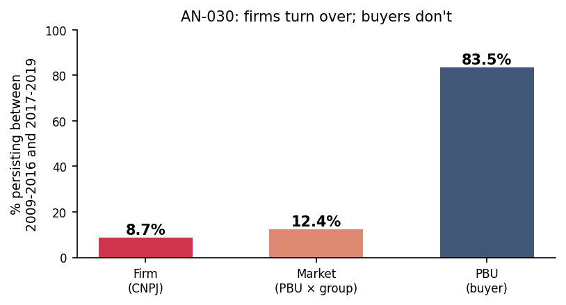

# AN-030: Market persistence between early (2009–2016) and late (2017–2019) panel

!!! abstract "Intuition (plain-language)"
    Is the temporal holdout a real out-of-sample test or a same-firms reshuffle? Mostly fresh: only 8.7% of firms and 12.4% of markets carry over from the early to the late panel, while 83.5% of *buyers* persist. So the institutions are stable but the firms and markets being scored are largely new. That asymmetry is what makes the prospective AUC credible — the screen generalizes to new players inside a stable institutional environment rather than re-recognizing old ones.

## Question

How much do the firms, markets, and procuring buyers in 2017–2019
overlap with those in 2009–2016? The temporal-holdout audits
([AN-006](an-006-strict-prospective-holdout.md),
[AN-013](an-013-precision-at-k-audit.md),
[AN-029](an-029-three-classifier-timing-battery.md)) gain or lose
force depending on whether test-period entities are the same firms
seen in training. This page documents the structural baseline.

## Design

- **Sample**: BEC 2009–2019 panel.
- **Early window**: 2009–2016.
- **Late window**: 2017–2019.
- **Persistence rate**: `(N entities in both windows) / (N entities in
  early window)`.
- **Three units of analysis**:
  - *Firm*: identified by CNPJ.
  - *Market*: identified by (PBU × item_group) with ≥5 tenders in the
    relevant window.
  - *PBU*: procuring buyer (administrative unit).

## Results

| Unit of analysis | Early N | Late N | Overlap | Persistence (%) |
|---|---:|---:|---:|---:|
| Firm | 1,240 | 2,036 | 108 | **8.7%** |
| Market (PBU × item-group, ≥5 tenders) | 24,770 | 35,864 | 3,082 | **12.4%** |
| PBU | 946 | 1,044 | 790 | **83.5%** |

Source: `output/market_persistence/persistence_summary.csv`.

*Figure: persistence rates between 2009-2016 and 2017-2019 panel
windows. Firms persist at 8.7% (red); markets at 12.4% (orange); PBUs
at 83.5% (navy). The institutional environment is stable; the firm
and market populations are essentially fresh across windows.*

## Interpretation

Three readings, all reinforcing H4 (timing discipline):

1. **Firm population is essentially fresh between windows.** Only 8.7%
   of early-period firms appear in the late period. The temporal-
   holdout audits in [AN-006](an-006-strict-prospective-holdout.md)
   and [AN-029](an-029-three-classifier-timing-battery.md) are
   evaluating a substantially **new firm population**, not the same
   firms in slightly different roles. The score generalizes across
   firms it never saw in training — this is the strongest possible
   form of within-data out-of-sample evaluation.

2. **Market turnover is similarly high.** Only 12.4% of early-period
   (PBU × item-group) markets persist into the late period. The
   procurement landscape is volatile at the market level — new
   product-buyer combinations enter, old ones fall off — so the
   temporal generalization in [AN-029](an-029-three-classifier-timing-battery.md)
   is also testing whether the score's loser-side logic carries across
   market churn.

3. **PBU persistence is high (83.5%) — the procuring buyers are
   stable.** This is consistent with administrative units changing
   slowly relative to firms and markets. The implication for H4: the
   *institutional* environment is stable across the temporal split;
   the change is in the firms and markets that operate within it.
   This rules out an alternative reading where the test-period
   evaluation suffers because procurement *institutions* changed.

The three-unit pattern is the right baseline for interpreting the
temporal-holdout AUC numbers. The temporal AUC of 0.864
([AN-014](an-014-leakage-audit-d3.md)) and the strict ex ante AUC
of 0.767 ([AN-006](an-006-strict-prospective-holdout.md)) are NOT
explained by "test firms = train firms in disguise" — only 8.7% of
firms appear in both windows.

For [H:timing-discipline](../hypotheses/timing-discipline.md): the
structural turnover of firms (~91% replacement) means the temporal
holdout is a near-clean out-of-sample evaluation. Combined with the
[AN-029](an-029-three-classifier-timing-battery.md) result that the
cobid_post2019 target (cobidders defined by adjudications AFTER the
training window) preserves AUC 0.79–0.89, the timing discipline is
about as well-supported as within-data evidence allows.

## Follow-ups

- Decompose persistence by FL14 status: are FL firms more or less
  persistent than non-FL always-losers? (relevant for whether FL is a
  stable firm characteristic vs a state).
- Persistence of cobidders specifically: of the 193 cobidders, how
  many are in both early and late windows?
- Cross-modality persistence rates.
- Add macros `\valFirmPersist`, `\valMarketPersist`, `\valPBUPersist`
  to the `scripts/99_make_paper_values.R` pipeline.
