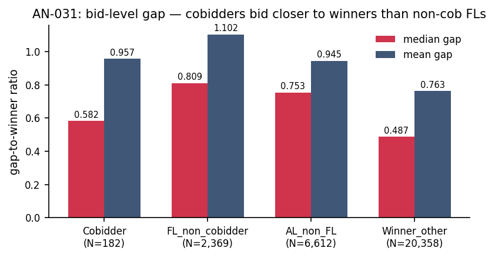

# AN-031: Bid-level behavioral profile — gap-to-winner across classes

!!! abstract "Intuition (plain-language)"
    Beyond participation patterns, do cobidders also BID differently? Cobidders place bids that are closer to the winning bid (median gap 0.58 vs 0.81 for non-cobidder FLs; effect size d = −0.28). They also show higher within-firm bid dispersion. The bid-level signature is consistent with credible cover bidding — submitting plausible-looking losing bids that don't win.

## Question

Do cobidders display bid-level behavior distinct from non-cobidder FLs,
independent of participation volume? The participation-level battery
([AN-008](an-008-pbu-characterization.md), [AN-028](an-028-exposure-stratum-balance.md))
showed cobidders bid in more tenders and cross more unique winners. The
question for H5 is whether the distinctness extends to *how they bid*,
not just *how often they bid*.

## Design

- **Sample**: always-loser firms with bid-level observations in BEC
  2009–2019. Bid-microdata coverage produces tighter samples than
  participation-only metrics:
  - Cobidders: N = 182.
  - FL_non_cobidder: N = 2,369.
  - AL_non_FL: N = 6,612.
  - winner_other: N = 20,358.
- **Bid-level metrics**: mean / median / sd / p75 of gap-to-winner
  ratio, computed per firm across its losing bids.
- **Statistic**: standardized mean difference (Cohen's d) and Wilcoxon
  rank-sum p-value of cobidders vs each reference class.

## Results

| Metric | Cobidder | vs FL_non_cobidder | vs AL_non_FL | vs winner_other |
|---|---:|---:|---:|---:|
| Mean gap-to-winner | 0.957 | −0.17 | +0.01 | **+0.33** |
| **Median gap-to-winner** | **0.582** | **−0.28** | −0.16 | +0.19 |
| SD of gap-to-winner | 1.207 | +0.15 | +0.49 | +0.44 |
| p75 of gap-to-winner | 1.300 | −0.16 | +0.01 | **+0.35** |

Bid-level reading of the **vs FL_non_cobidder** column (the within-FL14
test that matters for H5):

- **Cobidders bid closer to winning** than non-cobidder FLs: median gap
  ratio 0.582 vs 0.809 (d = −0.28, Wilcoxon p < 10⁻⁶). Cobidders'
  half-the-time bid is at ~58% of the gap-to-winner range, vs ~81% for
  non-cobidder FLs. Cobidders place more competitive-looking losing
  bids.
- **SD of gap higher** (1.21 vs 1.10, d = +0.15, p = 0.05). Cobidders'
  bid behavior is more variable — consistent with role-rotation in
  cover-bidding theory where the loser sometimes bids competitively
  and sometimes far above the winner.
- Mean and p75 attenuate but stay negative-d (cobidders below non-FL).

Reading vs **winner_other**:

- Mean gap +0.33, p75 +0.35, SD +0.44 — cobidders' bid distribution
  is far wider than winners'. Winners have tight bids (they bid to win);
  cobidders have wider bids (they bid to show up, sometimes close to
  winner, sometimes far).

Source: `output/theory_bridge/standardized_diffs_bidlevel.csv`,
firm-level inputs from `output/theory_bridge/firm_bidlevel_metrics.csv`.

*Figure: median (red) and mean (navy) gap-to-winner ratio across the
four firm classes. Cobidders bid closer to the winner (median 0.582)
than non-cobidder FLs (median 0.809) — d = -0.28, p < 10⁻⁶. The
within-FL distinctness extends to bid-level behavior beyond mere
participation volume.*

## Interpretation

The bid-level battery extends H5 beyond participation-only distinctness:

1. **Cobidders place more competitive-looking losing bids than non-
   cobidder FLs** (median gap d = −0.28). This is a behavioral
   signature consistent with credible cover bidding — bids close
   enough to look like genuine attempts, but never winning. Non-
   cobidder FLs bid further from the winner, suggesting more
   inattentive participation.

2. **The signal is at the bid level**, not the participation level
   alone. Within FL14 (already conditioning on persistent zero-win
   participation), cobidders are bid-conduct-distinct. This addresses
   the "is H5 just a volume artifact?" critique:
   ([H:cobidder-profile-distinct](../hypotheses/cobidder-profile-distinct.md))
   the within-FL distinctness survives in a dimension orthogonal to
   participation count.

3. **The bid-level patterns are *consistent with* — but not diagnostic
   of — credible losing roles**, per the locked rule of engagement.
   Mr-frequent calibrates this carefully: cover bidding could produce
   "bids close to winner" patterns; so could attentive-but-uncompetitive
   actual losing; both are observationally similar at the bid level.
   The proof-producing distinction stays in the bid layer's content
   (allocation, communication, coordination), not in moments.

4. **N drops from 191 (firm-level) to 182 (bid-level)** because 9
   cobidders lack bid-microdata coverage. The 5% sample loss is small;
   the qualitative result is unchanged.

The reading remains 🟡 (single-source own-project) because:
- the bid-level dimensions are observational, not causally identified;
- "credible losing role" interpretation is the spirit of cover-bidding
  theory but not a tight test against alternative interpretations;
- the 0.28 Cohen's d, while highly significant given N, is a moderate
  effect — not the d = 1.0 of unique-winners-crossed.

## Follow-ups

- Bid-level moments under exposure-strata matching (cobidder vs
  volume-matched FL_non_cobidder) — strongest within-data audit for
  H5; would directly answer "is bid-level distinctness a residual
  signal or a volume sub-channel?"
- Decomposition by procurement modality (Convite vs Pregão have
  different bid mechanics).
- Bootstrap CIs on the median-gap and SD-gap estimates.
- Add macros `\valBidGapMedCob`, `\valBidGapMedFL`, `\valBidGapSDCob`,
  `\valBidGapSDFL` to the `scripts/99_make_paper_values.R` pipeline.
