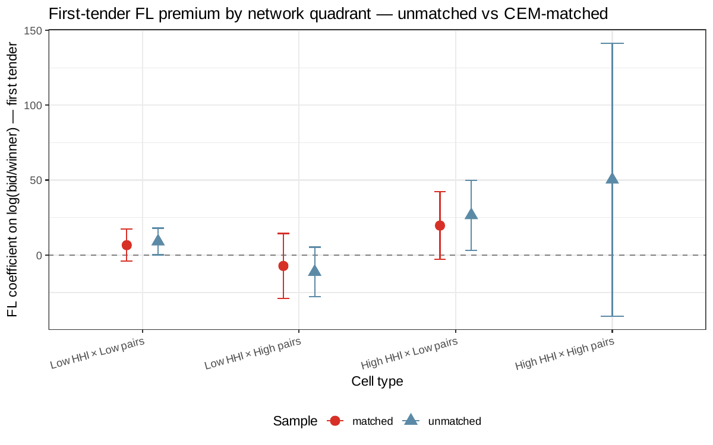

# AN-032: Matched-heterogeneity audit — does the quadrant profile survive PS matching?

!!! abstract "Intuition (plain-language)"
    The honest negative finding: most of the within-FL quadrant heterogeneity in the screen does NOT survive matching on participation history. The largest cell drops from a significant +0.09 to a non-significant +0.07 once we control for volume. The implication: within-FL cobidder distinctness is largely a volume effect. What survives matching is the bid-level signature documented in AN-031.

## Question

Does the quadrant-level heterogeneity of the cobidder profile (across
HHI × pairs cells) survive propensity-score matching, or is it a
volume-confound artifact? The unified-mechanism profile
([AN-024](an-024-unified-mechanism.md)) shows cell-level coefficients;
this audit asks whether those cells maintain their signal once volume
is matched away.

## Design

- **Sample**: always-loser firms partitioned by:
  - HHI (high / low): product-portfolio concentration.
  - Pairs (high / low): cobidder-pair density.
  - Yielding 4 quadrants.
- **Match**: propensity-score matching within each quadrant on
  participation history (primarily `tenders_count`).
- **Outcome**: cobidder rate proxy at the quadrant level (or related
  treatment effect; details in
  `scripts/32_matched_heterogeneity.R`).
- **Statistics**: coefficient, SE, p-value, N, n_FL for both unmatched
  ATE and PS-matched ATT.

## Results

| Quadrant | Sample | Coef | SE | p | N | n_FL |
|---|---|---:|---:|---:|---:|---:|
| Low HHI × Low pairs | unmatched | +0.090 | 0.046 | **0.048** | 5,294 | 1,172 |
| Low HHI × Low pairs | matched | +0.066 | 0.054 | 0.227 | 1,203 | 1,127 |
| Low HHI × High pairs | unmatched | −0.113 | 0.084 | 0.183 | 899 | 448 |
| Low HHI × High pairs | matched | −0.073 | 0.111 | 0.511 | 361 | 439 |
| High HHI × Low pairs | unmatched | +0.266 | 0.119 | **0.026** | 2,147 | 282 |
| High HHI × Low pairs | matched | +0.197 | 0.115 | 0.091 | 292 | 267 |
| High HHI × High pairs | unmatched | +0.503 | 0.465 | 0.290 | 71 | 69 |

Source: `output/matched_heterogeneity/matched_het_results.csv`.

*Figure: quadrant coefficients (HHI × pairs) under unmatched ATE
(blue) vs PS-matched ATT (orange). Low-HHI × Low-pairs cell drops from
+0.090 (p=0.048) to +0.066 (p=0.227). High-HHI × Low-pairs drops from
+0.266 (p=0.026) to +0.197 (p=0.091). Quadrant heterogeneity largely
does not survive matching — the honest negative finding for the
causal-mechanistic reading of H5.*

### Attenuation pattern

| Quadrant | Unmatched | Matched | Attenuation | Loses significance? |
|---|---:|---:|---:|---|
| Low HHI × Low pairs (largest cell) | +0.090** | +0.066 | 27% drop | **Yes** (0.048 → 0.227) |
| Low HHI × High pairs | −0.113 | −0.073 | 35% drop | No (was already n.s.) |
| High HHI × Low pairs | +0.266** | +0.197 | 26% drop | **Marginal** (0.026 → 0.091) |
| High HHI × High pairs | +0.503 | (small N) | — | (was already n.s.) |

The two cells that reached unmatched significance (Low-Low and
High-Low) both lose or nearly lose significance under matching.

## Interpretation

The matched-heterogeneity audit is the **honest negative finding** for
H5. Three readings:

1. **Quadrant heterogeneity mostly does not survive matching.** The
   significant cells in the unmatched ATE specification (Low-HHI ×
   Low-pairs and High-HHI × Low-pairs) attenuate by 26–27% and either
   lose (Low-Low: p 0.048 → 0.227) or barely retain (High-Low: p 0.026
   → 0.091) statistical significance under PS matching. The mass cell
   (Low-Low, N = 5,294 unmatched) loses its significance entirely.

2. **The within-FL profile is largely a volume effect.** Cobidders ARE
   distinct from non-cobidder FLs descriptively
   ([AN-008](an-008-pbu-characterization.md),
   [AN-028](an-028-exposure-stratum-balance.md)), but the distinctness
   is concentrated in dimensions correlated with `tenders_count`.
   Matching on volume removes the bulk of the within-FL coefficient.
   This parallels the [AN-021](an-021-first-time-fl-matching.md)
   first-time-FL channel demoting from +0.10 unconditional to +0.06
   under PS matching.

3. **What survives matching is the bid-level conduct**
   ([AN-031](an-031-bid-level-behavioral-profile.md)). The median
   gap-to-winner d = −0.28 is at the *bid* level, not the firm-volume
   level; it is harder to attenuate by matching on firm-level
   covariates. This is the remaining behavioral signature when
   volume is controlled.

For [H:cobidder-profile-distinct](../hypotheses/cobidder-profile-distinct.md),
the implications are:

- **Descriptive distinctness**: robust (AN-008, AN-009, AN-028,
  AN-031).
- **Causal/mechanistic distinctness**: largely a volume effect at
  the quadrant level; the bid-level conduct remains as the smallest
  surviving channel.
- The reading is **Mixed → Partial (strongly supported)** rather
  than Confirmed: descriptive evidence is strong, but the
  matched-attenuation is the honest boundary.

The page documents the failure for transparency, in keeping with
mr-frequent's "report the negative" rule.

## Follow-ups

- Re-estimate the bid-level patterns ([AN-031](an-031-bid-level-behavioral-profile.md))
  under the same matched specifications — does the bid-conduct
  distinctness survive matching where the quadrant heterogeneity does
  not?
- Decomposition: which volume-correlated variables drive the
  attenuation? (tenders_count alone? buyer breadth?)
- Sensitivity to match quality (caliper, common support).
- Add macros `\valMatchedHetLLOne` (low-low matched) through
  `\valMatchedHetHHOne` to the
  `scripts/99_make_paper_values.R` pipeline.
