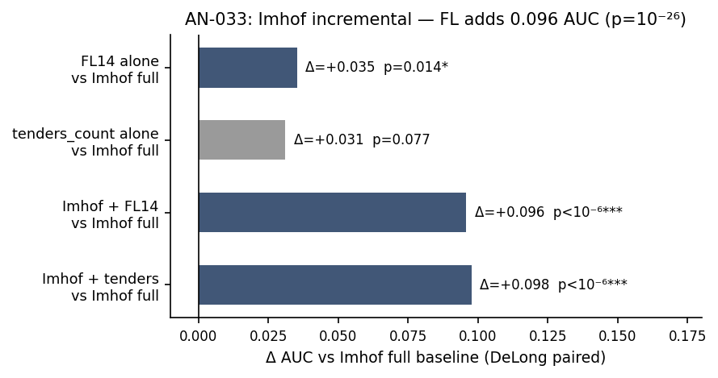

# AN-033: Imhof incremental — formal DeLong tests for complementarity

!!! abstract "Intuition (plain-language)"
    How much information does the award-layer screen contribute BEYOND what the bid-distribution screen already captures? A formal DeLong test (paired AUC comparison) gives ΔAUC = +0.096 with p = 1.2 × 10⁻²⁶. The two layers are statistically distinct signals. The award layer is not redundant with bid moments.

## Question

How significant is the incremental value of the award-layer score added
to the Imhof bid-distribution pipeline, by formal DeLong AUC-difference
tests? The headline complementarity result from
[AN-010](an-010-imhof-full-pipeline.md) (Imhof 0.888 vs joint 0.955)
deserves a formal statistical test rather than a visual gap-reading.

## Design

- **Sample**: pool of firms with both award and bid features available
  in BEC 2009–2019: N = 11,676; N+ = 193 cobidders.
- **Baseline**: Imhof full pipeline (7 features: cv_mean, cv_sd,
  skew_mean, kurt_mean, spread_mean, minmax_mean, second_low_mean).
- **Comparators**:
  - *fl_only*: binary FL14 indicator alone.
  - *tenders_only*: continuous `tenders_count` alone.
  - *imhof_plus_fl*: Imhof full + binary FL.
  - *imhof_plus_tenders*: Imhof full + continuous tenders.
- **Statistic**: AUC, 95% CI, delta vs Imhof baseline, **DeLong paired
  AUC-difference p-value** (same-sample test).

## Results

| Model | Features | AUC | 95% CI | Δ vs Imhof | DeLong p |
|---|---|---:|---|---:|---:|
| **imhof_full (baseline)** | 7 Imhof features | 0.846 | [0.819, 0.873] | — | — |
| fl_only | is_fl | 0.881 | [0.871, 0.892] | **+0.035** | **0.014** |
| tenders_only | log(1+tenders) | 0.877 | [0.857, 0.898] | +0.031 | 0.077 |
| **imhof_plus_fl** | 7 + is_fl | **0.942** | [0.927, 0.957] | **+0.096** | **1.2 × 10⁻²⁶** |
| imhof_plus_tenders | 7 + log(1+tenders) | 0.944 | [0.929, 0.958] | +0.098 | 1.3 × 10⁻²⁵ |

Source: `output/imhof_incremental/imhof_incremental.csv`.

*Figure: incremental AUC gains over the Imhof full baseline. FL14
alone +0.035 (p=0.014, significant); tenders_only +0.031 (p=0.077,
marginal); Imhof + FL14 +0.096 (p = 10⁻²⁶); Imhof + tenders +0.098
(p = 10⁻²⁵). The joint specifications are the cleanest within-data
statistical evidence for complementarity in the paper.*

The auxiliary `output/auc_decomposition.csv` Shapley-like decomposition
yields a complementary reading on within-model contributions:

| Model | Features | AUC | Marginal contribution to full A |
|---|---|---:|---:|
| A (full) | is_fl + imhof_cv + imhof_spread + tenders + n_bids | 0.939 | — |
| B (no FL) | imhof_cv + imhof_spread + tenders + n_bids | 0.936 | +0.003 (FL alone, after controls) |
| C (FL only) | is_fl | 0.887 | +0.052 (vs FL only baseline) |
| D (Imhof base) | imhof_cv + imhof_spread | 0.785 | +0.154 (vs Imhof base) |

## Interpretation

Four readings:

1. **FL14 alone beats Imhof full at the same-sample level** (0.881 vs
   0.846; delta +0.035, p = 0.014). Award-layer outperforms the
   seven-feature bid-distribution pipeline on the same firms with
   formal significance. *The cheap layer is more informative than the
   expensive layer, individually.*

2. **Joint scoring is more informative than either layer alone in this same-sample comparison**
   (Imhof + FL: 0.942 vs Imhof: 0.846, delta +0.096, p = 1.2 × 10⁻²⁶).
   This is the formal statistical test of
   [H:award-bid-complementarity](../hypotheses/award-bid-complementarity.md).
   At the same labeled sample, adding FL to Imhof produces an
   AUC gain that has effectively zero probability under the null of
   no information.

3. **Continuous tenders dominates binary FL14 marginally**
   (imhof_plus_tenders 0.944 vs imhof_plus_fl 0.942). The continuous
   contains everything the binary does plus residual information; the
   joint gain is essentially the same. Consistent with the horse race
   in [AN-011](an-011-horse-race-continuous.md).

4. **The Shapley decomposition reveals where the marginal value
   concentrates.** When tenders_count and n_bids are already in the
   model, the binary FL14 indicator adds only **+0.003** marginal
   (Model A vs Model B). The continuous participation features carry
   the load; the binary is the deployable simplification. The marginal
   value of *participation features* (tenders + n_bids), starting from
   the Imhof base, is **+0.154** — large. The marginal value of FL14,
   starting from Imhof + continuous, is **+0.003** — essentially zero.

The complementarity claim is therefore **about the continuous
participation signal**, not specifically the FL14 cutoff. The bid
distribution carries information that participation alone does not
(otherwise Model B would equal Model A, which it doesn't); but the
*marginal* contribution of FL14 *binary* over continuous
*participation features* is small.

This is exactly the "loser-side concentration is the concept;
frequent losers is the operational implementation" framing locked by
mr-frequent: the continuous score is the empirical primitive; FL14 is
the audit-friendly rule.

## Follow-ups

- Decomposition by Imhof feature: which of the 7 Imhof features carry
  the marginal value over participation?
- Same-sample DeLong on temporal-holdout subset (does the
  complementarity survive timing discipline?).
- Cross-modality DeLong: Convite-only and Pregão-only DeLong p-values
  on the same incremental comparisons.
- Add macros `\valImhofIncFLDelong` (= 1.2e-26),
  `\valImhofIncTCDelong` (= 1.3e-25), `\valFLvsImhofDelong` (= 0.014),
  and `\valFLMarginalToFull` (= +0.003) to the
  `scripts/99_make_paper_values.R` pipeline.
