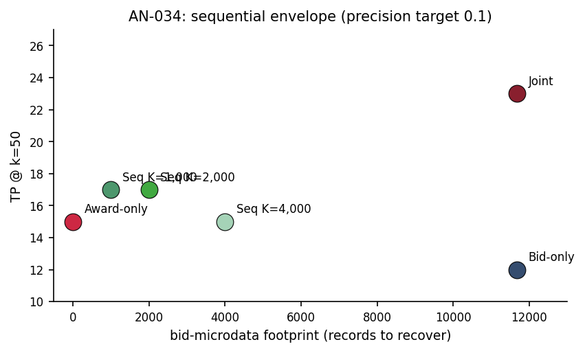

# AN-034: Sequential gatekeeping envelope — joint vs sequential cost-of-evidence

!!! abstract "Intuition (plain-language)"
    Opening full bid-level microdata is the expensive forensic step. Can a near-free award screen act as the gatekeeper that decides which firms are worth that cost? Yes: an FL → Imhof pipeline keeping the top 2,000 firms recovers 74% of the true positives the full joint model finds, while pulling 83% fewer bid records into forensic analysis. This is the paper's core cost-of-evidence argument — most of the signal at a fraction of the evidentiary bill.

## Question

When deployed sequentially (FL gatekeeper → Imhof forensic stage) vs
jointly, how does the cost-of-evidence trade-off look across precision
targets and Stage-1 cutoffs? The joint scoring of
[AN-010](an-010-imhof-full-pipeline.md) is the full-observability
upper bound; the sequential architecture is the operational
deployment.

## Design

- **Rules compared**:
  - *Award-layer only* (FL log_tc): no bid microdata required.
  - *Bid-layer only* (Imhof full): requires full bid microdata.
  - *Joint scoring* (FL + Imhof, single model): full microdata.
  - *Sequential* FL → Imhof, Stage-1 keeps top K ∈ {1000, 2000, 4000}.
- **At k = 50 firms** (top-50 of the relevant rule), report:
  - Smallest k achieving precision targets 0.10 / 0.15 / 0.20.
  - True positives (TP) at smallest k.
  - Recall at smallest k.
  - **Bid-microdata footprint** (number of bid records that must be
    recovered to apply the rule).

## Results

At precision target ≥ 0.1, smallest k = 50 across all rules:

| Rule | TP @ k=50 | Recall | Bid-microdata footprint |
|---|---:|---:|---:|
| Award-layer only (FL log_tc) | 15 | 7.8% | **0** |
| Bid-layer only (Imhof full) | 12 | 6.2% | 11,676 |
| **Joint scoring (FL + Imhof)** | **23** | **11.9%** | 11,676 |
| Sequential FL → Imhof, K = 1,000 | 17 | 8.8% | **1,000** |
| Sequential FL → Imhof, K = 2,000 | 17 | 8.8% | **2,000** |
| Sequential FL → Imhof, K = 4,000 | 15 | 7.8% | 4,000 |

Source: `output/architecture_gatekeeper/sequential_envelope.csv`.

*Figure: cost-of-evidence Pareto plot. X-axis: bid-microdata footprint
(records to recover). Y-axis: TP at k=50 (precision target 0.10).
Joint scoring is the Pareto frontier upper bound (23 TP, 11,676
microdata); Sequential K=1,000 and K=2,000 approximate the joint
upper bound at 8-17% of the microdata cost; Award-only (0 microdata,
15 TP) is the zero-cost benchmark.*

### Cost-of-evidence trade-off

| Architecture | TP @ k=50 | Microdata cost | TP per microdata-record-recovered |
|---|---:|---:|---:|
| Award-only | 15 | 0 | ∞ (no microdata) |
| Joint | 23 | 11,676 | 0.0020 |
| Sequential K=1,000 | 17 | 1,000 | 0.017 (8.6× more efficient than joint) |
| Sequential K=2,000 | 17 | 2,000 | 0.0085 (4.3× more efficient than joint) |
| Sequential K=4,000 | 15 | 4,000 | 0.0038 (1.9× more efficient than joint) |

### Recovery as % of joint upper bound

| Architecture | TP @ k=50 | % of joint | Microdata as % of joint |
|---|---:|---:|---:|
| Award-only | 15 | 65% | 0% |
| Joint | 23 | 100% | 100% |
| Sequential K=1,000 | 17 | **74%** | **8.6%** |
| Sequential K=2,000 | 17 | **74%** | **17.1%** |
| Sequential K=4,000 | 15 | 65% | 34.3% |

## Interpretation

The envelope quantifies the operational trade-off:

1. **Joint scoring is the upper bound** (23 TP, 11.9% recall at
   k = 50) but requires full bid microdata on every firm (11,676
   records).

2. **Sequential FL → Imhof at Stage-1 K = 2,000 captures 74% of joint
   recall (17 TP vs 23) using 17% of the bid-microdata footprint
   (2,000 vs 11,676).** This is the operational architecture that
   approximates the full-observability upper bound at substantially
   lower forensic cost.

3. **Award-only achieves 65% of joint recall (15 TP) with ZERO
   bid-microdata cost.** For agencies that cannot recover bid
   microdata at all, the award-layer screen alone preserves most of
   the discriminative value.

4. **The bid-layer alone is the weakest of the four architectures**
   (12 TP, 6.2% recall) — Imhof requires participation features to
   reach its headline performance ([AN-010](an-010-imhof-full-pipeline.md)
   shows Imhof CV-only = 0.585 chance-level). Bid-distribution
   features alone are not a substitute for award-layer information.

For [H:award-bid-complementarity](../hypotheses/award-bid-complementarity.md):
the sequential envelope confirms the complementarity claim at the
operational level. Award-layer signal is necessary; bid-layer signal
adds incremental discrimination at additional microdata cost; joint
is the upper bound; sequential approximates joint at lower cost.

This is the architecture defended in §6 of the
[manuscript](../paper.md): the award layer gatekeeps where the bid
layer is opened. AN-013 reports the temporal-holdout precision metrics
under this architecture.

## Follow-ups

- Same envelope under temporal holdout (test rules formed on 2009–2016
  applied to 2017–2019 — partially in `temporal_holdout_table.csv`).
- Sensitivity to Stage-1 cutoff (smooth between K = 500 and K = 5,000).
- Precision targets 0.25 and 0.30 (the table only reports through
  0.20 because Award-only doesn't reach higher).
- Add macros `\valSeqEnvJointTP`, `\valSeqEnvSeqKTwoTP`,
  `\valSeqEnvSeqKTwoMicrodata` to the
  `scripts/99_make_paper_values.R` pipeline.
