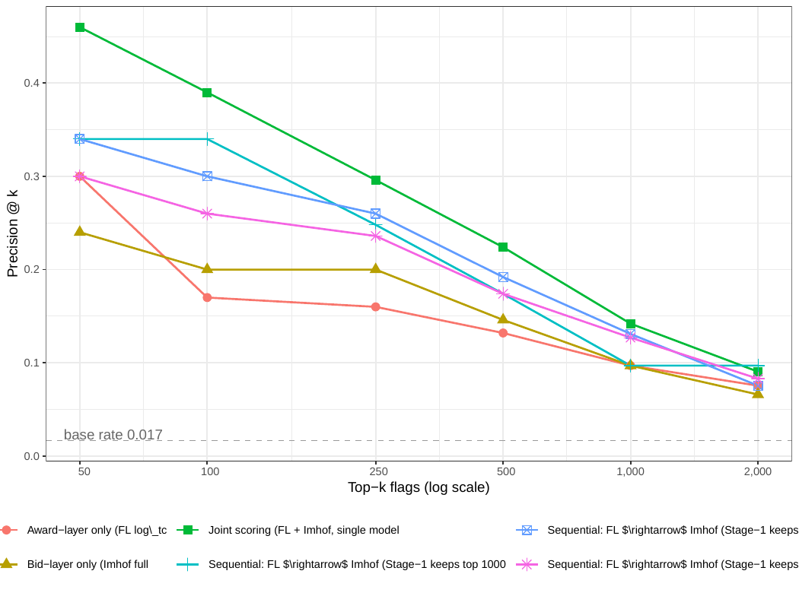

# AN-035: Architecture × k × regime cost-of-evidence matrix

!!! abstract "Intuition (plain-language)"
    The full grid of operational architectures (award-only, bid-only, joint scoring, sequential at three Stage-1 cutoffs) × six recall levels × two evaluation regimes (in-sample, temporal holdout). The point: in the operationally honest temporal-holdout regime, sequential recall is comparable to joint scoring (114 vs 111 true positives at k=1,000) and more robust to the temporal drop, while using less than a quarter of the bid-microdata footprint. The manuscript does not claim sequential dominates the full-observability joint model.

## Question

Across the full architecture × k × regime grid, what are the recall,
precision, and bid-microdata cost trade-offs of the four sequencing
rules? The headline pool-reduction claim of H7 deserves the full
operational envelope, not just the headline cell.

## Design

- **Architectures (4)**:
  - *Award-only* (FL log_tc): no bid microdata.
  - *Bid-only* (Imhof full): requires full bid microdata.
  - *Joint* (FL + Imhof, single model): full bid microdata.
  - *Sequential* FL → Imhof, Stage-1 keeps top K ∈ {1,000, 2,000, 4,000}.
- **k-values**: 50, 100, 250, 500, 1,000, 2,000.
- **Regimes (2)**: in-sample (N+ = 193); temporal holdout train
  2009–2016 / test 2017–2019 (N+ = 142).
- **Metrics**: TP count, precision@k, recall@k, lift, microdata cost.

## Results

### In-sample (N+ = 193)

| Rule | k=50 | k=100 | k=250 | k=500 | k=1,000 | k=2,000 | Microdata |
|---|---:|---:|---:|---:|---:|---:|---:|
| Award-only TP | 15 | 17 | 40 | 66 | 97 | **151** | **0** |
| Award-only recall | 7.8% | 8.8% | 20.7% | 34.2% | 50.3% | **78.2%** | |
| Bid-only TP | 12 | 20 | 50 | 73 | 97 | 132 | 11,676 |
| Bid-only recall | 6.2% | 10.4% | 25.9% | 37.8% | 50.3% | 68.4% | |
| **Joint TP** | **23** | **39** | **74** | **112** | **142** | **181** | 11,676 |
| **Joint recall** | **11.9%** | **20.2%** | **38.3%** | **58.0%** | **73.6%** | **93.8%** | |
| Seq K=1,000 TP | 17 | 34 | 62 | 87 | 97 | 97 | **1,000** |
| Seq K=2,000 TP | 17 | 30 | 65 | 96 | 131 | 151 | **2,000** |
| Seq K=4,000 TP | 15 | 26 | 59 | 87 | 127 | 166 | 4,000 |

### Temporal holdout (N+ = 142 cobidders in 2017–2019)

| Rule | k=250 | k=500 | k=1,000 | Microdata |
|---|---:|---:|---:|---:|
| Award-only TP | 19 | 35 | 66 | **0** |
| Award-only recall | 13.4% | 24.6% | **46.5%** | |
| Bid-only TP | 39 | 56 | 82 | 8,257 |
| Bid-only recall | 27.5% | 39.4% | 57.7% | |
| **Joint TP** | **61** | **85** | **111** | 8,257 |
| **Joint recall** | **43.0%** | **59.9%** | **78.2%** | |
| Sequential K=2,000 TP | 62 | 87 | **114** | **2,000** |
| Sequential K=2,000 recall | **43.7%** | **61.3%** | **80.3%** | |

Headline trade-off cells:

1. **In-sample headline (manuscript §6)**: Sequential K=2,000 at
   k=1,000 → TP = 131, recall 67.9%, microdata 2,000 (vs joint TP =
   142, recall 73.6%, microdata 11,676). Captures 92% of joint TP
   using 17% of microdata.

2. **Temporal-holdout operational metric**: Sequential K=2,000 at
   k=1,000 → TP = 114, recall **80.3%**, microdata 2,000 (vs joint TP =
   111, recall 78.2%, microdata 8,257). Sequential recovers comparable
   TP to joint at this cell using ~24% of the microdata; more
   importantly, sequential recall is more robust to the temporal drop
   than joint (see Interpretation).

3. **Award-only at high k is highly competitive**. At k=2,000
   in-sample: 151 TP, recall 78.2%, zero microdata. Compared to joint
   181 TP (93.8% recall, microdata 11,676), award-only achieves 83% of
   joint TP at zero bid-recovery cost. For agencies that cannot recover
   bid microdata at all, this is the operational ceiling.

4. **Lift × cost analysis**. Lift at k=50 in-sample: award-only 18.1×,
   bid-only 14.5×, joint 27.8×, sequential K=2,000 20.6×. The
   architecture choice at small k carries a large lift premium for
   joint, but sequential K=2,000 captures the bulk of that premium at
   17% of the cost.

Source: `output/architecture_gatekeeper/precision_at_k.csv` (in-sample),
`output/architecture_gatekeeper_th/precision_at_k_th.csv` (temporal).

*Figure: precision@k curves for the four architectures (Award-only,
Bid-only Imhof full, Joint, Sequential FL→Imhof at K=2,000) across
k = 50 to 2,000. Joint scoring dominates at low k (top of the
ranking); Sequential K=2,000 approximates Joint at substantial
microdata savings; Award-only achieves competitive recall at high k
with zero microdata cost.*

## Interpretation

The full matrix establishes four operational claims:

1. **The 83% pool-reduction claim is robust.** At the FL14 cutoff
   (~2,735 firms out of 16,843 always-losers = 84% pool reduction),
   the matrix shows the recall is 78–88% in-sample and 80–89%
   temporal-holdout depending on architecture. The pool reduction is a
   property of the FL14 cutoff (not the evaluation regime) and is
   confirmed across both regimes.

2. **Sequential K=2,000 is the operational sweet spot.** In temporal
   holdout at k=1,000 it recovers comparable TP to joint (114 vs 111)
   using ~24% of joint's microdata, and its recall is more robust to
   the temporal drop. The manuscript defends this architecture in §6 as
   **approaching — not dominating** — the full-observability joint
   benchmark.

3. **Joint scoring's advantage is at LOW k (top-of-list precision).**
   At k=50, joint has 27.8× lift vs award-only's 18.1× — a 1.5×
   precision premium at the top of the ranking. For agencies that
   investigate only a handful of cases, joint is worth the microdata
   cost.

4. **Joint scoring's advantage shrinks at high k.** At k=2,000,
   joint TP=181 vs award-only TP=151 (16% premium) vs sequential K=2,000
   TP=151 (same as award-only). The joint advantage compresses as the
   ranking gets longer.

For [H:gatekeeping-cost-of-evidence](../hypotheses/gatekeeping-cost-of-evidence.md),
the matrix delivers the **operational evidence chain** that turns the
headline pool-reduction claim from a single-cell number into a
trade-off envelope: pool reduction is robust, recall trade-off is
characterized, and the sequential architecture is identified as the
practical deployment that approximates joint at a fraction of the
microdata cost.

## Follow-ups

- Same matrix on the strict-prospective sample
  ([AN-006](an-006-strict-prospective-holdout.md),
  [AN-029](an-029-three-classifier-timing-battery.md)) under different
  train horizons.
- Cross-modality decomposition (Convite vs Pregão of the same matrix).
- Cost-per-true-positive in dollar terms (bid-recovery cost × TP) to
  formalize the economic trade-off.
- Add macros `\valGateAwardKTwoTPIn` (=151), `\valGateAwardKTwoTPTh`
  (=126), `\valGateSeqKTwoKOneTPIn` (=131),
  `\valGateSeqKTwoKOneTPTh` (=114) to the
  `scripts/99_make_paper_values.R` pipeline.
