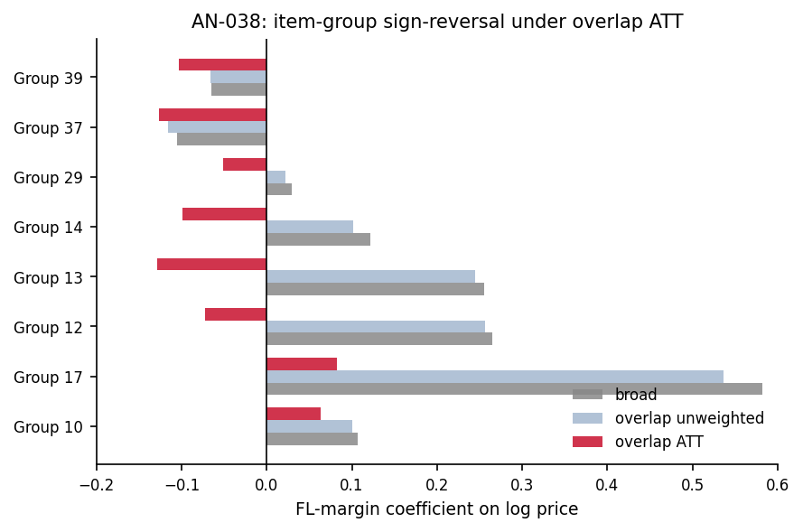

# AN-038: Negative cell + item-group segment audit

## Question

At the item-group and operating-cell level, where does the negative
FL-price coefficient hold and where does it not? The within-overlap
subgroup decomposition ([AN-037](an-037-sign-reversal-decomposition.md))
showed the negative survives across modality, PBU size, and most
tender-value quartiles. This page documents the finer cell-level
decomposition.

## Design

- **Item-group decomposition** (`segment_betas.csv`): for each top
  item group (BEC item-group code 10–39), report the three-spec
  progression — broad, overlap_unweighted, overlap_att.
- **Cell-by-cell negative audit** (`negative_cell_audit.csv`): for
  cells with negative point estimates in the broad spec, report
  modality, period, PBU-size quartile, tender-value quartile, top
  item group, and top buyer.

## Results

### Item-group decomposition (segment_betas.csv)

| Item group | Broad coef | Overlap unweighted | **Overlap ATT** |
|---|---:|---:|---:|
| 10 | +0.107 | +0.101 | **+0.063** (stays positive) |
| 12 | +0.265** | +0.256** | **−0.072** (flips) |
| 13 | +0.255 | +0.245 | **−0.129*** (flips, p = 0.069) |
| 14 | +0.122 | +0.102 | **−0.099*** (flips, p = 0.059) |
| 17 | +0.582*** | +0.536*** | **+0.083** (attenuates, n.s.) |
| 29 | +0.029 | +0.022 | **−0.051**** (flips, p = 0.019) |
| 37 | **−0.105**** | **−0.116**** | **−0.126**** (stays negative) |
| 39 | **−0.065**** | **−0.066**** | **−0.103**** (stays negative) |

### Negative cell audit (negative_cell_audit.csv)

Cells with negative point estimates in the broad spec:

| Dimension | Group | Coef | SE | p | N | Treated share |
|---|---|---:|---:|---:|---:|---:|
| modality | Convite | −0.062*** | 0.024 | 0.009 | 4,470 | 54.2% |
| modality | Pregão | −0.065** | 0.032 | 0.041 | 2,856 | 49.0% |
| period | 2009–2013 | **−0.119*** | 0.025 | <10⁻⁵ | 3,842 | 45.6% |
| period | 2014–2016 | +0.009 | 0.033 | 0.796 | 1,999 | 54.5% |
| period | 2017–2019 | −0.055 | 0.090 | 0.540 | 1,485 | 66.1% |
| direct_cade_item | 0 (none) | **−0.080*** | 0.025 | 0.001 | 7,239 | 51.7% |
| pbu_size_q | 3 | +0.061 | 0.089 | 0.494 | 1,991 | 70.9% |
| pbu_size_q | 4 | **−0.126*** | 0.022 | <10⁻⁷ | 4,275 | 37.9% |
| tender_value_q | 1 | **−0.123*** | 0.018 | <10⁻⁹ | 2,577 | 30.7% |
| tender_value_q | 2 | −0.061 | 0.035 | 0.080 | 1,492 | 42.9% |
| tender_value_q | 3 | +0.021 | 0.038 | 0.570 | 1,100 | 65.6% |
| tender_value_q | 4 | −0.045 | 0.109 | 0.679 | 2,157 | 77.4% |
| item_group_top | 37 | **−0.182*** | 0.022 | <10⁻⁹ | 1,317 | 30.4% |
| item_group_top | Other | +0.058 | 0.052 | 0.261 | 3,242 | 66.3% |
| buyer_top | Other | −0.018 | 0.029 | 0.549 | 5,899 | 57.3% |

Sources: `output/sign_reversal_decomp/segment_betas.csv`,
`output/negative_cell_audit/negative_cell_audit.csv`.

*Figure: FL-margin coefficient by item group across three
specifications — broad (grey), overlap unweighted (light blue),
overlap ATT (red). Groups 12, 13, 14, 29 flip from positive baseline
to negative ATT (sign reversal). Group 37 stays negative across all
specs (structural negative); group 10 stays positive (structural
positive). Predictably structured heterogeneity, not noise.*

## Interpretation

Three readings:

1. **Most item groups flip from positive to negative under overlap
   ATT**: groups 12, 13, 14, 29 all move from positive baseline to
   negative ATT (sign flip). Group 17 attenuates from +0.582*** to
   +0.083 (n.s.), losing significance but staying positive — partial
   sign-flip. Groups 37 and 39 are negative across all specifications
   — they would never have supported a naive damages reading.
   Group 10 is the only group that stays clearly positive throughout
   (+0.107 → +0.063), and even there the ATT spec is not significant.

2. **Cell-by-cell, the negative is concentrated in the early period
   and large-PBU + low-value corner**. Period 2009–2013 gives the
   strongest negative (−0.119, p < 10⁻⁵); period 2014–2016 gives
   +0.009 (n.s.); period 2017–2019 gives −0.055 (n.s., small N).
   PBU-size Q4 (largest buyers, but where 38% are treated — low
   treatment share) gives −0.126; tender-value Q1 (lowest value)
   gives −0.123. These are the cells where the loser-side scope
   applies cleanly: routine, low-value tenders with large-PBU
   procurers.

3. **Item-group 37 is the structural negative**. Across all three
   specifications, group 37 has a strongly negative coefficient
   (−0.105 broad → −0.116 overlap unweighted → −0.126 overlap ATT;
   all p < 10⁻⁶). This item group is the cleanest case for the
   scope reading — FL presence is associated with *lower* observed
   prices, consistent with cobidder activity occurring in a regime
   where the underlying price-formation process is also lower-priced
   (perhaps because high participation correlates with competitive
   product categories where cartels operate at the margin).

The cell-by-cell heterogeneity is **predictably patterned**, not
random:
- Routine, low-value, large-PBU cells → negative (sign-reversed)
- Specific item-group categories (37, 39) → negative across specs
- Item-group 10 and high-value Q4 → positive (the boundaries of the
  scope reading)
- Item-group 17 → loses significance under ATT (partially flipped)

For [H:price-scope-sign-reversal](../hypotheses/price-scope-sign-reversal.md):
the cell decomposition strengthens the headline reading by showing the
sign reversal is not uniform but predictably structured. The agency
deploying the screen should expect:
- Robust negative price-FL association in the routine large-PBU
  low-value corner (the operational deployment target);
- Positive or neutral association in specific item groups and
  high-value tenders (scope boundaries to communicate to courts).

The reading is 🟡 because the cell-level patterns are observational
and depend on item-group taxonomy choices; promotion to 🟢 requires
either independent cell-level replication or a clean instrument for
the within-cell FL margin.

## Follow-ups

- Item-group 37 deep-dive: which product category is this? Does the
  consistent negative coefficient survive year-fixed effects within
  this group?
- High-value Q4 deep-dive: why does the positive coefficient persist?
  Is it a damages-reading remnant or a noise floor?
- Buyer-top decomposition (current "Other" cell is too coarse).
- Add macros `\valNegCellConvCoef` (−0.062), `\valNegCellPregCoef`
  (−0.065), `\valSegBetaG37ATT` (−0.126), `\valSegBetaG10ATT`
  (+0.063) — some already in `values.tex` as `\valNegCellConvCoef`
  etc.
