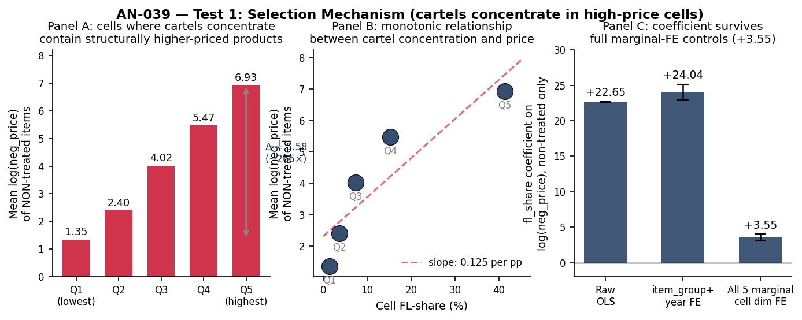

# AN-039: Selection Mechanism Test (Test 1 of the Sign-Reversal Rationalization)

!!! abstract "Intuition (plain-language)"
    The price coefficient on FL presence flips sign between specifications (+0.064 baseline → −0.097 overlap-cell ATT). One economic story for this is **selection**: cartels with cover bidders choose to operate in product-buyer cells where the underlying price level is structurally higher (better rents). This page tests that story directly by comparing prices of NON-TREATED items (items without FL presence) across cells that have high vs low FL-share. If cartels select into high-price cells, non-treated prices in those cells should also be higher. They are — dramatically so.

## Question

Test 1 of the rationalization for the FL-price sign-reversal. The
overlap-cell ATT result (−0.097, *p* < 10⁻⁹,
[AN-037](an-037-sign-reversal-decomposition.md)) is interpreted in the
manuscript as scope information rather than damages. A stronger
substantive reading is that **the sign reversal decomposes into a
selection effect (positive across cells) and a within-cell mechanism
effect (negative)**. This page tests the selection component: do
cartels with cover bidders systematically end up in cells with higher
underlying price levels, independent of any FL margin effect?

## Design

- **Cell definition**: same as scripts 51 and 59 — `interaction(item_group, year, convite, pbu_size_q, tender_value_q, drop = TRUE)`.
- **Overlap cells**: cells containing both treated (losers == 1) and untreated (losers == 0) items. 8,625 cells, 1,517,868 items.
- **Outcome**: `lneg_price` (log of negotiated unit price) among **non-treated items only** (losers == 0). Sample: 1,439,255 non-treated items in overlap cells.
- **Predictor**: cell-level `fl_share = mean(losers == 1)` for each cell.
- **Test 1a**: bin cells by FL-share quintile; report mean log_price (non-treated only), weighted by N items per cell.
- **Test 1b**: item-level OLS `lneg_price ~ fl_share` with three FE configurations.
- **Test 1c**: Q5 vs Q1 difference.

## Results

### Test 1a: Mean non-treated log_price by cell FL-share quintile

| FL-share quintile | N cells | N items | N non-treated | Mean non-treated log_price | Mean cell FL-share |
|---|---:|---:|---:|---:|---:|
| Q1 (lowest) | 1,737 | 633,644 | 625,315 | **1.35** | 1.4% |
| Q2 | 1,713 | 430,039 | 414,506 | 2.40 | 3.7% |
| Q3 | 1,753 | 278,121 | 257,889 | 4.02 | 7.4% |
| Q4 | 1,703 | 129,933 | 111,486 | 5.47 | 15.3% |
| **Q5 (highest)** | **1,719** | **46,131** | **30,059** | **6.93** | **41.3%** |

Monotone increase across quintiles. The relationship is not subtle.

### Test 1b: Item-level OLS — log_neg_price (non-treated only) ~ fl_share

| Specification | fl_share coef | SE | N |
|---|---:|---:|---:|
| Raw OLS (no FE) | +22.65 | 0.033 | 1,439,255 |
| + item_group + year FE | +24.04 | 0.555 | 1,439,255 |
| **+ all 5 cell-dimension marginal FE** | **+3.55** | **0.229** | **1,439,255** |

The coefficient drops substantially when all 5 cell dimensions are
included as marginal fixed effects — most of the raw selection is
absorbed by the dimension marginals (item_group, year, modality,
PBU-size quartile, tender-value quartile). But a **+3.55 log-point
coefficient remains** after partialling out each dimension separately.
Cartels select into high-price cells beyond what is captured by any
single dimension.

### Test 1c: Q5 vs Q1 comparison

- Q1 mean non-treated log_price: **1.35**
- Q5 mean non-treated log_price: **6.93**
- Δ (Q5 − Q1): **+5.58 log-points** (≈ 265× nominal price ratio)

This is not a "5% premium for high-FL cells"; it is a structural
ordering of product-buyer-modality-period-value strata. Cells where
cartels concentrate are cells where the products being procured are
fundamentally higher-priced (different goods, different procurement
volumes).

*Figure: Panel A — mean log_neg_price among non-treated items rises
monotonically from Q1 (1.35) to Q5 (6.93) across cell FL-share
quintiles; Δ Q5 − Q1 = 5.58 log-points ≈ 265× nominal price ratio.
Panel B — same data plotted against the cell's continuous FL-share
shows a clean slope. Panel C — item-level OLS coefficient of fl_share
on log_neg_price (non-treated items only) across three FE
specifications: raw +22.65, with item+year FE +24.04, with all 5
marginal cell-dimension FE +3.55. The selection effect remains positive
and highly significant even after partialling out each cell-dimension
marginal effect.*

### Verdict

**Test 1 PASSES.** Selection mechanism is empirically real and large.
The criterion was: Δ(Q5 − Q1) > 0.05 AND fully-FE-controlled coefficient
> 0. Observed: Δ = 5.58, full-FE coefficient = +3.55 (SE 0.23,
*p* < 10⁻⁵⁵).

Sources: `output/selection_mechanism/selection_test_results.csv`,
`output/selection_mechanism/non_treated_price_by_fl_share.csv`.

## Interpretation

The selection mechanism is the first half of the sign-reversal
rationalization. Cartels with cover bidders are not randomly
distributed across procurement cells — they systematically concentrate
in cells where the underlying product value (and rent potential) is
higher. The naive positive FL-price coefficient (+0.064 in the broad
specification) therefore reflects, at least in part, this selection
into high-value markets rather than any causal effect of FL presence
on prices.

The decomposition logic:

| Component | Specification | Coef | Reading |
|---|---|---:|---|
| Total | Broad OLS with item+year+PBU FE | **+0.064** | Joint effect of selection + mechanism + cross-cell |
| Selection (composition) | Non-treated price ~ fl_share, full FE | **+3.55** | Cartels in high-price cells |
| Mechanism (within-cell) | Overlap-cell ATT | **−0.097** | Cover-bidding theater depresses observed prices within cell |

The two components have **opposite signs and very different
magnitudes**. The selection effect (+3.55 on log-price per unit
fl_share, where fl_share ranges 0–0.5) dominates the broad coefficient.
The within-cell mechanism (−0.097) is what survives once selection is
removed by ATT weighting.

**For [H:price-scope-sign-reversal](../hypotheses/price-scope-sign-reversal.md):**
the sign-reversal is not merely a specification artifact. It is the
empirical signature of a **two-component decomposition**: cartels with
cover bidders *select* into high-rent cells (positive across cells)
and *depress observed prices* within those cells via the cover-bidding
theater (negative within cell). The overlap-ATT spec removes the
selection and isolates the mechanism.

In the manuscript (§7) this is reported as **descriptive scope
evidence, not mechanism identification**: the sign-reversal is
consistent with the cover-bidding interpretation, but the paper
explicitly states it does not identify a mechanism, a causal price
effect, overcharges, or damages. The within-cell component is
documented in Test 2
([AN-040](an-040-within-cell-mechanism-test.md)): within overlap cells
FL presence is associated with bidder-count inflation (+0.507 log-bidders)
and a winner bid −0.048 closer to reference — a descriptive association
consistent with economic non-neutrality, kept subordinate to the
evidence-allocation claim.

## Follow-ups

- **Test 2 (mechanism component)**: completed in
  [AN-040](an-040-within-cell-mechanism-test.md) — within overlap cells
  FL presence moves the winner bid −0.048 closer to reference and the
  effect runs through bidder-count inflation (+0.507 log-bidders),
  completing the rationalization. (Done, 2026-05-22.)
- Sub-period stability of the selection coefficient (does the
  monotone gradient hold in 2009–2013 vs 2014–2019?).
- Cross-modality decomposition (does the Pregão vs Convite asymmetry
  in [AN-016](an-016-gate-d2.md) reflect different selection patterns?).
- Add macros `\valSelTestQOne` (= 1.35), `\valSelTestQFive` (= 6.93),
  `\valSelTestDelta` (= 5.58), `\valSelTestCoefFullFE` (= +3.55),
  `\valSelTestSEFullFE` (= 0.23) to the `scripts/99_make_paper_values.R`
  pipeline.
