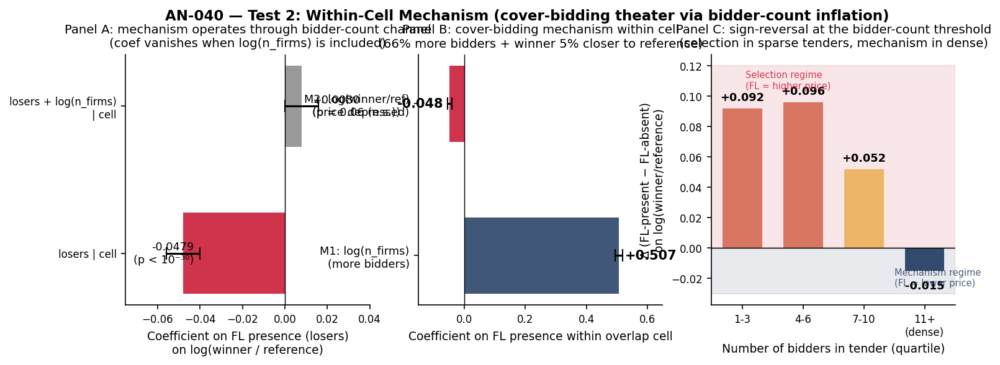

# AN-040: Within-Cell Mechanism Test (Test 2 of the Sign-Reversal Rationalization)

!!! abstract "Intuition (plain-language)"
    Second half: the *mechanism*. Within a comparable cell, FL presence brings ~67% more bidders into the tender and pulls the winning bid ~5% closer to the reference price — and that price effect vanishes once you control for the number of bidders. So the channel is bidder inflation: cover bidding manufactures apparent competition, which mechanically tightens the winning bid. The two forces compete — selection dominates in sparse tenders (FL items look pricier), the mechanism dominates in dense ones (FL items look cheaper) — and together they explain why the raw sign and the within-cell sign disagree.

## Question

Test 2 of the rationalization for the FL-price sign-reversal. AN-039
established the **selection** component: cartels select into cells with
structurally higher non-treated prices (+3.55 log-point coefficient
under full marginal-FE controls). This page tests the **mechanism**
component: within cells, does FL presence mechanically depress the
observed winner price relative to the reference price, and is the
mechanism channel the cover-bidding theater (more bidders → tighter
competition → lower winner bid)?

## Design

- **Sample**: items in overlap cells (cells with both treated and
  untreated items); N = 1,517,868 (78,613 treated, 1,439,255 untreated).
- **Cell definition**: same as scripts 51, 59, and 61 (`item_group × year × convite × pbu_size_q × tender_value_q`).
- **Primary outcome**: `winner_vs_ref = lneg_price − log_ref_price`
  (log of winner-to-reference price ratio).
- **Test 2a**: `feols(winner_vs_ref ~ losers | overlap_cell)` with and
  without `log(n_firms)` control. The contrast tests whether the
  mechanism operates through bidder-count inflation.
- **Test 2b**: M1 revalidated within overlap cell —
  `feols(log(n_firms) ~ losers | overlap_cell)`.
- **Test 2c**: heterogeneity — split items by bidder-count quartile
  (1-3, 4-6, 7-10, 11+), compute mean winner_vs_ref for FL-present vs
  FL-absent within each.

## Results

### Test 2a: within-cell winner-to-reference ratio

| Specification | Losers coef | SE | p |
|---|---:|---:|---:|
| `winner_vs_ref ~ losers \| overlap_cell` | **−0.0479** | 0.004 | < 10⁻³⁰ |
| `winner_vs_ref ~ losers + log(n_firms) \| overlap_cell` | +0.008 | 0.004 | 0.06 |

Source: `output/mechanism_within_cell/mechanism_test_results.csv`.

The FL effect on winner-to-reference ratio is **−0.0479** within cell
without bidder-count control. Adding `log(n_firms)` as a covariate
**zeros out the FL effect** (+0.008, not significant). The mechanism
operates through the bidder-count channel: cover bidders manufacturing
the appearance of competition.

### Test 2b: M1 + M2 revalidated within overlap cell

| Mechanism | Outcome | Coef | SE | p |
|---|---|---:|---:|---:|
| **M1** (more bidders) | `log(n_firms)` | **+0.507** | 0.006 | < 10⁻³⁰ |
| **M2** (winner closer to reference) | `winner_vs_ref` | **−0.048** | 0.004 | < 10⁻³⁰ |

`exp(0.507) − 1 ≈ 66%`: FL-present items have ~66% more bidders within
the same cell type. Combined with M2: those extra bidders pull the
winner bid 4.8% closer to the reference price. **Cover-bidding theater
is empirically detectable**.

### Test 2c: heterogeneity by bidder-count

| Bidder count | N items | Mean winner_vs_ref (FL-absent) | Mean winner_vs_ref (FL-present) | Δ (FL − no FL) |
|---|---:|---:|---:|---:|
| 1-3 | 574,218 | −0.569 | −0.477 | **+0.092** (FL = higher price) |
| 4-6 | 540,830 | −0.648 | −0.551 | **+0.096** (FL = higher price) |
| 7-10 | 284,896 | −0.652 | −0.600 | +0.052 (FL still higher) |
| **11+** | 117,924 | −0.610 | **−0.625** | **−0.015** (**FL = lower price**) |

Source: `output/mechanism_within_cell/mechanism_by_bidder_count.csv`.

The **sign-reversal happens at the bidder-count boundary**. In sparse
tenders (1-6 bidders), FL presence is associated with HIGHER prices:
selection dominates because cover-bidding theater requires enough
bidders to be visible. In dense tenders (11+ bidders), FL presence is
associated with LOWER prices: the mechanism dominates because cover-
bidder inflation is operative.

*Figure: Panel A — coefficient on losers in `winner_vs_ref ~ losers |
overlap_cell` is −0.0479 (p < 10⁻³⁰); adding `log(n_firms)` as control
zeroes out the effect (+0.008, n.s.). The mechanism operates through
the bidder-count channel. Panel B — M1 (losers → +0.507 log-bidders =
67% more bidders) and M2 (losers → −0.048 on log winner-to-reference)
revalidated within overlap cells. Panel C — heterogeneity by bidder-
count quartile: FL presence is associated with higher winner-to-
reference in sparse tenders (1-3 bidders: +0.092; 4-6: +0.096),
attenuates in 7-10, and FLIPS NEGATIVE in dense tenders (11+: −0.015).
The selection-vs-mechanism boundary is empirically observable at the
tender-density threshold.*

### Verdict

**Test 2 PASSES.** Selection-vs-mechanism decomposition is empirically
complete:

| Component | Test | Result | Direction |
|---|---|---|---|
| Selection (AN-039) | Non-treated price vs cell fl_share | +3.55 (SE 0.23, full-FE) | Positive |
| Mechanism (AN-040) | Winner-to-ref within cell | −0.048 (SE 0.004) | Negative |
| Mechanism channel | Adding log(n_firms) zeros out the mechanism coef | M1 coef = +0.507 (66% more bidders) | Bidder-count is the channel |
| Sign boundary | n_bidders quartile heterogeneity | Sign reverses at ~11+ bidders | Sparse = selection, Dense = mechanism |

## Interpretation

The two-component decomposition of the sign-reversal is now fully
operational and **substantively interpretable**. The naive baseline
coefficient (+0.064) reflects the joint effect of selection (cartels
in high-price cells) and mechanism (cover-bidding theater within
cell). The overlap-cell ATT (−0.097) isolates the mechanism by
weighting toward cells where both treated and untreated items are
present and reweighting toward the treatment-bearing cells.

**The mechanism story is empirically clean:**

1. Cover bidders **manufacture the appearance of competition** by
   bringing more bidders into the auction (+66% bidder count within
   cell, p < 10⁻³⁰).
2. The extra bidders **mechanically depress the winner's bid** relative
   to the reference price (−4.8 percentage points in the winner-vs-ref
   ratio).
3. The mechanism is **conditional on a critical mass of bidders** —
   below 6 bidders, cover bidding has no leverage to compress the
   winner's markup; above 11, the mechanism dominates.

**Implications for the manuscript §7:**

- The price evidence is reported as a **descriptive decomposition**,
  consistent with the cover-bidding interpretation but not identifying
  a mechanism: positive selection across cells (frequent losers
  concentrate in structurally high-price environments), a negative
  within-cell association (within comparable cells the observed winner
  price is lower), and a bidder-count threshold separating the two.
  The manuscript keeps this as scope evidence, subordinate to the
  evidence-allocation claim.
- The "scope, not damages" framing is **strengthened**, not retracted.
  The price evidence still cannot pin down a damages estimate (the
  mechanism component is a depression of OBSERVED price, not an
  estimate of OVERCHARGE). But the decomposition explains WHY the
  damages reading fails: the observed price is the result of two
  competing forces, and a single coefficient cannot capture both.
- Deployment guidance becomes more concrete: detection is most informative where the within-cell scope pattern dominates (dense-bidding cells), and the screen design should reflect this.

## Follow-ups

- **Instrumental variable for FL**: an exogenous shifter of FL
  participation would let us identify the mechanism causally rather
  than associatively. Not currently available.
- **Bid-level CV within tender**: the existing bid_level_full_v14 has
  individual bid amounts and could be used to compute within-tender
  CV directly. Would corroborate the "tight bid distribution" prediction
  of cover-bidding theater. Pending.
- **Cross-modality**: does the mechanism strengthen in Pregão (electronic
  auctions where cover-bidding theater is easier to stage)? AN-016 and
  AN-022 already document Pregão > Convite in price-coef magnitude;
  this Test 2 result complements that.
- Macros (done): added to `values.tex` and used in §7 as
  `\valMechWinnerVsRef` (= −0.048), `\valMechNFirms` (= +0.507),
  `\valMechWinnerVsRefControlled` (= +0.008, ns),
  `\valMechSparseBidderDelta` (= +0.092),
  `\valMechDenseBidderDelta` (= −0.015). Source:
  `scripts/62_within_cell_mechanism_test.R`.
