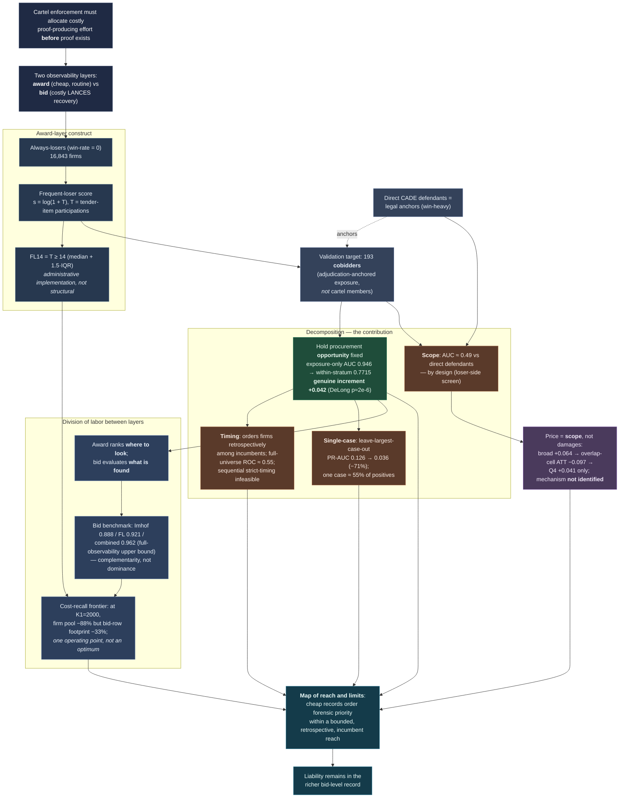

# Paper DAG

The directed acyclic graph of the paper's argument: how the institutional
premise flows through the award-layer construct, the **decomposition** that
disciplines it, and the **reach-and-limits** map that is the contribution.
Each node is a claim or object; each arrow is "supports / leads to."

!!! note "How to read it"
    The green node is the paper's methodological core — the **opportunity
    decomposition** that separates a genuine ranking signal (+0.042) from the
    mechanical exposure arithmetic (0.946) that inflates the raw pooled AUC. The
    brown nodes are the **limits** that the same decomposition exposes
    (retrospective ordering, single-case dependence, the direct-defendant scope
    boundary). The contribution is not a deployable cartel detector — it is the
    method that draws this boundary, and the map of where cheap administrative
    records can, and cannot, order forensic priority.
