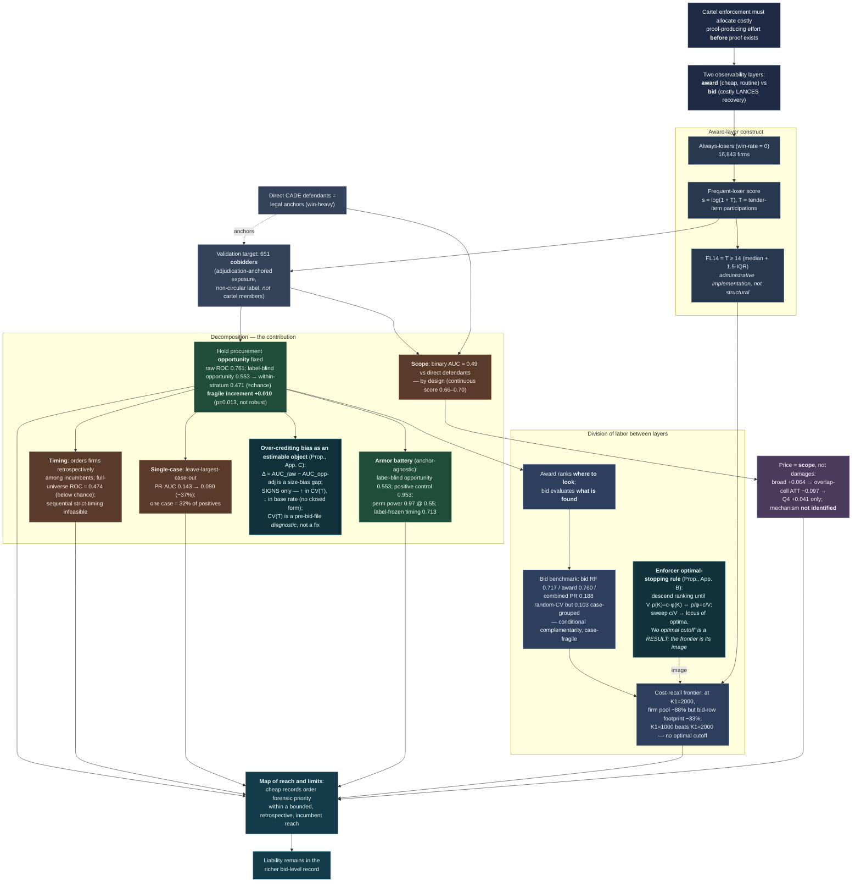

# Paper DAG

<!-- REVISED: canonical-target reframe 2026-06-04 -->
<!-- REVISED: hostile-review armor 2026-06-04 -->

The directed acyclic graph of the paper's argument: how the institutional
premise flows through the award-layer construct, the **decomposition** that
disciplines it, and the **reach-and-limits** map that is the contribution.
Each node is a claim or object; each arrow is "supports / leads to."

!!! note "How to read it"
    The green nodes are the paper's methodological core — the **opportunity
    decomposition** that strips mechanical co-participation exposure from the raw
    award-layer score (0.761) and finds that almost nothing survives: genuine
    label-blind opportunity ranks the label at only 0.553, the within-stratum AUC
    is ≈ chance (0.471), and the only positive is a fragile +0.010 increment that
    is not robust across designs. The **armor battery** (anchor-agnostic) decides
    the deflationary verdict: a planted positive control recovers 0.953
    (falsifiability), the permutation test has power 0.97 at within-AUC 0.55, and
    label-frozen timing (0.713) shows generic contact forecasting, not
    cartel-specific prediction. The ranking by *observed* contact (0.905) is
    mechanical label encoding, not a winning model. The brown nodes are the
    **limits** the same decomposition exposes (below-chance out-of-time ordering,
    single-case dependence, the direct-defendant scope boundary). The two teal
    nodes are the v24 reframe's **positive modeled objects**: the **enforcer
    optimal-stopping rule** (whose image is the cost-recall frontier — "no
    optimal cutoff" is a *result*, the frontier is the locus of budget-dependent
    optima) and the **over-crediting bias** $\Delta$ (a size-bias
    characterization of the deflation, stated as *signs only* — increasing in
    $\mathrm{CV}(T)$, decreasing in the base rate, no closed form, with
    $\mathrm{CV}(T)$ a pre-bid-file diagnostic). The contributions are these two
    modeled objects plus a **disciplined audit protocol** — not a deployable
    cartel detector.

!!! abstract "Second platform: the same DAG re-run on federal ComprasNet (§5)"
    The entire decomposition branch above (raw award score → label-blind
    opportunity → within-stratum residual → armor battery) was re-run
    **unchanged** on the federal **ComprasNet** platform (2013–2019, pure
    Pregão) against the same family of CADE anchors, and **reaches the same
    verdict**: the deflation replicates. Federally the raw award-layer ROC is
    0.744, label-blind opportunity ranks the label at 0.611, the within-stratum
    residual falls to ≈ chance (**0.462**), the nested increment is null
    (**+0.005, $p = 0.191$**), and the negative controls return the surviving
    order to generic opportunity/volume geometry. The strict full-universe
    prospective collapse carries too (ROC 0.489 federal / 0.474 BEC). The
    construct **ports and deflates; it does not break.** This is a
    second-platform demonstration of the protocol, **provisional** —
    **partially overlapping legal anchors** (the 7 federal cases are the same
    cartels as the BEC portfolio, establishment-anchored), not a promotion to
    "Confirmed." Full battery in §5 and Appendix G; see the
    [Changelog](changelog.md) v23 entry.
