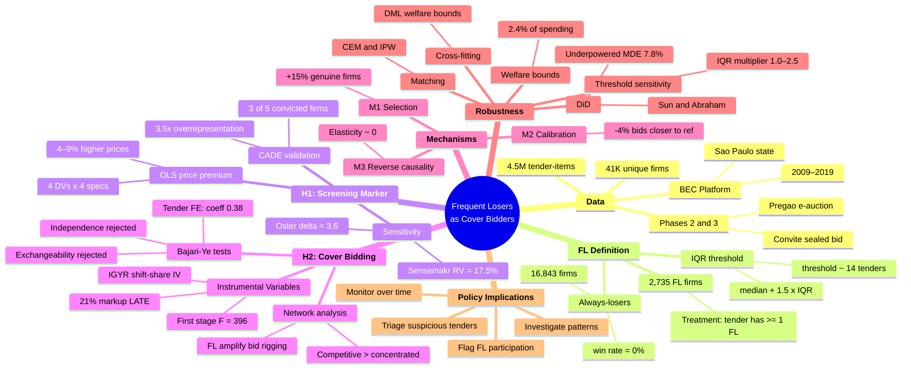

# Mind Map

Interactive overview of the paper's logical structure. Click and drag to explore.

---

[:material-arrow-left: Back to Frequent Losers Summary](index.md) · [:material-book-open-variant: Back to Research](../working-papers.md)
