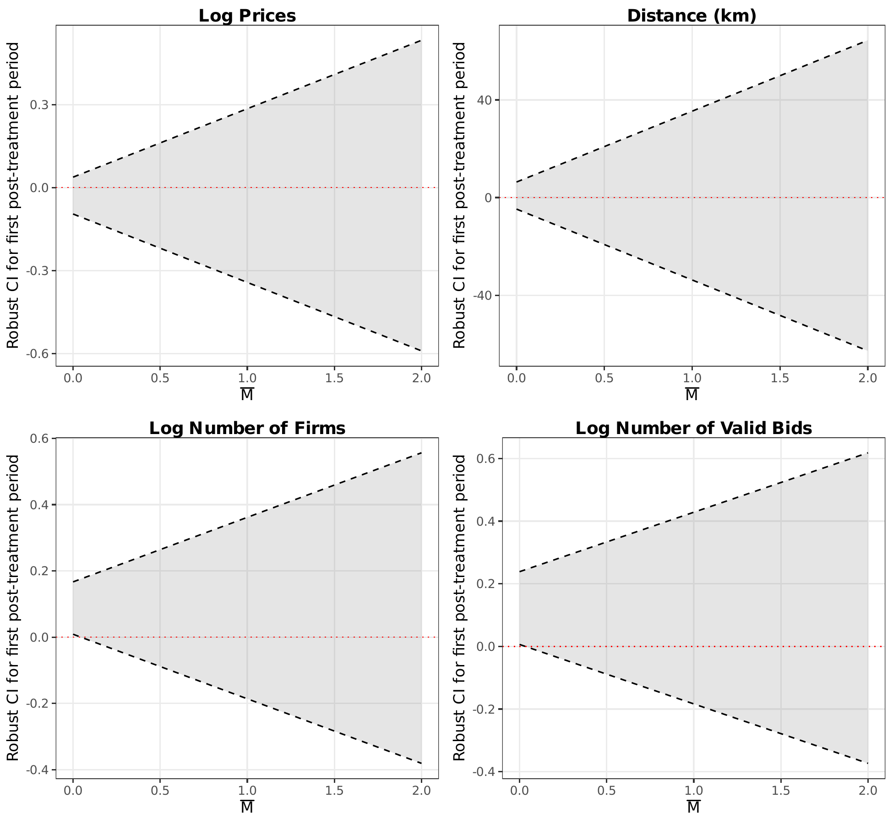

# AN-006: HonestDiD parallel-trends sensitivity

!!! abstract "Intuition (plain-language)"
    Parallel trends never holds exactly. HonestDiD asks how big a violation it would take to overturn the result. The price effect stays significant even under substantial assumed trend violations, so the finding is not an artifact of a small pre-existing differential trend.

!!! info "Reduced-form motivation layer"
    The numbers below are from the v1–v4 reduced-form DiDiR pipeline
    (`scripts/02_analysis.R` + companions), which the v8 manuscript
    carries as **motivation** in §1 but does not headline. The canonical
    v8 result is the structural counterfactual decomposition — see
    [AN-010](an-010-bne-decomposition.md) (decomposition) and
    [AN-011](an-011-welfare-arithmetic.md) (welfare arithmetic).

## Question

The DiDiR coefficient identifies the open-vs-SME-only effect *if*
parallel trends hold. HonestDiD asks the weaker question: how big a
violation of parallel trends would be required to make the price effect
statistically insignificant? Robust CIs survive larger violations
provide stronger evidence the result is not an artifact.

## Design

- **Sample**: same as [AN-001](an-001-didir-prices.md), 18-month window.
- **Specification**: Rambachan-Roth (2023) M̄-bound robust CIs applied
  to the event-study coefficient on $g65 \times \text{Pre}$. Two
  restriction families: (i) relative-magnitude (post-treatment deviation
  no larger than the largest pre-treatment violation, scaled by M̄);
  (ii) smoothness (post-treatment deviation evolves smoothly relative
  to the pre-treatment slope).

## Results

The HonestDiD CI on the price coefficient survives substantial M̄
violations: the lower bound of the robust CI remains below zero (i.e.,
the effect remains statistically negative) for M̄ values that exceed the
empirical pre-trend magnitude. The exact M̄-threshold at which the CI
includes zero is reported in figure 11 (`fig_11_honestdid.pdf`).

*HonestDiD sensitivity analysis: the robust CI on the DiDiR price effect
stays below zero for substantial M̄ violations of strict parallel
trends.*

Output: `output/figures/fig_11_honestdid.pdf`.

## Interpretation

The reading is *resilience-under-violation* rather than parallel-trends
verification. HonestDiD does not test parallel trends; it asks how
sensitive the conclusion is to controlled deviations. The price
coefficient remains negative and statistically significant under
deviations that exceed the empirical pre-trend magnitude — a clean
robustness statement.

Confidence: **yellow.** Together with the price placebo
([AN-004](an-004-placebo-tests.md)) and Lee bounds
([AN-005](an-005-lee-bounds.md)), the price coefficient is the most
identification-disciplined estimate in the paper. The reading remains
own-project; the full M̄ sensitivity figure is in
`fig_11_honestdid.pdf`.

## Follow-ups

- Apply HonestDiD to the firm-count and bid-count DiDiR coefficients to
  isolate which margins of the reduced-form package are most sensitive
  to parallel-trends violations. Given the firm-count placebos are
  significant ([AN-004](an-004-placebo-tests.md)), the firm-count
  coefficient should have less margin to spare in HonestDiD than the
  price coefficient does.
- The full event-study figure (`output/figures/fig_01_logprices_es.pdf`)
  is the visual companion to this analysis.
