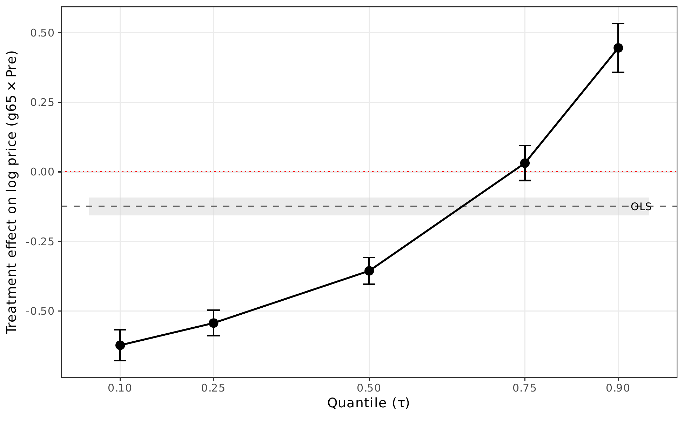

# AN-007: Quantile DiD across the conditional price distribution

!!! info "Reduced-form motivation layer"
    The numbers below are from the v1–v4 reduced-form DiDiR pipeline
    (`scripts/02_analysis.R` + companions), which the v8 manuscript
    carries as **motivation** in §1 but does not headline. The canonical
    v8 result is the structural counterfactual decomposition — see
    [AN-010](an-010-bne-decomposition.md) (decomposition) and
    [AN-011](an-011-welfare-arithmetic.md) (welfare arithmetic).

## Question

The DiDiR mean coefficient in [AN-001](an-001-didir-prices.md) is an
average effect across the conditional price distribution. How does the
open-competition price effect vary along the distribution? Canay (2011)
quantile DiD estimates the treatment effect at specified quantiles.

## Design

- **Sample**: same as [AN-001](an-001-didir-prices.md); 18-month window;
  completed items.
- **Specification**: Canay (2011) quantile DiD applied to log prices at
  $\tau \in \{0.10, 0.25, 0.50, 0.75, 0.90\}$.
- **Outcomes**: conditional quantiles of log prices.

## Results

| $\tau$ | β | SE | p |
|---|---:|---:|---:|
| 0.10 | −0.623 | 0.028 | <0.01 |
| 0.25 | −0.543 | 0.023 | <0.01 |
| 0.50 | −0.356 | 0.024 | <0.01 |
| 0.75 | +0.031 | 0.032 | n.s. |
| 0.90 | +0.445 | 0.045 | <0.01 |
| OLS benchmark | −0.124 | 0.017 | <0.01 |

*Coefficients across the conditional price distribution: strongly
negative at low quantiles, reversing at the upper tail.*

Output: `output/tables/tab_quantile_did.tex`,
`output/figures/fig_14_quantile_did.pdf`.

## Interpretation

The benefits of open competition concentrate at the lower quantiles of
the conditional price distribution: $\tau \leq 0.50$ shows strongly
negative coefficients. At $\tau = 0.90$, the effect *reverses* to
positive — possibly reflecting specialized items with thin supplier
markets where opening the auction up admits a price-raising selection
of non-SMEs (e.g., specialized medical equipment from a small pool of
qualified suppliers).

The OLS benchmark (−0.124) sits between the median quantile DiD
(−0.356) and the $\tau = 0.75$ coefficient (+0.031), illustrating that
the mean coefficient is *not* a clean summary of the distributional
impact.

Confidence: **yellow.** The distributional reading is informative but
the standard errors are larger than for the mean coefficient. The
direction at the lower quantiles is robust; the reversal at $\tau =
0.90$ is the most-interesting and most-uncertain finding.

## Follow-ups

- Item-class decomposition of the upper-tail reversal: which item
  subcategories drive the positive coefficient at $\tau = 0.90$?
  Specialized medical equipment vs reagents vs disposables.
- A Frandsen-Lalive-Reinhold conditional-quantile decomposition could
  isolate composition effects (different items being completed in
  pre- vs post-period) from genuine distributional shifts in price
  formation.
