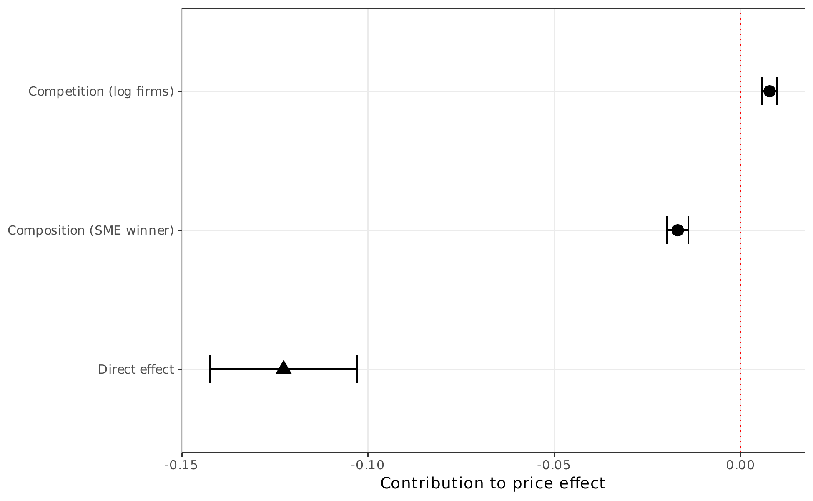

# AN-008: Gelbach decomposition of price effect

!!! abstract "Intuition (plain-language)"
    Why do prices fall under open competition — more bidders, or a different (non-SME) winner? A Gelbach decomposition splits the gap. The composition channel (who wins) explains most of the mediated part, the headcount channel partly offsets it, and a large share runs through neither — consistent with each remaining firm also bidding harder, not just more firms showing up.

!!! info "Reduced-form motivation layer"
    The numbers below are from the v1–v4 reduced-form DiDiR pipeline
    (`scripts/02_analysis.R` + companions), which the v8 manuscript
    carries as **motivation** in §1 but does not headline. The canonical
    v8 result is the structural counterfactual decomposition — see
    [AN-010](an-010-bne-decomposition.md) (decomposition) and
    [AN-011](an-011-welfare-arithmetic.md) (welfare arithmetic).

## Question

The DiDiR price coefficient in [AN-001](an-001-didir-prices.md) is a
reduced-form sum of channels. How much of the price effect is
attributable to the *competition* channel (more bidders under open
competition) vs the *composition* channel (different winner types)?

## Design

- **Sample**: same as [AN-001](an-001-didir-prices.md).
- **Specification**: Gelbach (2016) short-vs-full decomposition. The
  "short" regression is the DiDiR price equation with controls only.
  The "full" regression adds two mediators: log firms (competition
  channel) and an SME-winner indicator (composition channel). The
  difference between short and full coefficients on
  $g65 \times \text{Pre}$ is decomposed into per-mediator contributions
  via the Gelbach formula.
- **Outcomes**: short coefficient, full coefficient, gap, per-mediator
  contributions.

## Results

| Channel | Coefficient | SE | % of gap |
|---|---:|---:|---:|
| Short regression ($g65 \times \text{Pre}$) | −0.1318*** | 0.0096 | — |
| Full regression ($g65 \times \text{Pre}$) | −0.1227*** | 0.0101 | — |
| Gap (short − full) | −0.0091 | — | 100% |
| Competition (log firms) | +0.0078*** | 0.0010 | −85% |
| Composition (SME winner) | −0.0169*** | 0.0014 | +185% |

Output: `output/tables/tab_mediation.tex`,
`output/figures/fig_15_mediation.pdf`.

## Interpretation

The two mediators operate as *partially offsetting* channels:

- The competition channel (more bidders → lower prices) contributes
  +0.0078, signed as the channel does: under open competition more
  firms bid, lowering prices. This is −85% of the gap (offsetting in
  the decomposition because the partial-equilibrium logic says
  competition is *positive* for price reduction, and the Gelbach
  decomposition signs it as +0.0078 reducing the magnitude of the
  full coefficient).
- The composition channel (SME-winner change) contributes −0.0169:
  open competition selects non-SME winners whose conditional pricing
  is lower; this is +185% of the gap.

The most-informative number is the *unexplained* portion: the full
coefficient remains at −0.1227, meaning ~93% of the reduced-form price
effect operates through channels *not* captured by these two mediators.
This is consistent with the structural decomposition reading
([AN-010](an-010-bne-decomposition.md)): the price-forming order
statistic itself shifts when the bidder pool changes, beyond what the
linear-mediator decomposition can attribute to log firms or SME-winner.

Confidence: **yellow.** The Gelbach decomposition is a useful
attribution device but inherits the linear-mediator restriction; the
large unexplained component is *not* a defect but a signal that the
mediators are partial. The structural decomposition replaces this
linear attribution with a counterfactual-pool reading.

## Follow-ups

- Enriched-mediator Gelbach: add bid dispersion (CV), winner-margin,
  and item-complexity proxies as mediators
  (`v7-jpube-tight/scripts/63_gelbach_enriched.R`,
  `v7-jpube-tight/scripts/59_gelbach_waterfall.R`). Not yet documented
  as a standalone AN.
- The composition channel sign matters: the +185% of gap loading
  implies the *change in winner-type* is the largest single attributable
  mediator. Decomposing this further by non-SME-firm-size (large vs
  marginal non-SMEs) would expose where the conditional-pricing
  difference comes from.
