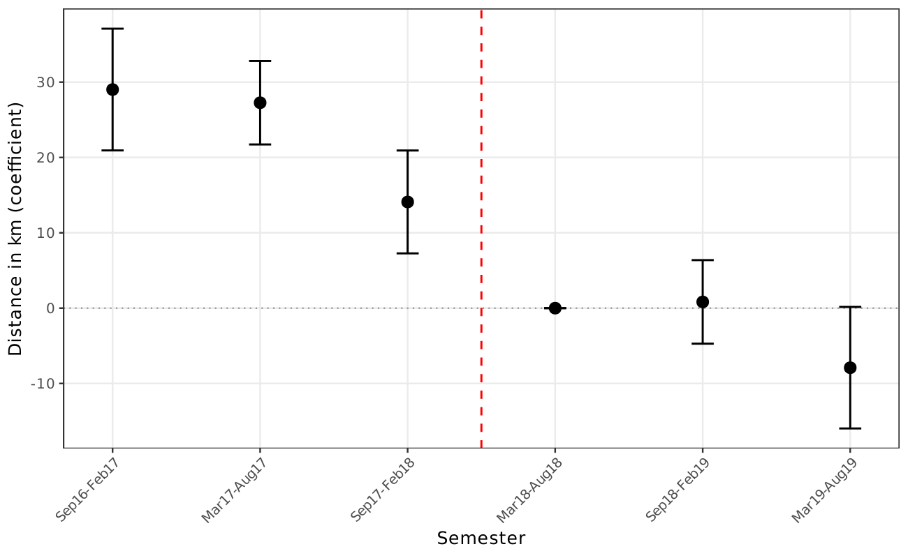

# Open auctions pull in geographically distant non-SME suppliers

!!! info "Reduced-form motivation layer"
    The headline number on this page comes from the v1–v4 reduced-form
    DiDiR pipeline. The v8 manuscript carries this as **motivation**
    in §1 but does not headline it; the v8 canonical claim is the
    structural decomposition — see
    [Exclusion dominates the price decomposition](exclusion-dominates-decomposition.md)
    and
    [Static welfare cost ~28.9%](static-welfare-loss-large.md).

🟡 On high-value items in switched group 65, opening to non-SME bidders
*widens* the average buyer-winner distance by **+12.1 km** (p<0.01,
item-clustered SEs), identified by DiDiR
([AN-003](../analyses/an-003-didir-distance.md)). On low-value items
the effect is null (+2.8 km, p>0.10). The asymmetry along the value
margin is consistent with the transport-cost amortization story:
non-SMEs span a wider geographic radius and can profitably bid in
distant markets only when contract value is large enough to absorb
logistics costs.

*Event study (figure A.1 / fig\_02\_distance\_es): semester-by-semester
group-65 vs control gap in buyer-winner distance (km). Pre-period gap
is large and stable; post-period gap collapses as non-SMEs are removed
from the eligible pool.*

**Caveat.** Distance is a coarse proxy for the geographic-catchment
channel — a richer specification would use the firm's full operational
footprint (e.g., RAIS-validated establishment locations) rather than a
single CEP. The RAIS-validated SME indicator partially substitutes for
the BEC SME flag in [AN-009](../analyses/an-009-sme-winner-extensions.md)
but does not enter the distance specification. The null result on
low-value items is *consistent* with the prediction but is not
diagnostic of an alternative reading; richer firm-size cross-cuts
would resolve it.

**Sources.**

- *Own analysis*: [AN-003](../analyses/an-003-didir-distance.md)
  (DiDiR distance table, value heterogeneity),
  [AN-004](../analyses/an-004-placebo-tests.md) (distance placebo null
  → rules out freight/logistics shock).
- *Reports*: none direct.
- *News anchors*: none direct.
- *Cross-refs*: [H:distance-widens-under-open](../hypotheses/distance-widens-under-open.md);
  [docs/results.md](../results.md) and the heterogeneity-by-value table.
- *Validation*: `scripts/02_analysis.R` →
  `output/tables/tab_distance.tex`; `scripts/06_extensions.R` →
  `tab_heterog_value.tex`.
