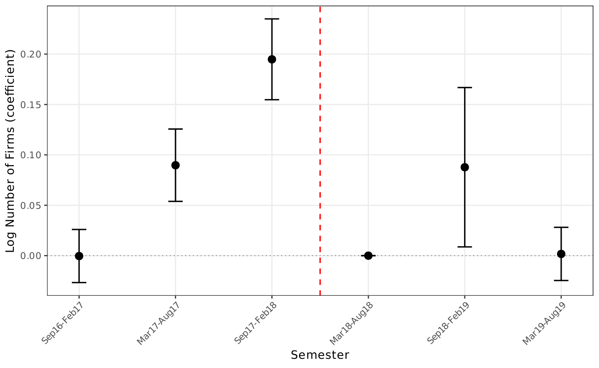

# Open auctions increase bidder participation by ~10–22%

!!! info "Reduced-form motivation layer"
    The headline number on this page comes from the v1–v4 reduced-form
    DiDiR pipeline. The v8 manuscript carries this as **motivation**
    in §1 but does not headline it; the v8 canonical claim is the
    structural decomposition — see
    [Exclusion dominates the price decomposition](exclusion-dominates-decomposition.md)
    and
    [Static welfare cost ~28.9%](static-welfare-loss-large.md).

🟡 Opening switched group 65 to non-SME bidders increased the average
number of participating firms by **~22% in the 6-month window**, attenuating
to **~10% in the 18-month window**, identified by DiDiR around March 2018
([AN-002](../analyses/an-002-didir-firms-bids.md), p<0.01 across all
specifications). The bid-count margin moves in the same direction.

The attenuation across windows reflects the *control groups'* gradual
SME restriction rollout — the placebo on firm counts is significant in
the pre-period
([AN-004](../analyses/an-004-placebo-tests.md)), but the placebo on the
*price* margin is null. The reading is therefore that the firm-count
DiDiR conflates the group-65 policy switch with a secular trend in the
control groups, while the price DiDiR isolates the policy effect itself.

*Event study (figure A.3 / fig\_03\_numfirms\_es): semester-by-semester
group-65 vs control gap in log number of bidder firms. Pre-period gap
narrows already under the secular trend; the post-period jump is the
mechanical result of removing non-SME bidders from group 65.*

**Caveat.** The reduced-form firm-count effect *combines* two margins:
the *removal* of non-SMEs and the *entry response* of additional SMEs.
The DiDiR cannot separate them. The structural decomposition does — see
[The protected SME pool responds but does not replace lost discipline](protected-pool-cannot-replace.md)
— and finds that the SME pool roughly doubles its participation, but
not enough to recreate the lost discipline.

**Sources.**

- *Own analysis*: [AN-002](../analyses/an-002-didir-firms-bids.md)
  (DiDiR firm-count tables), [AN-004](../analyses/an-004-placebo-tests.md)
  (firm-count placebo and its interpretation),
  [AN-010](../analyses/an-010-bne-decomposition.md) (structural
  decomposition of the bidder-count response).
- *Reports*: PGE-SP opinion (March 2018) anchors the institutional
  break.
- *News anchors*: none direct.
- *Cross-refs*: [H:entry-thickens-pool](../hypotheses/entry-thickens-pool.md);
  [docs/results.md](../results.md).
- *Validation*: `scripts/02_analysis.R` → `output/tables/tab_participants.tex`
  and `tab_validbids.tex`.
