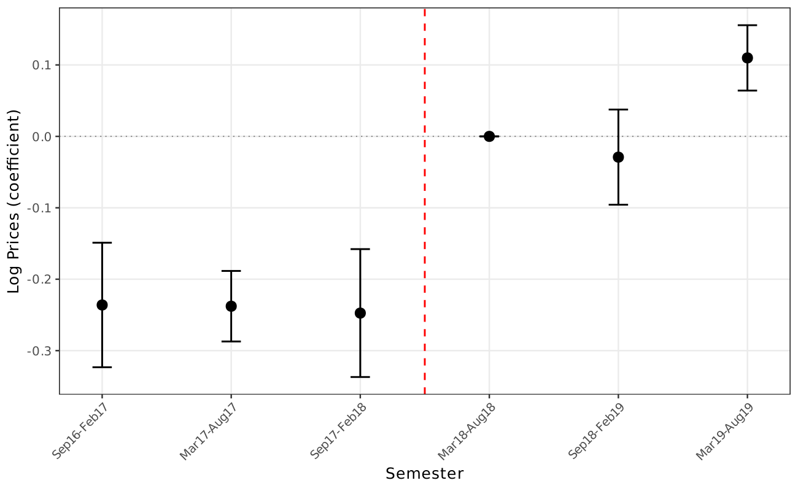

# Open auctions cut procurement prices by ~10–11% in switched group 65

!!! info "Reduced-form motivation layer"
    The headline number on this page comes from the v1–v4 reduced-form
    DiDiR pipeline. The v8 manuscript carries this as **motivation**
    in §1 but does not headline it; the v8 canonical claim is the
    structural decomposition — see
    [Exclusion dominates the price decomposition](exclusion-dominates-decomposition.md)
    and
    [Static welfare cost ~28.9%](static-welfare-loss-large.md).

🟡 In São Paulo's BEC procurement platform, opening switched group 65
(medical/hospital supplies) to non-SME bidders before March 2018
lowered negotiated prices by **~10–11%** relative to the SME-only
regime that followed (v8 reduced-form benchmark β = −0.113, 18-month
window, item-clustered SEs, p<0.01), identified by a
difference-in-differences-in-reverse (DiDiR) against control groups that
were SME-only throughout ([AN-001](../analyses/an-001-didir-prices.md)).
The earlier v1–v4 pipeline gave a slightly larger −0.131 to −0.133; the
v8 benchmark is the canonical number.

The estimate is stable across 6/12/18-month windows around the March 2018
PGE-SP legal reversal, robust to PBU fixed effects, and concentrated at
the lower end of the conditional price distribution: quantile DiD finds
the effect at $\tau \leq 0.50$ (β strongly negative) but reversing at
$\tau = 0.90$ ([AN-007](../analyses/an-007-quantile-did.md)). Lee
(2009) selection bounds are tight, confirming negligible completion-selection
bias ([AN-005](../analyses/an-005-lee-bounds.md)); HonestDiD CIs survive
substantial M̄ violations ([AN-006](../analyses/an-006-honestdid.md));
the pre-treatment placebo on prices is null
([AN-004](../analyses/an-004-placebo-tests.md)).

*Event study (figure A.1 / fig\_01\_logprices\_es): semester-by-semester
group-65 vs control gap in log prices. The gap narrows sharply after the
March 2018 cutoff and stabilizes — consistent with parallel trends in
the pre-period.*

**Caveat.** The reduced-form coefficient is a *policy comparison* under
DiDiR identification, not a structural counterfactual. It does not
decompose the price gap into the lost-discipline channel and the
protected-pool offset (the structural reading lives in
[Exclusion dominates the price decomposition](exclusion-dominates-decomposition.md)
and rests on the maintained IPV-clock interpretation). The reading is
🟡 because it is a single-source own-project estimate; promotion to 🟢
would require either an independent replication in another procurement
jurisdiction or a converging recovery from the Convite first-price
sample (cross-modality check; partly run, not yet documented as an AN).

**Sources.**

- *Own analysis*: [AN-001](../analyses/an-001-didir-prices.md)
  (DiDiR price tables), [AN-004](../analyses/an-004-placebo-tests.md)
  (placebo), [AN-005](../analyses/an-005-lee-bounds.md) (Lee bounds),
  [AN-006](../analyses/an-006-honestdid.md) (HonestDiD),
  [AN-007](../analyses/an-007-quantile-did.md) (quantile DiD).
- *Reports*: PGE-SP opinion (March 2018) is the institutional anchor.
- *News anchors*: none direct.
- *Cross-refs*: [H:price-discipline-loss](../hypotheses/price-discipline-loss.md);
  [H:parallel-trends-hold](../hypotheses/parallel-trends-hold.md);
  [docs/results.md](../results.md) main-results page.
- *Validation*: backing scripts `scripts/02_analysis.R`,
  `scripts/05_robustness.R`, `scripts/07_advanced.R` produce
  `output/tables/tab_prices.tex`, `tab_placebo.tex`, `tab_lee_bounds.tex`,
  `tab_quantile_did.tex`.
