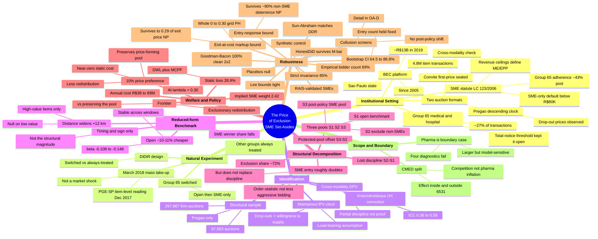

# Mind Map

Interactive overview of the paper's logical structure. Click and drag to explore.

```mermaid
mindmap
  root((The Price<br/>of Exclusion<br/>SME Set-Asides))
    **Institutional Setting**
      BEC platform
        Sao Paulo state
        Since 2005
        ~R$13B in 2019
        4.8M item transactions
      SME statute LC 123/2006
        Revenue ceilings define ME/EPP
        SME-only default below R$80K
        Group 65 adherence ~43% post
      Group 65 medical and hospital
        ~27% of transactions
        Total-notice threshold kept it open
      Two auction formats
        Pregao descending clock
          Drop-out prices observed
        Convite first-price sealed
          Cross-modality check
    **Natural Experiment**
      March 2018 mass take-up
        PGE-SP item-level reading Dec 2017
        Not a market shock
      Group 65 switched
        Open then SME-only
      Other groups always treated
      DiDiR design
        Switched vs always-treated
    **Identification**
      Maintained IPV-clock
        Drop-outs = willingness to supply
        Load-bearing assumption
      Krasnokutskaya UH correction
        ICC 0.36 to 0.59
      Cross-modality GPV
        Partial discipline not proof
      Structural sample
        Pregao only
        97,993 auctions
        297,967 firm-auctions
    **Reduced-form Benchmark**
      Open ~10-11% cheaper
        beta -0.108 to -0.148
        Stable across windows
      Timing and sign only
        Not the structural magnitude
      Distance widens +12 km
        High-value items only
        Null on low value
      SME winner share falls
    **Structural Decomposition**
      Three pools S1 S2 S3
        S1 open benchmark
        S2 exclude non-SMEs
        S3 post-policy SME pool
      Lost discipline S2-S1
      Protected-pool offset S3-S2
      Exclusion share ~72%
      SME entry roughly doubles
        But does not replace discipline
        Order-statistic not less aggressive bidding
    **Welfare and Policy**
      Static loss 28.9%
        At lambda = 0.30
        DWL plus MCPF
      Implied SME weight 2.42
      10% price preference
        Near-zero static cost
        Preserves price-forming pool
        Less redistribution
      Annual cost R$38 to 89M
      Frontier
        Exclusionary redistribution
        vs preserving the pool
    **Robustness**
      Placebos null
      HonestDiD survives M-bar
      Lee bounds tight
      Goodman-Bacon 100% clean 2x2
      Sun-Abraham matches DDR
      Synthetic control
      Bootstrap CI 64.5 to 86.8%
        Entry count held fixed
      Strict invariance 85%
      Empirical bidder count 69%
      Exit-at-cost markup bound
        Survives to 0.29 of exit price NP
        Whole 0 to 0.30 grid PH
      Entry-response bound
        Survives ~90% non-SME deterrence NP
      Collusion screens
        No post-policy shift
        Detail in OA-D
      RAIS-validated SMEs
    **Scope and Boundary**
      Pharma is boundary case
        Larger but model-sensitive
        Four diagnostics fail
      CMED split
        Effect inside and outside 6531
        Competition not pharma inflation
```
